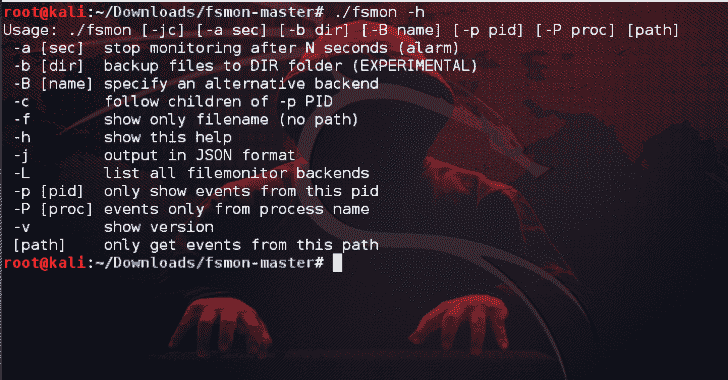

# FSMon:监视 iOS/OS X/Android/Firefox OS/Linux 上的文件系统

> 原文：<https://kalilinuxtutorials.com/fsmon-monitor-filesystem/>

运行在 Linux、Android、iOS 和 OSX 上的 FSMon 或文件系统监视器实用程序。由 Sergiàlvarez 在 Nowsecure 为您带来，在麻省理工学院许可下发行。

**用途**

该工具从特定目录中检索文件系统事件，并以彩色格式或 JSON 显示它们。

可以从特定的程序名或进程 id (PID)中过滤发生的事件。

**用法:。/fs mon[-JC][-a sec][-B dir][-B name][-p pid][-P proc][path]** **-a**【sec】N 秒后停止监控(报警)
**-B**【DIR】将文件备份到 DIR 文件夹(实验)
**-B**【name】指定一个备选后端
**-c** 跟随-P PID 的子代
**-t
**-h** 显示此帮助
**-j** 以 JSON 格式输出
**-L** 列出所有 filemonitor 后端
**-P【pid】**只显示来自此 PID 的事件
**-P**【proc】事件只从进程名
**-v** 显示版本
**【路径】**只获取**

**也可阅读-[Zeek:一个强大的网络分析框架](https://kalilinuxtutorials.com/zeek-powerful-network-analysis-framework/)**

**后端**

fsmon 文件系统信息取自不同的后端，具体取决于操作系统和可用的 API。

这是可以用`fsmon -L`列出的后端列表:

*   inotify (linux / android)
*   fanotify (linux > 2.6.36 / android 5)
*   devf sev(OS x/dev/f events–需要 root)
*   k queue(xnu–需要根)
*   kdebug (bsd？，xnu–需要根)
*   osx 文件系统监控 api

**编译**

fsmon 是一个可移植的工具。它可以在 iOS、OSX、Linux 和 Android (x86、arm、arm64、mips)上运行

**Linux**

**$ make**

**OSX + iOS fatbin**

**$ make**

**iOS**

**$制作 ios**

**安卓**

**$制作安卓 NDK_ARCH=** <arch>**安卓 _API=**<api></api></arch>

**要在系统范围内安装 fsmon，只需键入:**

**$ make 安装**

**更改安装路径…**

**$ make 安装前缀=/usr DESTDIR=/**

[**Download**](https://github.com/nowsecure/fsmon)