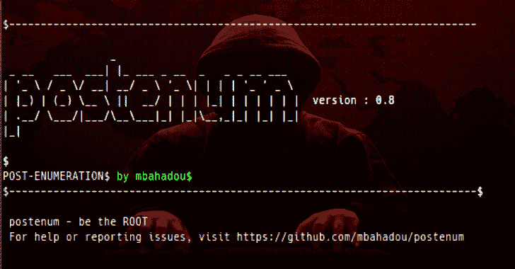

# Postenum:用于基本/高级权限提升技术的工具

> 原文：<https://kalilinuxtutorials.com/postenum-privilege-escalation-techniques/>

Postenum 是一个干净、漂亮、简单的工具，用于基本/高级权限提升矢量/技术。该工具旨在 Linux 机器上本地执行。不仅仅是一个普通用户。做根。

**使用**

。/postenum . sh[选项]
。/postenum.sh -s
。/postenum.sh -c

**另请参阅—[SIEM—安全信息和事件管理工具初学者指南](https://kalilinuxtutorials.com/a-beginners-guide-to-siem/)**

**选项**

-a : All -s : Filesystem [SUID、SGID、Config/DB 文件等。]
-l : Shell escape 和开发工具
-c:最有趣的文件
-n:网络设置
-p:服务和 cron 作业
-o : OS 信息和内核漏洞
-v:软件的版本
-t : Fstab 凭证和数据库检查器

**Install.sh**

您可以使用 install.sh 脚本来安装该工具。(仅适用于系统/网络管理员)。要运行它:

。/install.sh

[**Download**](https://github.com/mbahadou/postenum)