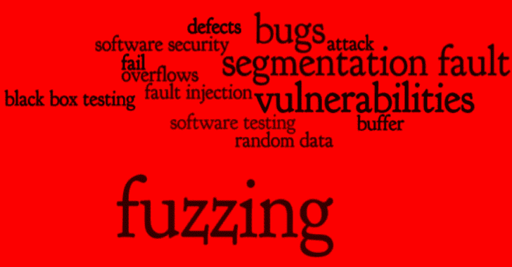

# UniFuzzer:一个基于 Unicorn & LibFuzzer 的闭源二进制模糊工具

> 原文：<https://kalilinuxtutorials.com/unifuzzer/>

**UniFuzzer** 是一款基于 [Unicorn](https://github.com/unicorn-engine/unicorn) 和 [LibFuzzer](https://llvm.org/docs/LibFuzzer.html) 的闭源二进制模糊工具。目前它支持在 ARM/MIPS 上模糊化 32 位 LSB ELF 文件，这种文件通常出现在物联网设备中。

**特性**

*   很少的黑客攻击并且易于构建
*   可以针对任何指定的函数或代码片段
*   快速覆盖制导模糊化
*   自动解析和加载依赖关系
*   通过预加载覆盖库函数

**打造**

1.  反转目标二进制，找到有趣的函数进行模糊化。
2.  在目录`**callback**`中创建一个`**.c**`文件，其中应该包含以下回调函数:

*   每次在 Unicorn 中加载一个依赖库时都会调用它。
*   当所有的二进制文件都被加载到 Unicorn 中后，它就会被调用。堆栈/堆/寄存器可以在这里设置。
*   `**int uniFuzzerBeforeExec(uc_engine *uc, const uint8_t *data, size_t len)**`:在每一轮模糊化执行前调用。
*   `**int uniFuzzerAfterExec(uc_engine *uc)**`:每一轮模糊化执行后调用。

**也可阅读-[ISPY:永恒之蓝/Bluekeep 扫描仪&Exploit](https://kalilinuxtutorials.com/ispy-eternalblue-bluekeep-scanner-exploit/)**

1.  运行`make`并获得名为`uf`的模糊工具。

**跑**

uniFuzzer 使用以下环境变量作为参数:

*   `**UF_TARGET**`:目标 ELF 文件的路径
*   `**UF_PRELOAD**`:预加载库的路径。请确保该库与目标具有相同的体系结构。
*   `**UF_LIBPATH**`:从属库所在的路径。使用`:`分隔多条路径。

可以使用以下命令启动模糊化:

UF _ TARGET =<target>[UF _ PRELOAD =<preload>]UF _ LIBPATH =<libpath>。/uf</libpath></preload></target>

**试玩**

有一个基本用法的演示。该演示包含以下文件:

*   这是 fuzzing 的目标。它包含一个名为`**vuln()**`的简单函数，该函数容易受到堆栈/堆溢出的攻击。
*   c:这是用于预加载挂钩的。它定义了一个空的`**printf()**`和简化的`**malloc()/free()**`。
*   callback/demo-callback.c:这定义了模糊演示`**vuln()**`函数所需的回调函数。

首先，请安装 mipsel 的 gcc(Debian 上的包`**gcc-mipsel-linux-gnu**`)来构建演示:

#目标二进制文件
# '-Xlinker–HASH-style = sysv '告诉 gcc 使用' DT_HASH '而不是' DT_GNU_HASH '进行符号查找
#因为目前 uniFuzzer 不支持' DT _ GNU _ HASH ' mipsel-Linux-GNU-gcc demo-vuln . c-Xlinker–HASH-style = sysv-no-pie-o demo-vuln

#预加载库 mipsel-Linux-GNU-gcc-shared-FPF

或者您可以只使用文件`**demo-vuln**`和`**demo-libcpreload.so**`，它们是使用上面的命令编译的。

接下来，运行`make`来构建 uniFuzzer。请注意，如果您自己编译 MIPS 演示，那么一些地址可能与预建的不同，并且`**demo-callback.c**` 应该相应地更新。

最后，确保 MIPS 的 libc 库已经准备好。在 Debian 上，它在安装包`**libc6-mipsel-cross**`后的`**/usr/mipsel-linux-gnu/lib/**`中，这就是`**UF_LIBPATH**`应该有的样子:

UF _ TARGET =<path to="" demo-vuln="">UF _ PRELOAD =<path to="" demo-libcpreload.so="">UF _ LIBPATH =<lib path="" for="" mips="">。/uf</lib></path></path>

**黑掉独角兽**

由于这个[问题](https://github.com/unicorn-engine/unicorn/issues/1043)，Unicorn 清除了 QEMU 的 JIT 缓存，这降低了 fuzzing 的速度，因为在每一轮执行期间，目标二进制文件都必须进行 JIT 重新编译。

为了提高性能，我们可以将该问题中的`**tb_flush(env);**`注释掉。

**托多**

*   支持 syscall
*   支持其他架构和二进制格式
*   ~~支持`GNU_HASH`~~
*   支持`IFUNC`
*   集成环境设置并提供 API

[**Download**](https://github.com/PAGalaxyLab/uniFuzzer)