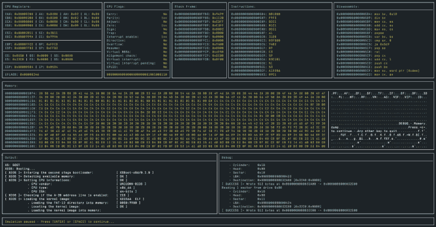

# Unicorn-Bios:Unicorn 引擎的基本 Bios 模拟器

> 原文：<https://kalilinuxtutorials.com/unicorn-bios/>

**Unicorn-Bios** 是 Unicorn Engine 的基本 Bios 仿真器/调试器。

**用途**

用法:unicorn-BIOS[选项] BOOT_IMG

选项:
–help/-h:显示帮助。
–memory/-m:为虚拟机
分配的内存量(以兆字节为单位)。默认为 64MB，最小 2MB。
–break/-b 在特定地址上断开。
–break-int:中断调用时中断。
–break-iret:中断返回时中断。
–陷阱:打破时引发陷阱。
–debug-video:打开视频服务的调试输出。
–单步:在每个指令上中断。
–no-ui:不启动用户界面(输出将显示到 stdout，调试信息显示到 stderr)。
–无颜色:不要使用颜色。

**另请参阅:[SIEM–安全信息和事件管理工具初学者指南](https://kalilinuxtutorials.com/a-beginners-guide-to-siem/)**

**安装**

brew 安装–HEAD macmade/tap/unicorn-BIOS

**执照**

unicorn-bios 是根据麻省理工学院的许可条款发布的。

**知识库信息**

所有者:让-大卫·加迪纳-XS-实验室
网站:www.xs-labs.com
博客:www.noxeos.com
推特:@ MAC made
GitHub:github.com/macmade
LinkedIn:ch.linkedin.com/in/macmade/
斯塔克韦尔弗洛:stackoverflow.com/users/182676/macmade