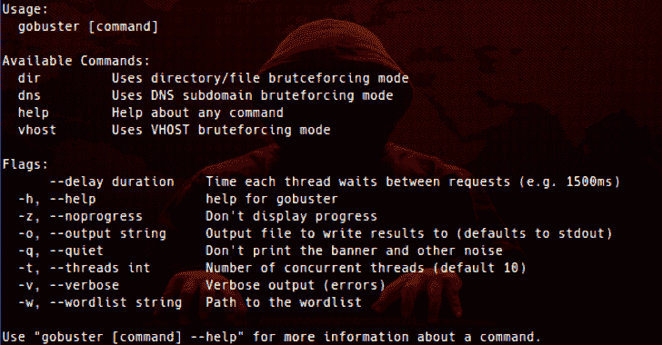

# GoBuster:用 Go 编写的目录/文件、DNS 和 VHost 破坏工具

> 原文：<https://kalilinuxtutorials.com/gobuster/>

**Gobuster** 是一个用来暴力破解类似 **URIs(目录和文件)的网站**、 **DNS 子域名(带通配符支持)**和**目标 web 服务器上虚拟主机名称**的工具。

**为什么！？**

*   一些没有胖 Java GUI 的东西(控制台 FTW)。
*   来构建一些只在命令行上工作的东西。
*   没有递归暴力的东西。
*   允许我一次暴力破解文件夹和多个扩展的东西。
*   可以在多种平台上编译的东西。
*   比解释脚本更快的东西(比如 Python)。
*   不需要运行时的东西。
*   使用对并发性有利的东西(因此使用 Go)。
*   在 Go 中构建一些并非完全无用的东西。

**不过是屎！而你的实现烂透了！**

是的，你可能是正确的。请随意:

*   不使用它。
*   告诉我如何做得更好。

**3.0 中的变化**

*   新的 CLI 选项，因此模式是严格分开的(`-m`现在消失了！)
*   性能优化和更好的连接处理
*   暴力破解主机名的能力
*   提供自定义 HTTP 头的选项

**可用模式**

*   dir——经典的目录强制模式
*   DNS–DNS 子域强制模式
*   vhost–虚拟主机强制模式(与 DNS 不同！)

**内置帮助**

帮助是内置的！

*   `**gobuster help**`–输出顶层帮助。
*   `**gobuster help <mode>**`–输出特定于该模式的帮助。

**DNS 模式帮助**

**用法:** gobuster dns【Flags】

**Flags:** -d，–domain string 目标域
-h，–help dns 的帮助
-r，–resolver string 使用自定义 DNS 服务器(格式 server.com 或 server.com:port)
-c，–Show cname 显示 cname 记录(不能与'-i '选项一起使用)
-i，–showips 显示 IP 地址
–超时时长 DNS 解析器 –no progress 不显示进度
-o，–输出字符串输出文件将结果写入其中(默认为 stdout)
-q，–quiet 不打印横幅和其他噪音
-t，–threads int 并发线程数(默认为 10)
–延迟持续时间每个线程在请求之间等待的时间(例如 1500ms)
-v，–Verbose Verbose Output(errors)
-w，–wordlist 字符串到单词列表的路径

**方向模式选项**

**用法:** gobuster dir[Flags]

**Flags:**
-f，–addslash Append/到每个请求
-c，–cookies 字符串 Cookies 用于请求
-e，–Expanded 扩展模式，打印完整 URL
-x，–extensions 字符串文件扩展名以搜索
-r，–Follow redirect 跟随重定向
-H，–headers 字符串指定 HTTP 头，-H 'Header1 –Include length 在输出中包含正文的长度
-k，–insecuressl 跳过 ssl 证书验证
-n，–no status 不打印状态代码
-P，–密码字符串基本身份验证的密码
-p，–代理字符串用于请求的代理[http(s)://host:port]
-s，–status codes 字符串肯定的状态代码(如果设置，将被 statuscodeslblack 覆盖)(默认值“200，204，30 –URL string 目标 URL
-a，–User Agent string 设置用户代理字符串(默认为“go buster/3 . 0 . 1”)
-U，–Username string 基本授权的用户名
–通配符发现时强制继续操作

**全局标志:**
-z，–no progress 不显示进度
-o，–Output string 输出结果要写入的输出文件(默认为 stdout)
-q，–quiet –threads int 并发线程数(默认为 10)
–延迟持续时间每个线程在请求之间等待的时间(例如 1500 毫秒)
-v，–详细输出(错误)
-w，–单词列表的单词列表字符串路径

**Vhost 模式选项**

**用法:** gobuster vhost[Flags]

**Flags:** -c，–cookie 字符串 cookie 用于请求
-r，–Follow redirect Follow 重定向
-H，–headers 字符串数组指定 HTTP 头，-H ' header 1:val 1 '-H ' header 2:val 2 '
-H，–help 帮助 vhost
-k，–insecuressl 跳过 ssl 证书验证
-P， –URL string 目标 URL
-a，–User Agent string 设置用户代理字符串(默认为“go buster/3 . 0 . 1”)
-U，–Username string 基本授权的用户名

**全局标志:**
-z，–no progress 不显示进度
-o，–Output string 输出结果要写入的文件(默认为 stdout)
-q，–quiet 不打印横幅和其他噪音

**易于安装**

**二进制发布**

我们现在为每个版本发布二进制文件，这样你甚至不需要自己构建它们！这多好啊！

如果你愚蠢到相信我整理的二进制文件，你可以从[发布](https://github.com/OJ/gobuster/releases)页面下载它们。

**使用 go get**

如果您有一个准备就绪的 [Go](https://golang.org/) 环境，就像:

去找 github.com/OJ/gobuster

**建筑来源**

由于这个工具是用 [Go](https://golang.org/) 编写的，你需要安装 Go 语言/编译器/等等。安装和设置的全部细节可以在 Go 语言网站上找到[。安装后，您有两个选择。](https://golang.org/doc/install)

**编译**

`gobuster`现在有外部依赖项，因此需要先将它们拉入:

**去获得&去建造**

这将为您创建一个`gobuster`二进制文件。如果你想把它安装在`$GOPATH/bin`文件夹中，你可以运行:

**去安装**

如果您已经拥有了所有的依赖项，那么您可以使用构建脚本:

*   `**make**`–为当前 Go 配置构建(即运行`go build`。
*   `**make windows**`–为 windows 构建 32 位和 64 位二进制文件，并将其写入`build`子文件夹。
*   `**make linux**`**–为 linux 构建 32 位和 64 位二进制文件，并将其写入`build`子文件夹。**
*   **`**make darwin**`–为 darwin 构建 32 位和 64 位二进制文件，并将它们写入`build`子文件夹。**
*   **`**make all**`–为所有平台和架构构建，并将结果二进制文件写入`build`子文件夹。**
*   **`**make clean**`–清除`build`子文件夹。**
*   **`make test`–运行测试。**

 ****Wordlists via STDIN**

通过向`-w`选项提供一个`-`,可以通过 stdin 将单词表输入到`gobuster`:

**hashcat-a3–stdout？https://mysite.com-w-**

注意:如果从标准输入管道的同时指定了`-w`选项，将显示一个错误，程序将终止。

**例子**

`**dir**` **模式**

命令行可能如下所示:

gobuster dir-u https://mysite.com/path/to/folder-c ' session = 123456 '-t 50-w common-files . txt-x . PHP，。超文本标记语言

默认选项如下所示:

Gobuster dir-u https://buffered . io-w ~/word lists/short list . txt
= = = = = = = = = = = = = = = = = = = = = = = = = = = = = = = = = = = = = = = = = = = = = = = = = = =
Gobuster v 3 . 0 . 1
作者 OJ Reeves(@ the colonial)&Christian Mehlmauer(@*fire fart*)

= = = = = = = = = = = = = = = = = = = = = = = = = = = = = = = = = = = = = =

禁用状态代码的默认选项如下所示:

Gobuster dir-u https://buffered . io-w ~/word lists/short list . txt-n
= = = = = = = = = = = = = = = = = = = = = = = = = = = = = = = = = = = = = = = = = = = = = = = = = = = = =
Gobuster v 3 . 0 . 1
作者 OJ Reeves(@ the colonial)&Christian Mehlmauer(@ fire fart)
= = = = = = = = = = = = = = = = = = = = = = = = = = = = = = = = = = = = = = =

详细输出如下所示:

Gobuster dir-u https://buffered . io-w ~/word lists/short list . txt-v
* * * * * * * * * * * * * * * * * * * * * * * * * * * * *
Gobuster v 3 . 0 . 1
作者 OJ Reeves(@ the colonial)&Christian mehl mauer(@*fire fart*)
* * * * * * * * * * * * * * * * * * * * * * * * * * * * *
[+]
未找到:/alsodesnotexist(状态:404)
找到:/index(状态:200)
未找到:/doesnotexist(状态:404)
找到:/categories(状态:301)
找到:/posts(状态:301)
找到:/contact(状态:301)
* * * * * * * * * * * * * * * * * * * * * * * * * * * * * * *

显示内容长度的示例:

Gobuster dir-u https://buffered . io-w ~/word lists/short list . txt-l
* * * * * * * * * * * * * * * * * * * * * * * * * * * * *
Gobuster v 3 . 0 . 1
作者 OJ Reeves(@ the colonial)&Christian mehl mauer(@*fire fart*)
* * * * * * * * * * * * * * * * * * * * * * * * * * * * *
[+]
/类别(状态:301)【大小:178】
/帖子(状态:301)【大小:178】
/联系人(状态:301)【大小:178】
/索引(状态:200)【大小:51759】
* * * * * * * * * * * * * * * * * * * * * * * * * * * * * * * * * * * * * * * * * * *
2019/06/21 11:51:17 完成【完

安静输出，状态禁用，扩展模式如下所示(“grep 模式”):

gobuster dir-u https://buffered . io-w ~/word lists/short list . txt-q-n-e
https://buffered.io/index
https://buffered.io/contact
https://buffered.io/posts
https://buffered.io/categories

**DNS 模式**

命令行可能如下所示:

**gobuster DNS-d mysite.com-T50-w common-names . txt**

正常的样品运行如下:

Gobuster DNS-d google.com-w ~/word lists/subdomains . txt
* * * * * * * * * * * * * * * * * * * * * * * * * * * * * * * * * * * * * * * * *
Gobuster v 3 . 0 . 1
by OJ Reeves(@ the colonial)&Christian Mehlmauer(@*fire fart*)
* * * * * * * * * * * * * * * * * * * * * * * * * * * * * * * * * *
[+】方式:dns

2019/06/21 11:54:20 首发 gobuster
找到:chrome.google.com
找到:ns1.google.com
找到:admin.google.com
找到:www.google.com
找到:m.google.com
找到:support.google.com
找到:translate.google.com
找到:cse.google.com
找到:news.google.com
找到:music.google.com
找到:mail.google.com
找到:store.google.com

Show IP 示例运行如下:

Gobuster DNS-d google.com-w ~/word lists/subdomains . txt-I
* * * * * * * * * * * * * * * * * * * * * * * * * * * * * * * * * * * * * * * * * * *
Gobuster v 3 . 0 . 1
作者:OJ Reeves(@ the colonial)&Christian Mehlmauer(@*fire fart*)
* * * * * * * * * * * * * * * * * * * * * * * * * * * * * * * * * * * * *
[+]方式 2001:4860:4802:32::a]
发现地:m.google.com【172 . 217 . 25 . 43，2404:6800:4006:802::200b】
发现地:cse.google.com【172 . 217 . 25 . 46，2404:6800:4006:800a::200 e】
发现地:chrome.google.com【172 . 217 . 25

基本域解析失败时的基本域验证警告。这是一个警告，而不是一个失败，以防用户在输入域名时手指变粗。

Gobuster DNS-d yp . to-w ~/word lists/sub domains . txt-I
* * * * * * * * * * * * * * * * * * * * * * * * * * * * * * * * * * *
Gobuster v 3 . 0 . 1
作者 OJ Reeves(@ the colonial)&Christian mehl mauer(@*fire fart*)
* * * * * * * * * * * * * * * * * * * * * * * * * * * * * * * * * * * * *
[+]

也可以正确检测通配符 DNS:

Gobuster DNS-d 0 . 0 . 1 . xip . io-w ~/word lists/sub domains . txt
* * * * * * * * * * * * * * * * * * * * * * * * * * * * * * * * * * * * *
Gobuster v 3 . 0 . 1
作者 OJ Reeves(@ the colonial)&Christian Mehlmauer(@*fire fart*)
* * * * * * * * * * * * * * * * * * * * * * * * * * * * * * * * * * * * * * * * * * * * * * * * *【t】IP 地址:1 . 0 . 0 . 0
2019/06/21 12:13:48[！]要强制处理通配符 DNS，请指定'–wild card '开关。
* * * * * * * * * * * * * * * * * * * * * * * * * * * * * * * * * * * * * * * * * * * * * * * * * * * * * * * * *
2019/06/21 12:13:48 完成

如果用户想要强制处理包含通配符条目的域，请使用`--wildcard`:

Gobuster DNS-d 0 . 0 . 1 . xip . io-w ~/word lists/sub domains . txt–通配符
* * * * * * * * * * * * * * * * * * * * * * * * * * * * * * * * *
Gobuster v 3 . 0 . 1
作者 OJ Reeves(@ the colonial)&Christian Mehlmauer(@*fire fart*)
* * * * * * * * * * * * * * * * * * * * * * * * * * * * * * * * * * * * * * * * * * * * *IP 地址:1.0.0.0
找到:127 . 0 . 0 . 1 . xip . io
* * * * * * * * * * * * * * * * * * * * * * * * * * *
找到:test . 127 . 0 . 0 . 1 . xip . io
* * * * * * * * * * * * * * * * * * * * * * * * * * * * * * * * *
2019/06/21 12:13:53

**虚拟主机模式**

命令行可能如下所示:

gobuster vhost-u https://mysite.com-w common-vhosts . txt

正常的样品运行如下:

Gobuster vhost-u https://mysite.com-w common-vhosts . txt
* * * * * * * * * * * * * * * * * * * * * * * * * * * * * * * * * * * * * * *
Gobuster v 3 . 0 . 1
by OJ Reeves(@ the colonial)&Christian mehl mauer(@*fire fart*)
* * * * * * * * * * * * * * * * * * * * * * * * * * * * * * * * * * T6【[+】网址:https://mysite.com
[+]线程

[**Download**](https://github.com/OJ/gobuster)**