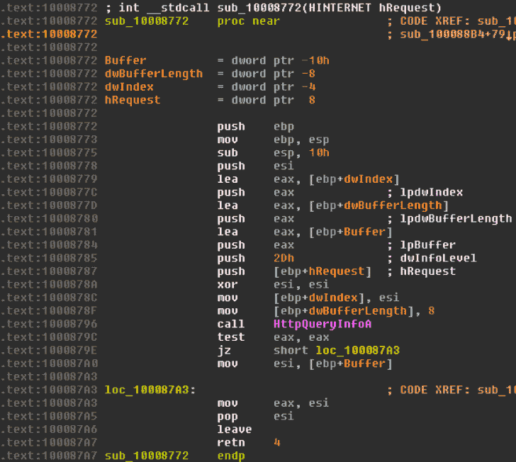
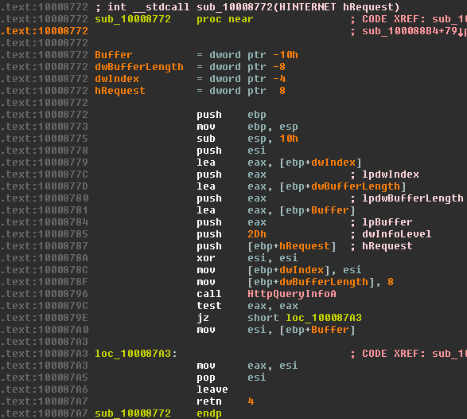
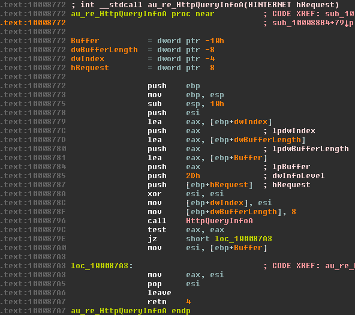
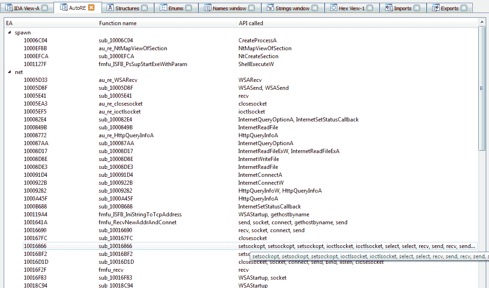
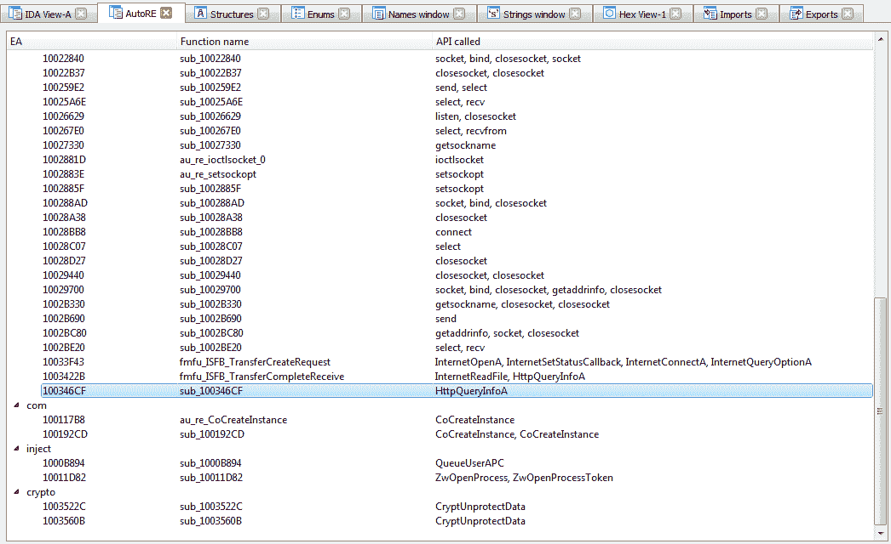
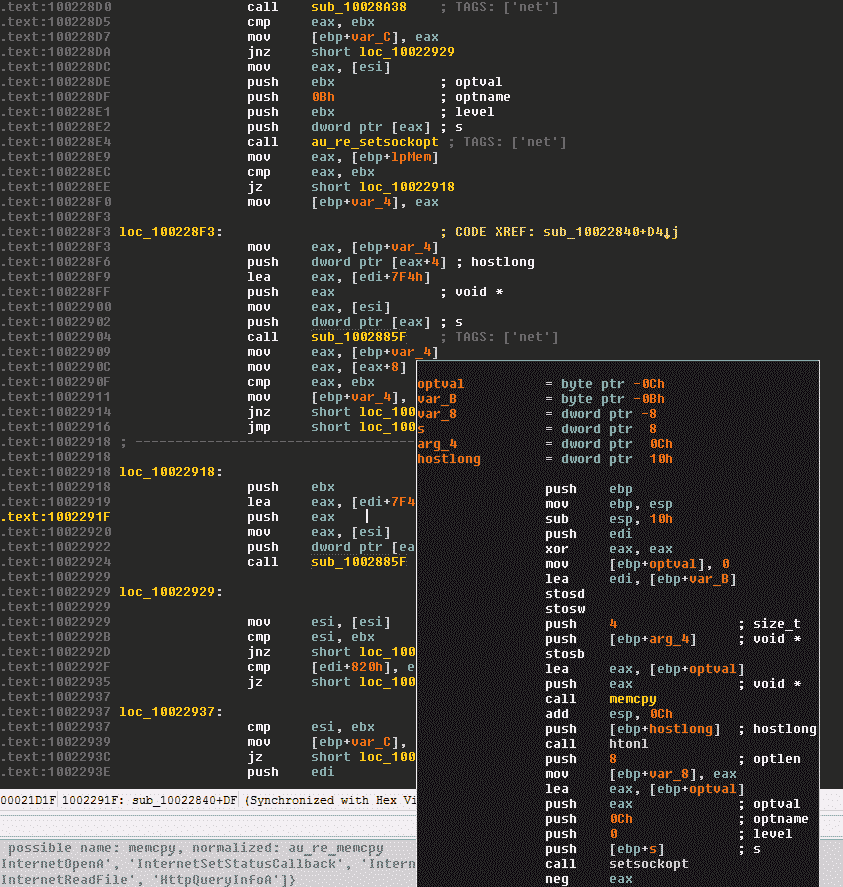
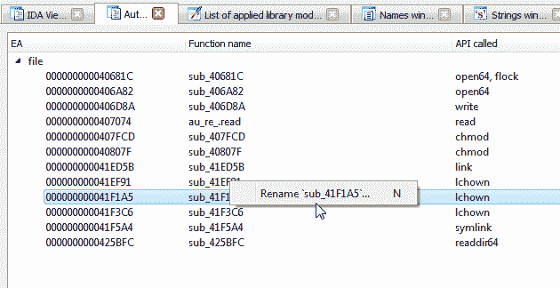

# Auto_Re:带有标签支持的 IDA PRO 自动重命名插件

> 原文：<https://kalilinuxtutorials.com/auto_re-ida-pro-auto-renaming-plugin/>

**Auto_re** 虚拟命名的函数，有一个 API 调用或跳转到导入的 API。

**在**之前

之后

**

**也可阅读-[UniFuzzer:一个基于 Unicorn 的闭源二进制文件的模糊工具&LibFuzzer](https://kalilinuxtutorials.com/unifuzzer/)**

*   根据内部调用的 API 指示符为函数分配标签
    *   将标记设置为可重复的函数注释，并在单独的视图中显示标记树

标签视图的一些截图:

标签在未探索的代码中的外观:

您可以使用上下文菜单或按下`n`热键轻松重命名功能:

**安装**

只需将`**auto_re.py**`复制到`**IDA\plugins**`目录，就可以通过`**Edit -> Plugins -> Auto RE**`菜单访问

[**Download**](https://github.com/a1ext/auto_re)**