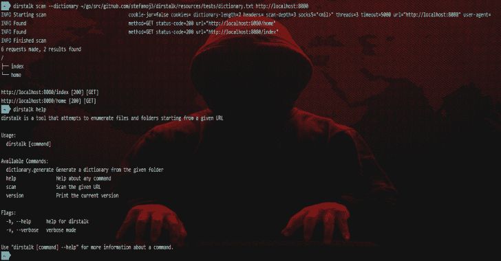

# dir stalk:dir buster/Dirb 的现代替代品

> 原文：<https://kalilinuxtutorials.com/dirstalk-modern-dirbuster-dirb/>

Dirstalk 是一个多线程应用程序，旨在暴力破解 web 服务器上的路径。该工具包含类似于 [dirbuster](https://www.owasp.org/index.php/Category:OWASP_DirBuster_Project) 和 [dirb](https://tools.kali.org/web-applications/dirb) 提供的功能。

在这里你可以看到它的作用:

**如何使用**

该应用程序是自文档化的，启动`dirstalk -h`将返回所有可用的命令和简短的描述，你可以通过执行`**distalk <command> -h**`获得每个命令的帮助。

例如**dirstalk result . diff-h**

**也可阅读-[Unicorn-Bios:Unicorn 引擎的基本 Bios 仿真器](https://kalilinuxtutorials.com/unicorn-bios/)**

**扫描**

要执行扫描，您至少需要提供一个字典和一个 URL:

**dirstalk 扫描 http://someaddress.url/–字典 mydictionary.txt**

如前所述，要查看 scan 命令可用的所有标志，只需调用带有`-h`标志的命令:

**直接扫描-h**

##### 如何定制扫描的示例:

dirstalk scan http://someaddress.url/ \
–dictionary my dictionary . txt \
–http-methods GET，POST \
–http-time out 10000 \
–扫描深度 10 \
–线程 10 \
–socks 5 127 . 0 . 0 . 1:9150 \
–cookie name = value \
–use-cookie-jar \
–user-agent my _ user _ agent \
–header "授权:Bearer 123

##### 当前可用的标志:

**–cookie string 数组**要添加到每个请求中的 cookie；eg name=value(可以多次指定)
**-d，–用于扫描的字典字符串**字典(本地文件或远程 url 的路径)
**–header string array**header 添加到每个请求中；eg name=value(可以多次指定)
**-h，–help**扫描帮助
**–http-cache-requests**缓存请求，以避免在同一扫描中多次执行相同的请求(例如，如果服务器多次回复相同的重定向位置，dirstalk 将只跟随一次)(默认为 true)
**–http-methods 字符串**要使用的 http 方法的逗号分隔列表；例如:GET，POST，PUT(默认[GET])
**–http-status-to-ignore**ints 显示和处理结果时要忽略的 http 状态的逗号分隔列表；例如:404，301(默认[404])
**–http-time out int**超时毫秒(默认 5000)
**–out string**路径存储结果输出的位置
**–scan-depth int**扫描深度(默认 3)
**–socks 5 string**socks 5 主机要使用的
**-t，–threads int**数量

##### 有用的资源

*   在这里你可以找到可以和 dirstalk 一起使用的字典
*   [tordock](https://github.com/stefanoj3/tordock) 是一个集装箱化的 Tor SOCKS5，你可以很容易地使用 dirstalk(只需`**docker run -d -p 127.0.0.1:9150:9150 stefanoj3/tordock:latest**`然后在启动扫描时指定以下标志:`**--socks5 127.0.0.1:9150**`)

**字典生成器**

Dirstalk 还可以生成自己的字典，例如，如果您想检查特定的文件集在给定的 web 服务器上是否可用，这是非常有用的。

##### 举例:

dirstall dictionary . generate/path/to/local/files–out my dictionary . txt

如果没有指定 out 标志，结果将被打印到 stdout。

**下载**

你可以从[这里](https://github.com/stefanoj3/dirstalk/releases)下载一份新闻稿，或者你可以使用 docker 图片。(例如`**docker run stefanoj3/dirstalk dirstalk <cmd>**`

如果你使用的是基于 arch 的 linux 发行版，你可以通过 https://aur.archlinux.org/packages/dirstalk/的 AUR 获取

示例:

**yay -S aur/dirstalk**

**开发**

进行本地开发所需要的就是让[使](https://www.gnu.org/software/make/)和 [golang](https://golang.org/) 可用，并正确配置 GOPATH。

然后，您可以克隆项目，进入文件夹并:

make dep #获取依赖关系
make tests #运行测试套件
make check #检查任何代码样式问题
make fix #使用 goimports 自动修复代码样式
make build #为您的主机操作系统构建可执行文件(未在 windows 下测试)

**制造帮助**

将打印 Makefile 中每个可用命令的描述。

想增加一项功能吗？修复 bug？分叉并创建一个 PR。

**未来的计划**

*   添加对旋转 SOCKS5 代理的支持
*   浏览网页，寻找暴力的链接
*   公开可用于启动扫描并检查其状态的 web 服务器
*   引入一些指标，这些指标可以给出在远程服务器上找到了多少字典

[**Download**](https://github.com/stefanoj3/dirstalk)