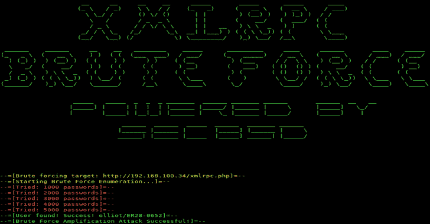

# XMLRPC:一个针对用 Python 3 编写的 WordPress 的强力工具

> 原文：<https://kalilinuxtutorials.com/xmlrpc-brute-forcer-wordpress-python/>

一个用 Python 3 写的针对 WordPress 的 **XMLRPC** 蛮力器。在 xmlrpc 暴力强制的上下文中，它比 Hydra 和 WpScan 更快。它可以每秒钟暴力破解 1000 个密码。

**用途**

**—python 3 xmlrcpbruteforce . py http://wordpress.org/xmlrpc.php 密码. txt 用户名
—python 3 xmlrpcbruteforce . py http://wordpress.org/xmlrpc.php 密码. txt userlist.txt ( > >进行中< < )**

**虫子**

如果你得到一个`**xml.etree.ElementTree.ParseError**`:

*   你忘了在 url 中添加“xmlrpc”吗？
*   尝试添加或删除“https”或“www”。

我正在处理异常。很快会修好的。

**也可阅读-[UniFuzzer:一个基于 Unicorn 的闭源二进制文件的模糊工具&LibFuzzer](https://kalilinuxtutorials.com/unifuzzer/)**

[**Download**](https://github.com/kavishgr/xmlrpc-bruteforcer)