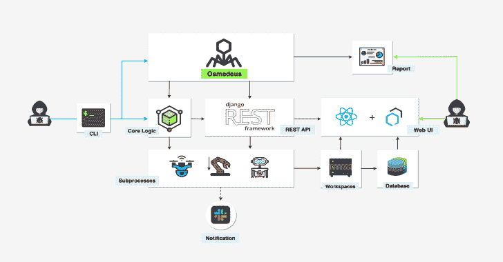
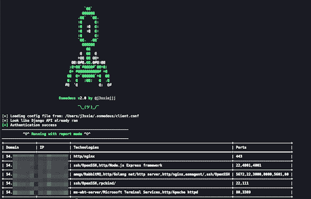
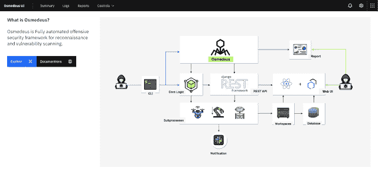
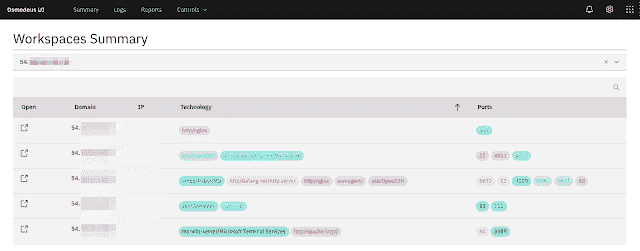
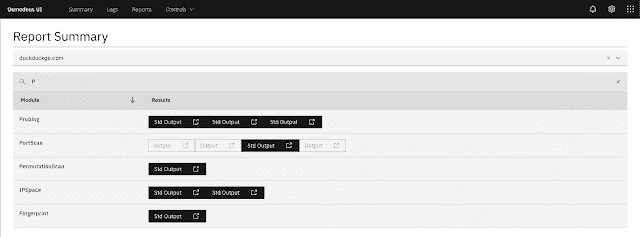

# osme deus–用于侦察和漏洞扫描的全自动攻击性安全框架

> 原文：<https://kalilinuxtutorials.com/osmedeus-fully-automated-offensive-security-framework/>

Osmedeus 是一个用于侦察和漏洞扫描的全自动攻击性安全框架

Osmedeus 允许您自动运行一系列出色的工具来侦察和扫描目标的漏洞。

**安装**

git 克隆 https://github.com/j3ssie/Osmedeus
CD osme deus
。/install.sh

这个安装只关注 Kali linux

**如何使用？**

如果你不知道你在做什么，只需输入下面的命令或查看高级用法

*   。/奥斯默德乌斯. example.com
*   特征
*   子域扫描。
*   子域接管扫描。
*   截图目标。
*   基本侦察，如 Whois，挖掘信息。
*   网络技术检测。
*   IP 发现。
*   彩色扫描。
*   SSL 扫描。
*   回溯机器发现。
*   URL 发现。
*   标题扫描。
*   端口扫描。
*   脆弱扫描。
*   单独的工作区存储所有扫描输出和详细记录。
*   REST API。
*   React Web UI。
*   支持连续扫描。
*   延期通知。
*   从命令行轻松查看报告。

**也可阅读-**[**Discover:用于自动化各种渗透测试任务的定制 Bash 脚本**](https://kalilinuxtutorials.com/discover-scripts-automate-penetration-testing/)

**演示**

**示例命令**

**#正常程序
。/osme deus . py-t example.com
。/osme deus . py-T list _ of _ target . txt**

**#常规，但子域模块
速度慢。/osme deus . py-t example.com–慢'全'**

**#直接模式示例
。/osme deus . py-m subdomain-t example.com
。/osme deus . py-m ports can-I " 1 . 2 . 3 . 4/24 "**

**。/osmedeus.py -m "portscan，vulnscan "-I " 1 . 2 . 3 . 4/24 "-w result _ folder
。/osme deus . py-m " git "-I ' repo:https://github . com/foo/bar '
。/osme deus . py-m " git "-I ' user:sample '**

**#直接列表模式示例
。/osme deus . py-m ports can-I list _ of _ targets . txt
。/osmedeus.py -m portscan，vulnscan-I list _ of _ targets . txt
。/osme deus . py-m screen-I list _ of _ targets . txt-w result _ folder**

**#报告模式
。/osemdeus . py-t example.com–报告列表
。/osemdeus . py-t example.com-报告导出
。/osemdeus . py-t example.com-报告摘要
。/osemdeus . py-t example.com——报道短
。/osemdeus . py-t example.com–报告全文**

**免责声明**

这个工具的大部分是由 CREDITS.md 中列出的工具的作者完成的。我只是将所有的部分放在一起，加上一些额外的魔法。

该工具仅用于教育目的。你要对自己的行为负责。如果你在使用这个软件时搞砸了一些事情或者违反了任何法律，那是你的错，而且仅仅是你的错。

**演职员表:**[@ j 3s iejjj](https://twitter.com/j3ssiejjj)， [@gujjuboy10x00](https://twitter.com/vis_hacker)

[Download](https://github.com/j3ssie/Osmedeus)