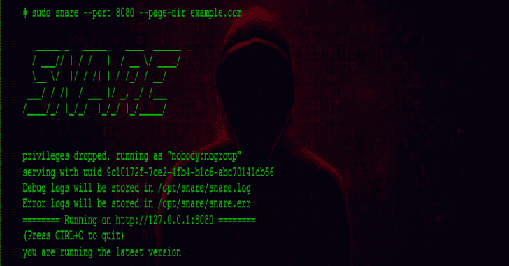
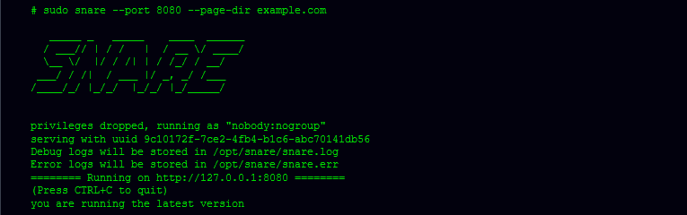

# 陷阱:超级下一代高级反应蜜罐

> 原文：<https://kalilinuxtutorials.com/snare-super-next-generation-advanced-reactive-honeypot/>

陷阱是一个超级下一代先进的反应蜜罐。这是一个 web 应用程序蜜罐传感器，吸引了来自互联网的各种恶意。

**基本概念**

*   先浮出水面。重点关注攻击面生成。
*   传感器和主机。轻量级收藏家和中央决策者(坦纳)。

**入门**

*   你需要 Python3。我们主要使用> =3.5 进行测试
*   这是用最近的基于 Ubuntu 的 Linux 测试的。

**也可以读作-[r buster:又一个恐怖分子](https://kalilinuxtutorials.com/rbuster-dirbuster/)**

**设置步骤**

*   使用`**git clone https://github.com/mushorg/snare.git**`和`**cd snare**`获取工具
*   安装要求:`**sudo pip3 install -r requirements.txt**`
*   使用`**sudo python3 setup.py install**`设置工具
*   克隆页面:`**sudo clone --target http://example.com**`
*   跑步陷阱:`**sudo snare --port 8080 --page-dir example.com**`
*   测试:访问[http://localhost:8080/index . html](http://localhost:8080/index.html)
*   (可选)运行您自己的 tanner 服务。

**Docker 构建指令**

将当前目录更改为项目目录
docker-compose build
docker-compose up

**测试**

为了运行测试并获得测试覆盖报告，我们建议运行`pytest`:

**pip install pytest pytest-cov
sudo pytest–cov-report term-missing–cov = snare/tests/**

**样本输出**

[Download](https://github.com/mushorg/snare)