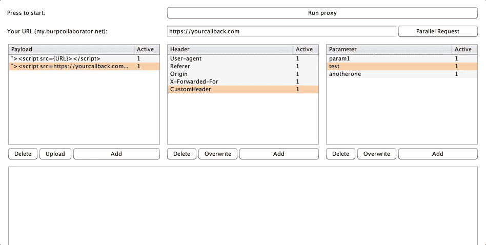
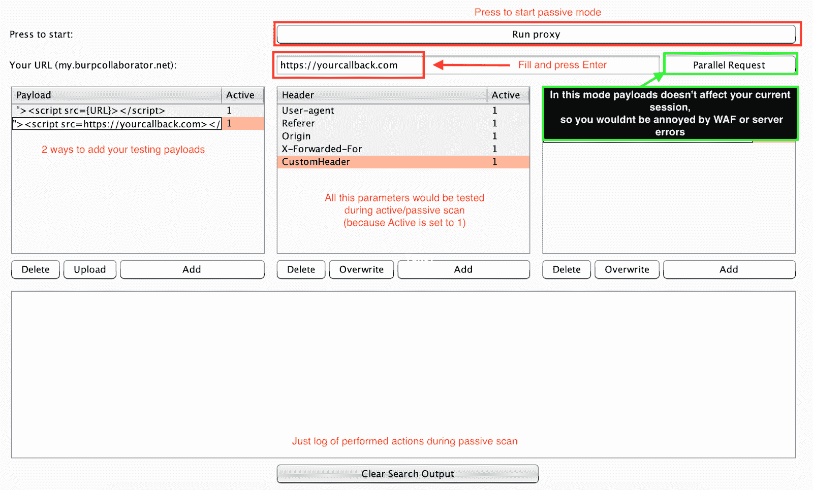

# Femida:自动盲 XSS 搜索打嗝组曲

> 原文：<https://kalilinuxtutorials.com/femida-automated-blind-xss-burp-suite/>

Femida 是为 Burp 套件设计的自动 blind-xss 搜索插件。

**安装**

Git 克隆[https://github.com/wish-i-was/femida.git](https://github.com/wish-i-was/femida.git)
打嗝- >扩展器- >添加- >查找并选择 blind-xss.py

**又读-[物联网植入:物联网设备植入攻击工具包](https://kalilinuxtutorials.com/iot-implant-toolkit-for-implant-attack/)**

**怎么用？**

**设置**

首先，你需要在名为“你的 url”的字段中设置你的回拨 URL，并按回车键自动将其保存在 config.py 文件中。

设置好之后，你需要用你的 OOB-XSS 向量填充有效载荷表，这样 extension 就能把你的有效载荷注入到输出请求中。

请注意，您需要在有效载荷中设置{URL}别名，这样扩展将能够从“您的 URL”字段中获取数据，并将其直接设置到您的有效载荷中。

**行为**

Femida 是随机驱动的扩展，所以在你的主动或被动扫描期间，每一个在“主动”行中带有“1”的有效载荷将被随机使用。因此，如果你想从测试中排除任何有效载荷或参数/头，只需将“活动”值更改为 0。

**有效载荷**

*   使用`**Upload**`或`**Add**`按钮将有效载荷添加到表格中。
*   **不要忘记**关于`**{URL}**`你的有效载荷中的参数。
*   当您在表格中添加任何数据时，`**Active**`行将手动等于`1`。(表示它现在处于活动状态)
*   如果您想使**无效**–将`**Active**`行设置为`0`

**表头&参数**

*   您可以使用`Add`按钮手动添加数据，也可以在`Target` / `Proxy` / `Repeater`中点击右键添加数据。

*   不要忘记，taht 头和参数是`**case insensitive**`。
*   如果您想使**无效**–将`**Active**`行设置为`0`。

**用法**

扩展能够执行主动和被动检查。

安装完成后，你就可以开始使用扩展了。第一种情况是被动检查，因此我们现在将介绍这一过程:

*   按下按钮“运行代理”，而它的活动扩展正在寻找配置的参数和标题。成功找到后，它把有效载荷放入其中。如果你在测试过程中发现一些问题(晶圆或错误等)。)您可以打开“并行请求”按钮，这样所有带有有效负载的请求都将作为带有有效负载的重复请求在后台发送，但是您的主会话将是清晰的，因此您将能够通过监视调试日志来检查一切是否正确。

[**Download**](https://github.com/wish-i-was/femida)