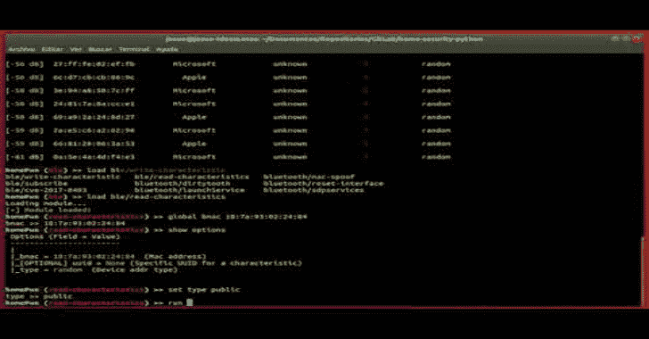

# HomePWN:用于物联网设备测试的瑞士军刀

> 原文：<https://kalilinuxtutorials.com/homepwn-swiss-army-knife-pentesting-iot-devices/>

**HomePwn** 是一个框架，提供审计和测试设备的功能，公司员工可以在日常工作中和相同的工作环境中使用这些设备。

它旨在发现家庭或办公室中的设备，利用某些漏洞读取或发送数据到这些设备。凭借强大的模块库，您可以使用该工具加载新功能，并在各种设备中使用它们。

HomePwn 有一个模块化的架构，任何用户都可以在其中扩展关于不同技术的知识库。原则上它有两个不同的组成部分:

*   发现模块。这些模块提供与发现阶段相关的功能，而不考虑要使用的技术。例如，它可以用于在监控模式下通过适配器进行 WiFi 扫描，发现 BLE 设备、蓝牙低能耗、附近的其他设备并查看其连接状态等。此外，它还可以用于发现使用 SSDP 或简单服务发现协议和 MDNS 或多播 DNS 等协议的家庭或办公室物联网服务。
*   待审核技术的特定模块。另一方面，有针对被审核技术的特定模块。如今，HomePwn 可以对 WiFi、NFC 或 BLE 等技术进行审计测试。换句话说，这些技术中的每一种都有模块，其中实现了不同的已知漏洞或不同的技术，以评估设备的安全级别，并与这种技术进行通信。

**又读-[FOCA:寻找元数据的工具&文档中隐藏的信息](https://kalilinuxtutorials.com/foca-metadata-hidden-documents/)**

**安装所有必需品**

要安装 Ubuntu 18.04 或其衍生版本中的所有依赖项，请使用 install.sh 文件

**>须藤 apt-get 更新
>须藤。/install.sh**

该脚本会询问您是否想要创建一个虚拟环境，如果您的回答是“y ”,那么它会在虚拟环境中安装 python 库，如果不是在系统本身中的话

**用法**

要运行该脚本，如果您在安装中选择了虚拟环境，请执行下一个命令来激活虚拟环境:

**>源 homePwn/bin/activate**

启动应用程序:

**>sudo python 3 homepwn . py**

**例子**

这里有一些视频来看看这个工具是如何工作的。

**HomePwn。蓝牙低能耗 PoC &黑客**

[https://www.youtube.com/embed/JgbIsP7IGxo?feature=oembed&enablejsapi=1](https://www.youtube.com/embed/JgbIsP7IGxo?feature=oembed&enablejsapi=1)

**HomePwn。蓝牙欺骗**

[https://www.youtube.com/embed/o9P1BwlHelM?feature=oembed&enablejsapi=1](https://www.youtube.com/embed/o9P1BwlHelM?feature=oembed&enablejsapi=1)

**HomePwn。NFC 克隆**

[https://www.youtube.com/embed/ZLas04ZCTLU?feature=oembed&enablejsapi=1](https://www.youtube.com/embed/ZLas04ZCTLU?feature=oembed&enablejsapi=1)

**HomePwn。BLE 对 PCAP 文件的捕获(嗅探)**

[https://www.youtube.com/embed/vw9nr584PJQ?feature=oembed&enablejsapi=1](https://www.youtube.com/embed/vw9nr584PJQ?feature=oembed&enablejsapi=1)

**HomePwn。QR 选项破解**

[https://www.youtube.com/embed/ta1DbnWOF8M?feature=oembed&enablejsapi=1](https://www.youtube.com/embed/ta1DbnWOF8M?feature=oembed&enablejsapi=1)

**HomePwn。苹果 BLE 发现**

[https://www.youtube.com/embed/xOU34op7Gls?feature=oembed&enablejsapi=1](https://www.youtube.com/embed/xOU34op7Gls?feature=oembed&enablejsapi=1)

**HomePwn。小米物联网广告**

[https://www.youtube.com/embed/Xi7KZibJsfE?feature=oembed&enablejsapi=1](https://www.youtube.com/embed/Xi7KZibJsfE?feature=oembed&enablejsapi=1)

**免责声明！**

本软件(仅用于教育目的)按“原样”提供，不含任何明示或暗示的担保，包括但不限于对适销性、特定用途适用性和不侵权的担保。在任何情况下，作者或版权所有者都不对任何索赔、损害或其他责任负责，无论是在合同诉讼、侵权诉讼或其他诉讼中，还是在与软件或软件的使用或其他交易相关的诉讼中。

[**Download**](https://github.com/ElevenPaths/HomePWN)