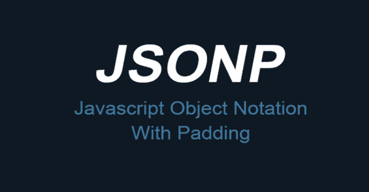

# JSONBee:一个现成的 JSONP 端点/有效负载，有助于绕过不同网站的内容安全策略

> 原文：<https://kalilinuxtutorials.com/jsonbee-jsonp-endpoints-payloads/>

a 准备使用 **JSONP** 端点来帮助绕过不同网站的内容安全策略。该工具在基辅举行的 HackIT 2018 上展示。

这个工具背后的主要思想是找到 JSONP 端点，以自动的方式帮助您绕过目标网站的内容安全策略。JSONBee 接受 url 名称的输入(即[https://www.facebook.com](https://www.facebook.com))，解析 CSP(内容-安全-策略)，并自动建议绕过 CSP 的 XSS 有效负载。它主要关注在我的 bug 赏金猎人活动中收集的 JSONP 端点，可以用来绕过 CSP。

JSONBee 依靠 3 种方法来收集 JSONP 端点:

*   该项目的存储库；
*   谷歌呆子；
*   互联网档案(archive.org)。

该工具尚未完全完成，因为我还在添加一些验证和功能。然而，存储库将被托管在这里，以便任何人都可以使用它，直到工具准备就绪。

repo 包含随时可用的有效载荷，可以绕过 CSP 用于 Facebook.com、Google.com 等地。

**也可阅读-[陷阱:超级下一代高级反应蜜罐](https://kalilinuxtutorials.com/snare-super-next-generation-advanced-reactive-honeypot/)**

**绕过 Facebook.com 内容安全策略:**

Facebook.com 在其 CSP 策略(script-src 指令)中允许*.google.com，因此，在 Facebook . com 上执行 JavaScript 时，下面的有效负载将非常有用:`**">**`

如果您遇到一个网站，该网站在其 script-src 指令中信任 jsonp.txt 文件中的任何域，那么选择一个与该域匹配的有效负载并从中获得乐趣。

[**Download**](https://github.com/zigoo0/JSONBee)