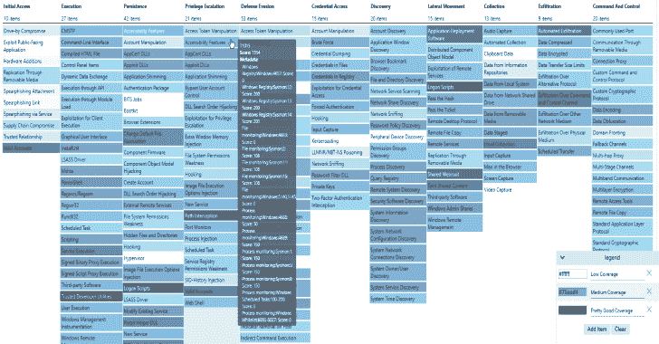

# ATTACKdatamap:事件级别的数据源评估，以显示潜在的覆盖范围

> 原文：<https://kalilinuxtutorials.com/attackdatamap-datasource-assessment/>

**ATTACKdatamap** 是事件级别的数据源评估，用于显示“米特 ATT & CK”框架的潜在覆盖范围。这个工具是我开发的，与“MITRE”和它伟大的“ATT & CK”团队没有任何关系，开发它的目的是为了简化数据源的映射以评估一个人的潜在覆盖范围。

**开始**

此工具需要模块导入 Excel，安装如下

安装模块导入 Excel

使用导入模块

**导入-模块。\ATTACKdatamap.psd1**

**也可理解为-[home pwn:用于测试物联网设备的瑞士军刀](https://kalilinuxtutorials.com/homepwn-swiss-army-knife-pentesting-iot-devices/)**

**请求-攻击请求**

生成一个 JSON 文件，导入到 ATT 和 CK 导航器中。mitre_data_assessment.xlsx 文件包含所有技术，可以通过 Invoke-ATTACK-UpdateExcel 进行更新。

每项技术都包含数据源，由我用权重单独打分。DataSourceEventTypes 需要根据环境进行评分。

这个脚本将各自的数据源得分相乘，并将它们加到总技术得分上。生成日期被添加到描述中。

**例子**

PS C:>请求-攻击 json -Excelfile。\ mitre _ data _ assessment . xlsx-Template。\ template . JSON-Output 2019-03-23-attack coverage . JSON

这些都被收集到一个 JSON 文件中，可以在这里打开；[米特 ATT & CK 领航员/企业/](https://mitre-attack.github.io/attack-navigator/enterprise/)

**调用-攻击-更新 Excel**

这将在一个表格中生成所有米特 ATT&CK 相关字段，并在 Excel 表中创建或更新 REF-DataSources 工作表

**例子**

PS C:>调用-攻击-更新 excel-攻击路径。\ enterprise-attack . JSON-excel file。\mitre_data_assessment.xlsx

-AttackPath 和-Excelfile 参数是可选的

**获取-攻击数据**

这将下载米特 ATT&CK 企业 JSON 文件

**例子**

**PS C:>Get-attack data-attack path。/enterprise-attack.json**

-AttackPath 参数是可选的

[**Download**](https://github.com/olafhartong/ATTACKdatamap)