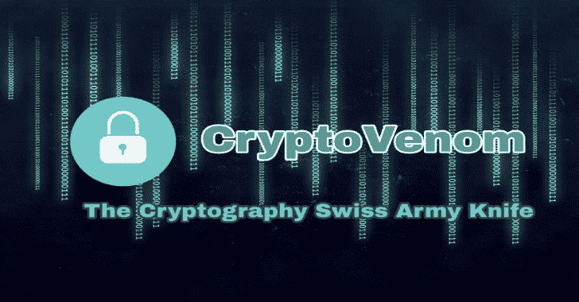

# Cryptovenom:密码学瑞士军刀

> 原文：<https://kalilinuxtutorials.com/cryptovenom-cryptography-swiss-army-knife/>

**CryptoVenom** 是一款开源工具，集多种密码系统和密码分析方法于一身，包括经典算法、哈希算法、编码算法、逻辑门、数学函数、现代对称和非对称加密等。

**隐毒液的用途是什么？**

使密码分析或密码系统的使用和操作更容易。如果你是一名 CTF 玩家或者只是一名好奇的学生，这是你的工具！

它只适用于 linux，我只在 kali 和 Parrot OS 中测试过，如果你在另一个地区，有问题请告诉我。安装是一个非常简单的过程，只要以 root 用户身份执行 setup.py 文件，依赖项就会被安装。

**也可阅读-[Femida:自动盲人 XSS 搜索打嗝组曲](http://kalilinuxtutorials.com/femida-automated-blind-xss-burp-suite/)**

**内容**

**[+]古典**

[*] *凯撒*
[*】维格纳密码
[*] *公平密码*
[*]波利比乌斯广场
[*] *莫尔斯*
[*】阿特巴什
[*] *培根*[*]auto key
[*]*博福特密码*
[*] Railfence 密码
[*] 【T2 porta
[*]*running key*
[*]adfg VX 密码
[*] *ADFGX 密码*
[*]仿射密码
[*] Vernam 密码

**[+]不对称**

[*]*RSA*
[*]Diffie-Hellman
[*]*DSA*
[*]ECC(椭圆曲线密码)

**[+]对称**

[*] *AES / Rijndael(高级加密算法)*
[*] DES(数据加密标准)
[*] *XOR 密码*
[*]Blowfish
[*]*two fish*
[*]3 DES/TDES(三重 DES)
[*] *RC2(罗恩的代码 2)*
[*] RC4(罗恩的代码 4)
[*]

**[+]编码**

[*]*base 16*
[*]base 32
[*]*base 64*
[*]base 58
[*]*base 85*
[*]base 91
[*]*十六进制*
[*]八进制
[*] *十进制*
[*]二进制
[*] 【T20

**[+]哈希**

[*]*MD5*
[*]SHA-1
[*]*SHA-224*
[*]SHA-256
[*]*SHA-384*
[*】*MD2*
[*】MD4
[*]*argon 2*
[*]BCrypt
[*]*BigCrypt unicrypt *DES Crypt Unix*
[*]FreeBSD Unix
[*]*HMAC*
[*]LDAP-MD5
[*]*LDAP Salted MD5*
[*]LDAP SHA-1
[*]*LDAP Salted SHA-1*
[*]lm Hash
[*]*MD5 Unix*
[*] *NTLM 哈希*
[*]Oracle 10 哈希
[*] *Oracle 11 哈希*
[*]PHPass 哈希
[*]*PostgreSQL MD5*
[*]RIPEMD
[*]*SCrypt*
[*]SHA-256 Unix
[*]【T84*

**[+]字符串操作**

[*] *反串*
[*]块反串
[*] *串到上*
[*]串到下
[*] *单字节列表*
[*]反例
[*] *删除空格*
[*]删除回车
[*] *串替换*
[*]添加行号

**[+]数学函数**

[*] *快速求幂算法*
[*]扩展欧几里德算法
[*]求两个素数的乘积

**[+]其他**

[*]*XOR*
[*]AND
[*]*NAND*
[*]NOT
[*]*OR*
[*]也不是
[*] *[*]PGP 运算*

 *# 计划添加功能

*   文件散列
*   完成抗裂剂
*   PGP 操作
*   算法标识符
*   椭圆曲线加密(ECC)
*   埃尔加马尔
*   针对对称算法的暴力破解者和破解者
*   更多的破解者和野蛮人对抗经典算法
*   计算文件熵
*   与 TCP 套接字的密钥交换
*   更多的错误处理和“尝试/例外”
*   更多可定制选项
*   hash bruteforcer 中的更多编码
*   为每个哈希算法添加 HMAC-(哈希)
*   请:如果你想在工具中添加任何东西，请联系我，我会把它添加到下一个版本中！

[**Download**](https://github.com/lockedbyte/cryptovenom)*