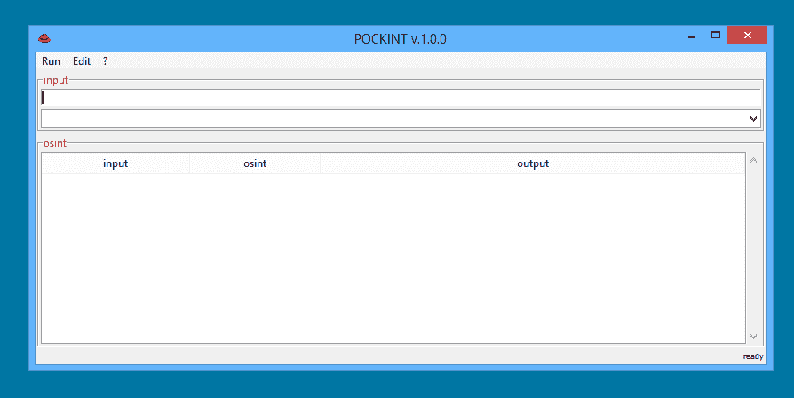

# Pockint:为 DFIR/OSINT 专业人士设计的便携式 OSINT 瑞士军刀

> 原文：<https://kalilinuxtutorials.com/pockint-portable-osint-swiss-army-knife-dfir-osint/>

POCKINT (又名袖珍情报)是为 DFIR/OSINT 专业人士设计的 OSINT 瑞士军刀。它被设计为一个轻量级和便携式 GUI 程序(在 USB 或调查 VMs 中携带)，以紧凑的形式为用户提供基本的 OSINT 功能:POCKINT 的输入框接受典型的指示符(URL、IP、MD5 ),并使用户能够以可重复的方式执行基本的 OSINT 数据挖掘任务。

你可以从[发布页面](https://github.com/netevert/pockint/releases)获取最新版本。POCKINT 是作为单个可执行文件提供的，可以在计算机上的任何地方存储和运行。POCKINT 适用于 Windows 和 Linux 平台。

**也可理解为-[attack data map:事件级别的数据源评估，以显示潜在的覆盖范围](http://kalilinuxtutorials.com/attackdatamap-datasource-assessment/)**

**特性**

为什么要用？POCKINT 被设计成简单、便携和强大的。

*   ⭐️ **简单**:现在有太多太棒的在线工具了。问题是它们要么要求分析师对命令行相当熟悉(想想 [pOSINT](https://github.com/ecstatic-nobel/pOSINT) )，要么给你太多的功能(想想 [Maltego](https://www.paterva.com/web7/) )。POCKINT 重在简单:*输入* > *运行变换* > *输出* …冲洗并重复。它是通过简单的界面快速轻松获得结果的理想工具。
*   📦**便携**:大多数工具要么需要安装，要么需要许可，要么需要配置。无论何时何地，普金特都准备好了。把它放入你的 USB，调查虚拟机或笔记本电脑，它就会运行。
*   🚀**强大的** : POCKINT 结合了廉价的 OSINT 资源(whois/DNS)和专业的[API 的力量](https://www.theguardian.com/media/pda/2007/dec/14/thenutshellabeginnersguide)。从一开始，您就可以使用一套内置的转换。添加几个 API 键，你就可以开启更专业的数据挖掘功能。

最新版本能够运行以下数据挖掘任务:域 IP 地址 URL 哈希电子邮件

新的 API 和输入集成不断被添加到工具中。查阅[路线图](https://github.com/netevert/pockint/milestones)以了解正在酝酿什么或者[提出](https://github.com/netevert/pockint/issues)你自己最喜欢的 API/输入。

**演职员表:** [奥拉夫·哈通](https://twitter.com/olafhartong)，[乌列尔](https://github.com/0x557269656C)，[杰克·克雷普斯](https://twitter.com/jakecreps) & [西蒙·比尔斯](https://twitter.com/si_biles)

[**Download**](https://github.com/netevert/pockint)