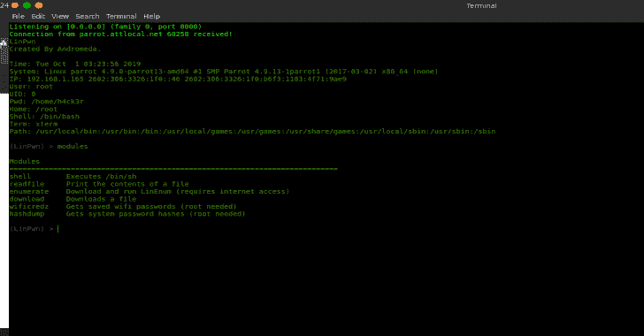

# LinPwn:交互式后期开发工具

> 原文：<https://kalilinuxtutorials.com/linpwn-interactive-post-exploitation-tool/>

LinPwn 是一款交互式工具，旨在帮助您进行漏洞利用后枚举和权限提升。

**连接**

*   在连接类中设置您希望它连接的 IP 和端口。
*   将 LinPwn 二进制文件放在目标机器上。
*   在您的机器上运行`**nc -lvp PORT**`,然后在目标机器上运行 LinPwn 来获得连接。

**也可阅读-[JSONBee:一个准备好使用 JSONP 端点/有效负载来帮助绕过不同网站的内容安全策略](https://kalilinuxtutorials.com/jsonbee-jsonp-endpoints-payloads/)**

**用法**

1.  shell 该命令执行/bin/sh
    示例用法:`**(LinPwn: Shell) > id**`
    键入 exit 返回 LinPwn。

2.  readfile–该命令将打印文件的内容。
    示例用法:`**(LinPwn: ReadFile)> /etc/passwd**`
    键入 exit 返回 LinPwn。

3.  enumerate–此命令运行 LinEnum.sh
    示例用法:`**(LinPwn) > enumerate**`
4.  download–该命令下载目标机器上的文件
    示例用法:`**(LinPwn: Download) > https://exampleurl.com/file_to_download**`
5.  wificredz–该命令收集保存的 wifi 密码
6.  hashdump–该命令收集系统密码散列

**编译**

我包含了一个名为 build.sh 的文件，这是可选的运行`bash build.sh`来查看构建选项，如果你想使用它们的话。

[**Download**](https://github.com/3XPL017/LinPwn)