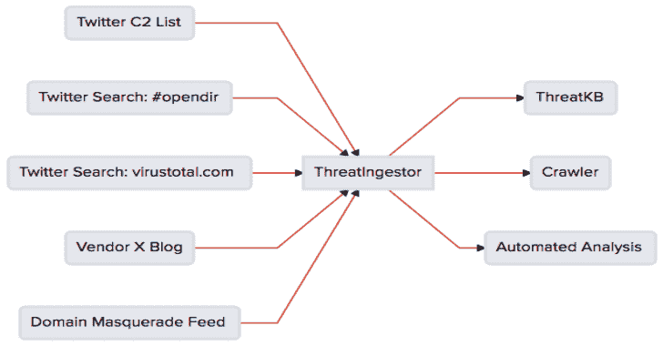

# 威胁情报官:提取和汇总威胁情报

> 原文：<https://kalilinuxtutorials.com/threatingestor-threat-intelligence/>

ThreatIngestor 是一个可扩展的工具，用于从威胁源中提取和聚合 IOC。集成了开箱即用的 [ThreatKB](https://github.com/InQuest/ThreatKB) 和 [MISP](https://www.misp-project.org/) ，并可以无缝地适应任何现有的工作流与 [SQS](https://aws.amazon.com/sqs/) 、[豆茎](https://beanstalkd.github.io/)和[定制插件](https://inquest.readthedocs.io/projects/threatingestor/en/latest/developing.html)。

**概述**

它可以配置为监视 Twitter、RSS 源或其他来源，提取恶意 IP/域和 YARA 签名等有意义的信息，并将这些信息发送到另一个系统进行分析。

**也可阅读-[pock int:为 DFIR/OSINT 专业人士准备的便携式 OSINT 瑞士军刀](http://kalilinuxtutorials.com/pockint-portable-osint-swiss-army-knife-dfir-osint/)**

**安装**

它需要 Python 3.6+，带有开发头。

从 PyPI 安装 ThreatIngestor:

**pip 安装威胁指示器**

根据需要，安装使用某些插件的可选依赖项:

**pip 安装威胁提示器【全部】**

查看[完整安装说明](https://inquest.readthedocs.io/projects/threatingestor/en/latest/installation.html)了解更多信息。

**用途**

创建一个新的`config.yml`文件，并配置您想要使用的每个源和操作员模块。(布局见`config.example.yml`。)然后运行脚本:

**threatingestor config.yml**

默认情况下，它将永远运行，每 15 分钟轮询一次每个配置的源。

查看[完整威胁处理器文档](https://inquest.readthedocs.io/projects/threatingestor/)了解更多信息。

**插件**

ThreatIngestor 使用带有“源”(输入)和“操作符”(输出)插件的插件架构。当前支持的集成有:

**来源**

*   [豆茎工作队列](https://inquest.readthedocs.io/projects/threatingestor/en/latest/sources/beanstalk.html)
*   [Git 仓库](https://inquest.readthedocs.io/projects/threatingestor/en/latest/sources/git.html)
*   [GitHub 知识库搜索](https://inquest.readthedocs.io/projects/threatingestor/en/latest/sources/github.html)
*   [RSS 源](https://inquest.readthedocs.io/projects/threatingestor/en/latest/sources/rss.html)
*   [亚马逊 SQS 排队](https://inquest.readthedocs.io/projects/threatingestor/en/latest/sources/sqs.html)
*   [推特](https://inquest.readthedocs.io/projects/threatingestor/en/latest/sources/twitter.html)
*   [通用网页](https://inquest.readthedocs.io/projects/threatingestor/en/latest/sources/web.html)

**操作员**

*   [豆茎工作队列](https://inquest.readthedocs.io/projects/threatingestor/en/latest/operators/beanstalk.html)
*   [CSV 文件](https://inquest.readthedocs.io/projects/threatingestor/en/latest/operators/csv.html)
*   [MISP](https://inquest.readthedocs.io/projects/threatingestor/en/latest/operators/misp.html)
*   [MySQL 表](https://inquest.readthedocs.io/projects/threatingestor/en/latest/operators/mysql.html)
*   [SQLite 数据库](https://inquest.readthedocs.io/projects/threatingestor/en/latest/operators/sqlite.html)
*   [亚马逊 SQS 排队](https://inquest.readthedocs.io/projects/threatingestor/en/latest/operators/sqs.html)
*   [ThreatKB](https://inquest.readthedocs.io/projects/threatingestor/en/latest/operators/threatkb.html)
*   [推特](https://inquest.readthedocs.io/projects/threatingestor/en/latest/operators/twitter.html)

查看[完整的 ThreatIngestor 文档](https://inquest.readthedocs.io/projects/threatingestor/)以获得更多关于包含的插件以及如何创建自己的插件的信息。

**威胁情报来源**

寻找一些威胁情报来源开始？研讯有一个 Twitter 列表，上面有几个发布 C2 域名和 IP 的账户:[https://twitter.com/InQuest/lists/ioc-feed](https://twitter.com/InQuest/lists/ioc-feed)。请注意，您需要申请一个 Twitter 开发者帐户才能使用 ThreatIngestor Twitter 源。看看`config.example.yml`看看如何设置这个列表作为一个来源。

为了更快地设置，RSS 提要是一个很好的情报来源。查看这个例子 [RSS 配置文件](https://github.com/InQuest/ThreatIngestor/blob/master/rss.example.yml)中一些预先配置的安全博客。

[**Download**](https://github.com/InQuest/ThreatIngestor)