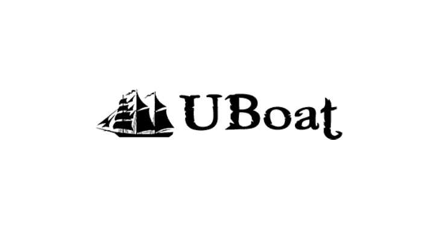

# UBoat : HTTP 僵尸网络项目

> 原文：<https://kalilinuxtutorials.com/uboat-http-botnet/>

UBoat 是一个 POC HTTP 僵尸网络，旨在复制一个完全武器化的商业僵尸网络。

**什么是僵尸网络？**

当 [HTTP 协议](http://tools.ietf.org/html/rfc2616)在 1999 年诞生时，没有人想到它会被最危险的网络威胁之一[僵尸网络](http://securityaffairs.co/wordpress/12655/cyber-crime/botnet-organization-easy-and-cheap.html)所利用。机器人是一种可以比人更快地执行和重复特定任务的应用程序。当大量的僵尸程序感染不同的目标(如电脑和[移动](http://securityaffairs.co/wordpress/12862/malware/mobile-botnets-from-anticipation-to-reality.html)设备)并相互连接时，它们就形成了一个僵尸网络或僵尸网络。一个僵尸网络由三个主要元素组成:僵尸程序、命令和控制服务器(C & C ),以及一个设计和控制僵尸网络的老练的攻击者，即僵尸大师。

第一代[僵尸网络](http://resources.infosecinstitute.com/botnets-and-cybercrime-introduction/)利用互联网中继聊天或 IRC 以及相关渠道建立中央指挥控制机制。IRC 机器人在连接到选定的频道时遵循推送方式，并保持连接模式。它们连接到由僵尸主机选择的 IRC 服务器和频道，并等待命令。尽管 IRC 僵尸网络易于使用、控制和管理，但它们有一个主要的缺点。

**特性**

*   用 C++编码，没有依赖性
*   加密的 C&C 通信
*   坚持不懈，防止你失控
*   连接冗余(使用备用服务器地址或域)
*   DDoS 方法(TCP 和 UDP 泛洪)
*   任务创建系统(改变系统 HWID，国家，IP，操作系统。系统)
*   远程命令
*   更新和卸载其他恶意软件
*   下载并执行其他恶意软件
*   主动和被动键盘记录器
*   启用 Windows RDP
*   易于功能更新的插件系统

**也可阅读-[LinPwn:交互式帖子开发工具](http://kalilinuxtutorials.com/linpwn-interactive-post-exploitation-tool/)**

**入门？**

*   点击[这里](https://github.com/Souhardya/UBoat/releases)下载机器人。
*   点此关注维基 **[。](https://github.com/Souhardya/UBoat/wiki)**

**截图**

**免责声明**

该项目应仅用于授权测试或教育目的。

创建这个攻击性项目的主要目的是帮助安全研究人员，并增强对商业 HTTP loader 风格僵尸网络的理解。我希望这个项目有助于恶意软件研究社区，人们可以开发有效的对策🙂

未经双方事先同意使用 uboat 可能会被视为非法行为。最终用户有责任遵守所有适用的地方、州和联邦法律。作者不承担任何责任，也不对该程序造成的任何误用或损害负责。

[**Download**](https://github.com/Souhardya/UBoat#features)