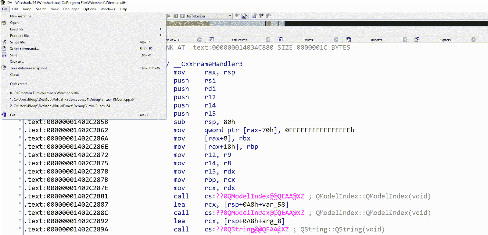
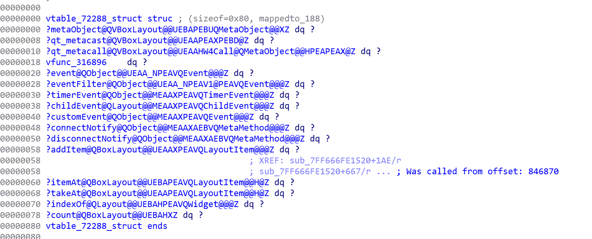
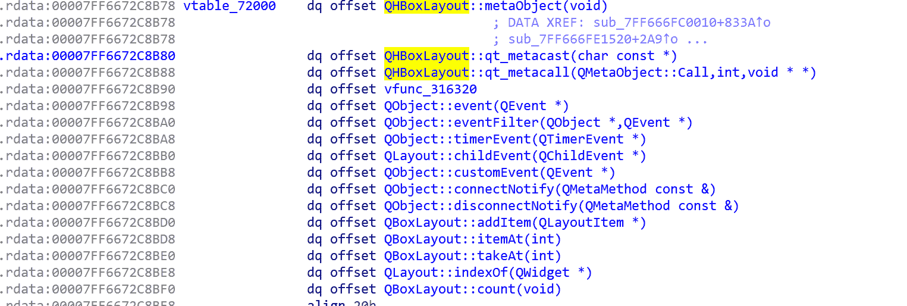
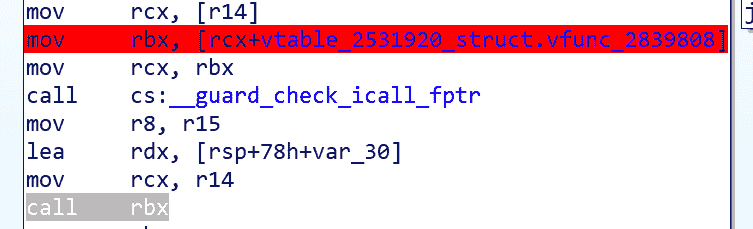
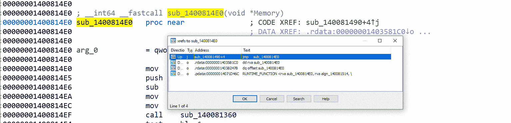

# Virtuailor : IDAPython 工具，用于在 IDA Pro 中创建自动 C++虚拟表

> 原文：<https://kalilinuxtutorials.com/virtuailor-idapython-tool/>

**Virtuailor** 是一款 IDAPython 工具，为针对英特尔架构编写的 C++代码重构 vtables，包括 32 位和 64 位代码以及 AArch64(新！).该工具由静态和动态两部分组成。

第一个是静态部分，包含以下功能:

*   检测间接呼叫。
*   使用条件断点(挂钩代码)挂钩间接调用的赋值。

第二个是动态部分，包含以下功能:

*   创建 vtable 结构。
*   重命名函数和 vtables 地址。
*   向程序集间接调用添加结构偏移量。
*   从对虚函数的间接调用中添加外部参照(多个外部参照)。
*   For AArch64-尝试修复未定义的 vtables 和相关虚函数(支持固件)。

**也可阅读-[LinPwn:交互式帖子开发工具](https://kalilinuxtutorials.com/linpwn-interactive-post-exploitation-tool/)**

**怎么用？**

*   默认情况下，Virtuailor 会在代码的所有地址中寻找虚拟调用。如果您想将代码限制在特定的地址范围内，没问题，只需编辑 *Main* 文件，将您想要的范围添加到变量 start_addr_range 和 end_addr_range 中:

if _ _**name _ _**= = ' _ _**main _ _**':

start _ addr _ range = IDC。MinEA() #你可以改变虚拟呼叫地址范围
end_addr_range = idc。MaxEA()
添加 _bp_to_virtual_calls(开始 _ 地址 _ 范围，结束 _ 地址 _ 范围)

*   可选(但强烈建议)，创建 idb 的快照。只需按 ctrl+shift+t 并创建一个快照。
*   按文件->运行脚本…然后进入 Virtuailor 文件夹，选择运行 Main.py，可以看到下面的 gif，更清晰直观的解释。

现在，GUI 将为您提供一个选择目标范围的选项，如果您想将所有二进制文件作为目标，只需在起始和结束地址中使用默认值，然后按 OK。

之后，断点将被放置在你的代码中，你所要做的就是用 IDA 调试器执行你的代码，做任何你想做的事情，看看 vtables 是如何构建的！对于 AArch64，您可以设置一个远程 gdb 服务器，并使用 IDA 调试器进行调试。

如果您不想/不再需要断点，只需进入 IDA 中的断点列表选项卡，然后根据需要删除断点。

还有一点非常重要，这是该工具的第二个版本，支持 32 位和 64 位以及 aarch64，可能在某些情况下会遗漏少量断点，在这种情况下，请提出问题并联系我，以便我能够改进代码并帮助修复它。提前谢谢你了🙂

**输出&通用功能**

**vtables 结构**

Virtuailor 从虚拟调用中使用的 vtable 创建的结构。根据 BP 操作码中使用的相关寄存器，从存储器中提取 vtable 函数。

因为我想在 IDA 中的结构和数据段中的 vtable 之间建立关联，所以 BP 将数据段中的 vtable 地址名称更改为结构的名称。如下图所示:

虚拟函数的名称也发生了变化，除了名称不是默认 IDA 名称的情况(带有符号的函数或用户更改的函数)，在这种情况下，函数名称将保持不变，也将使用其当前名称添加到 vtable 结构中。

选择的名称使用以下模式构建:

*   vtable_
*   vfunc_ 名称的其余部分或者从段的开头偏移，这主要是因为现在大多数二进制文件是 PIE 和 PIC，因此 ASLR 是强制的，(而不是使用完整的地址名称，在 64 位环境中这也是相当长的)。vtable 结构也有一个注释，“从偏移量:XXXX 调用”，这个偏移量是从段开始的偏移量。

**向装配体添加结构**

创建 vtable Virtuailor 后，还会在创建的结构和装配之间添加一个连接，如下图所示:

页（page 的缩写）s:BP 中使用的结构偏移仅与最后一次调用相关，为了更好地理解所有虚拟调用，添加了 xref 特性，如下一节所述

**Xref 到虚函数**

当静态反转 C++时，很难看出谁调用了谁，这是因为大多数调用都是间接调用，但是在运行 Virtuailor 之后，每个被间接调用的函数现在都有一个指向这些位置的外部参照。

以下 gif 显示了添加的外部参照及其间接函数调用:

[**Download**](https://github.com/0xgalz/Virtuailor)