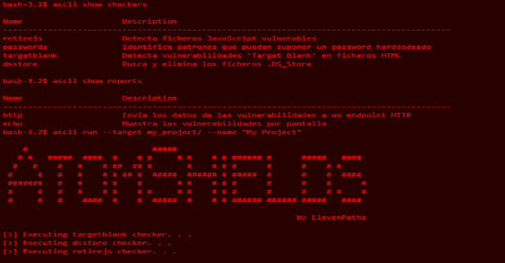

# AtomShields CLI:存储库和源代码的安全测试框架

> 原文：<https://kalilinuxtutorials.com/atomshields-cli-security-testing-framework/>

AtomShields Cli 是使用软件 [AtomShields](https://github.com/ElevenPaths/AtomShields) 的命令行界面。AtomShields 是一个针对存储库和源代码的安全测试框架。

该系统具有检测可能暴露风险的不同漏洞或文件的不同模块，并且由于报告模块，可以获得或发送所获得的结果。

**对于开发者:**也有可能开发自己的漏洞检测(称为检查器)或报告模块。该工具为那些想要实现自己的模块、发布它们并将其集成到官方 ElevenPaths 工具中的人提供了某些便利。

**也读作-[威胁者:提取&聚合威胁情报](https://kalilinuxtutorials.com/threatingestor-threat-intelligence/)**

**安装**

**pip 安装 atomshieldscli**

**基本用法**

**ascli <动作> <上下文>–目标<路径>–名称<项目 _ 名称>**

允许的*动作*值为:

*   **安装**:根据设置的上下文安装检查器或报告。
*   **卸载**:根据设置的上下文卸载检查器或报告。
*   **运行**:运行扫描。
*   **显示**:根据设置的上下文显示检查列表或报告列表。
*   **帮助**:显示帮助

允许的*上下文*值为:

*   **跳棋**:用跳棋操作
*   **报表**:对报表进行操作

*目标*选项设置要扫描的路径，或者要安装/卸载的插件(检查器/报告)。

**显示所有跳棋**

**ascli 显示跳棋**

**显示所有报告**

**ascli 显示报告**

**安装检查器**

**ascli 安装检查器–目标路径/to/file.py**

**安装报告**

**ascli 安装报告–目标路径/to/file.py**

**卸载检查器**

**ascli 卸载检查器-目标路径/to/file.py
或
ascli 卸载检查器-目标检查器 _ 名称**

**卸载报告**

**ascli 卸载报告–目标路径/to/file.py
或
ascli 卸载报告–目标检查器 _ 名称**

**运行扫描**

**ascli run–目标路径/to/file . py–name repo _ name**

[**Download**](https://github.com/ElevenPaths/AtomShields-cli)