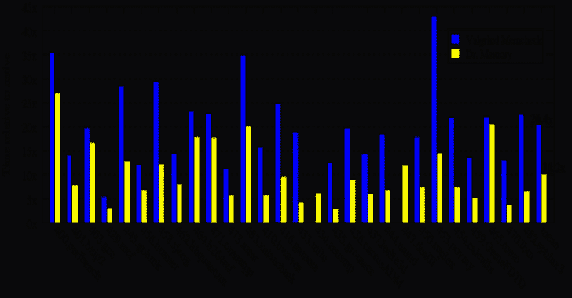
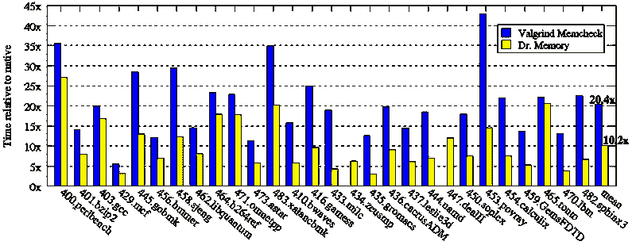

# DrMemory:适用于 Windows、Linux、Mac 和 Android 的内存调试器

> 原文：<https://kalilinuxtutorials.com/drmemory-memory-debugger-windows-linux-mac-android/>

**DrMemory** 是一个内存监控工具，能够识别与内存相关的编程错误，例如访问未初始化的内存、访问不可寻址的内存(包括分配的堆单元之外以及堆下溢和上溢)、访问释放的内存、双重释放、内存泄漏和(在 Windows 上)句柄泄漏、GDI API 使用错误以及访问未保留的线程本地存储槽。

DrMemory 运行在商用 IA-32、AMD64 和 ARM 硬件上的 Windows、Linux、Mac 或 Android 上运行的未经修改的应用程序二进制文件上。

DrMemory 是在 LGPL 许可下发布的，二进制包[可供下载](https://github.com/DynamoRIO/drmemory/wiki/Downloads)。

DrMemory 建立在 [DynamoRIO 动态仪器工具平台](http://dynamorio.org/)上。

**另请阅读—[寻找合适的 SOC 计划—完整指南](https://kalilinuxtutorials.com/soc-program/)**

**性能**

Dr. Memory 比包括 Valgrind 在内的同类工具更快，正如我们在 2011 年的[CGO](http://www.cgo.org/)论文[中使用 Dr. Memory 进行实际内存检查](http://www.burningcutlery.com/derek/docs/drmem-CGO11.pdf)所示，我们在 SPECCPU 2006 基准测试套件上比较了 Linux 上的两个工具:

**文档**

文档包含在发布包中。我们还为[在线浏览](http://drmemory.org/docs/)保留了一份副本。

**Windows 系统调用跟踪器**

Dr. Memory 包包括[一个名为`drstrace`](http://drmemory.org/strace_for_windows.html) 的“Windows strace”工具。

**获得帮助**

*   记忆博士有自己的[讨论列表](http://groups.google.com/group/DrMemory-Users)。
*   要报告错误，请使用[问题跟踪器](https://github.com/DynamoRIO/drmemory/issues)。
*   参见[记忆博士主页](http://drmemory.org/):【http://drmemory.org/ 

[**Download**](https://github.com/DynamoRIO/drmemory\)