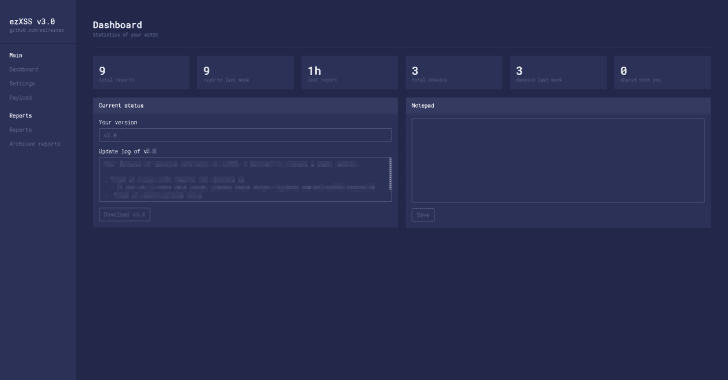
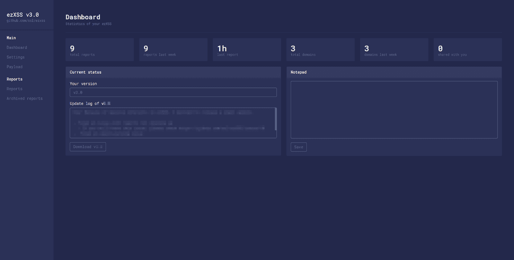
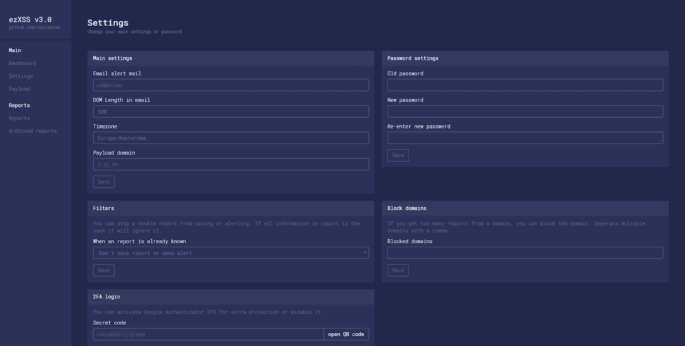
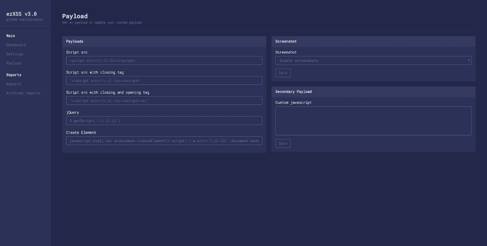
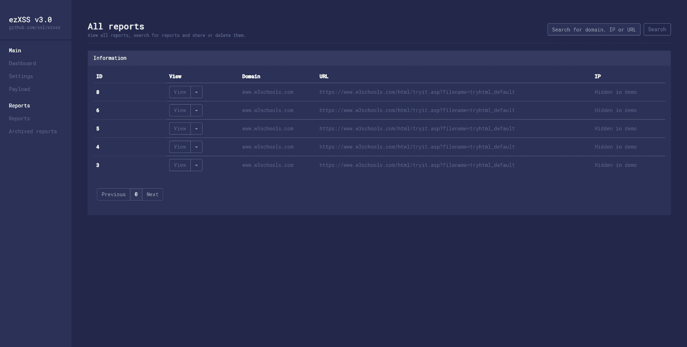
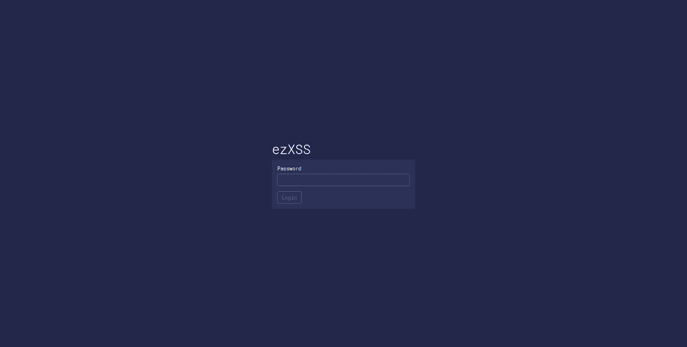

# ezXSS:渗透测试人员和 Bug 赏金猎人的简单方法

> 原文：<https://kalilinuxtutorials.com/ezxss-penetration-testers-bug-bounty/>

ezXSS 是渗透测试人员和 bug 赏金猎人测试(盲)跨站脚本的一种简单方法。

**当前特征**

ezXSS 的一些功能

*   易于使用的仪表板，包含静态数据、有效负载、查看/共享/搜索报告等
*   有效载荷发生器
*   有效负载的即时电子邮件提醒
*   自定义 javascript 有效负载
*   启用/禁用屏幕截图
*   防止双重有效负载保存或报警
*   块域
*   通过直接链接或与其他 ezXSS 用户共享报告
*   在仪表板中轻松管理和查看报告
*   通过额外保护来保护您的登录(2FA)
*   以下信息收集在易受攻击的页面上:
    *   页面的 URL
    *   IP 地址；网络地址
    *   任何页面引用者(或共享引用者)
    *   用户代理
    *   所有非 HTTP 专用 Cookies
    *   所有区域存储
    *   所有会话存储
    *   页面的完整 HTML DOM 源
    *   页面原点
    *   执行时间
    *   页面截图
*   这只是 ez🙂

**必需的**

*   PHP 7.1 或更高版本的主机
*   域名(考虑一个短域名)
*   如果您想在 https 网站上进行测试，可以使用 SSL(考虑 Cloudflare，或者让我们加密一个免费的 SSL)

**安装**

ezXSS 易于安装

*   克隆存储库并将文件放在文档根目录下
*   创建一个空数据库，并在“src/Database.php”中提供您的数据库信息
*   在您的浏览器中访问/管理/安装并设置密码和电子邮件
*   搞定了。那是 ez 对吗？

**也可阅读-[atom shields CLI:存储库安全测试框架&源代码](https://kalilinuxtutorials.com/atomshields-cli-security-testing-framework/)**

**演示**

如需演示，请使用密码 *demo1234* 访问[demo.ezxss.com/manage](https://demo.ezxss.com/manage)。请注意，在演示版本中，某些功能可能会被禁用。

**截图**

[**Download**](https://github.com/ssl/ezXSS)