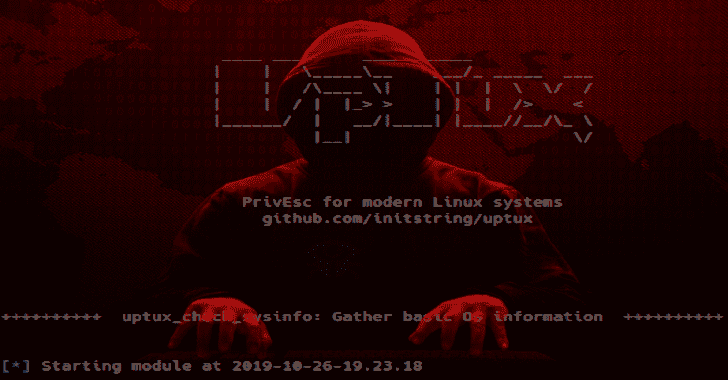

# Uptux : Linux 权限提升检查

> 原文：<https://kalilinuxtutorials.com/uptux-linux-privilege-escalation-checks/>

**Uptux** 是专门针对 Linux 系统的权限提升检查。迄今已实施:

*   可写的 systemd 路径、服务、计时器和套接字单元
*   反汇编 systemd 单元文件，查找:
    *   对可写的可执行文件的引用
    *   指向可写目录的断开符号链接的引用
    *   相对路径语句
    *   可写的 Unix 套接字文件(偷偷摸摸的 API)
*   可写 D 总线路径
*   过于宽松的 D-Bus 服务设置
*   HTTP APIs 以根用户身份运行，并在文件绑定的 unix 域套接字上响应

这些检查是基于我在自己的研究中遇到的事情，这个工具当然不包括您应该查看的所有内容。不要跳过经典！

**也可阅读-[Virtuailor:IDA python 工具，用于在 IDA Pro](http://kalilinuxtutorials.com/virtuailor-idapython-tool/) 中创建自动 C++虚拟表**

**用途**

所有的功能都包含在一个文件中，因为在受限的 shells 中安装包是一件痛苦的事情。Python2 的兼容性将会为我们一直使用的那些垃圾旧机器而保持。然而，由于检查实际上是针对更现代的用户空间的东西，无论如何不太可能在旧机器上发现任何有趣的东西。

不需要安装什么，只需抓取脚本并运行它。

**用法:uptux . py[-h][-n][-d]

PrivEsc 对于现代 Linux 系统，由 init string(github.com/initstring)

可选参数:
-h，–help 显示此帮助消息并退出
-n，–no logging 不将输出写入日志文件
-d，–debug 将一些额外的调试信息打印到控制台**

**测试**

出于测试目的，您可以运行`**tests/r00tme.sh**`脚本，这将在您的系统上产生许多 uptux 可以识别的易受攻击的配置问题。运行`**tests/unr00tme.sh**`将撤销这些更改，但不要逼我这么做。不用说，这是危险的。

以这种方式使用虚拟机进行测试。

[**Download**](https://github.com/initstring/uptux)