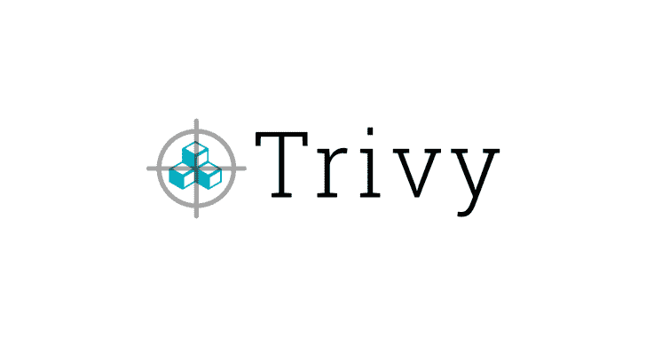
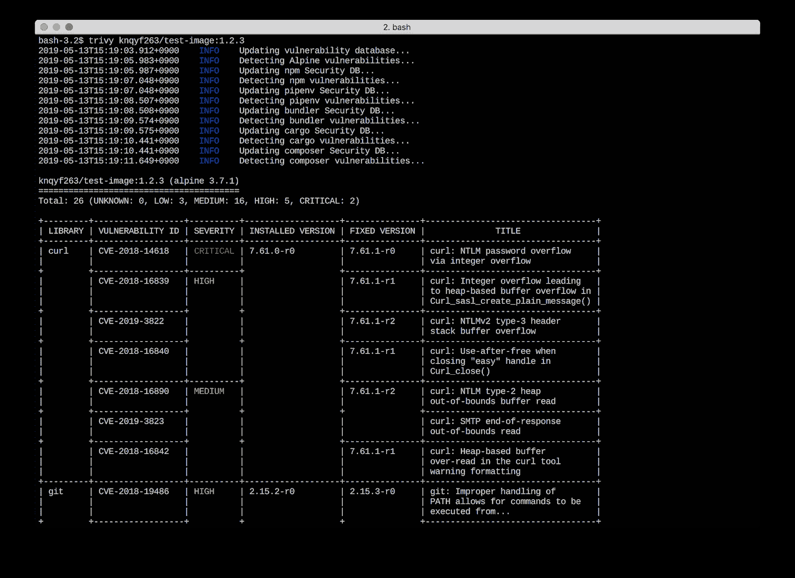
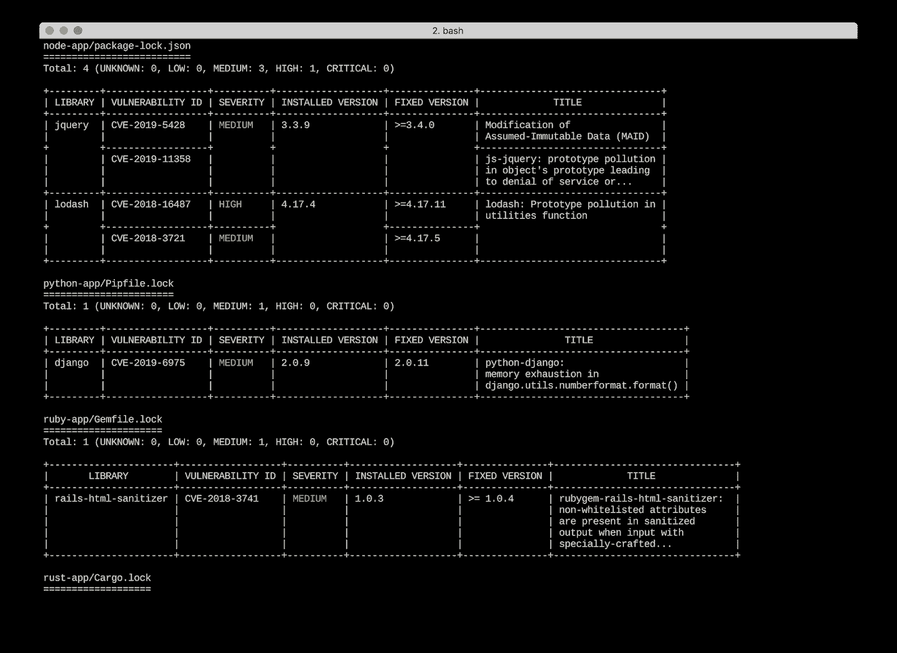

# Trivy:简单而全面的漏洞扫描器

> 原文：<https://kalilinuxtutorials.com/trivy-comprehensive-vulnerability-scanner/>

Trivy 是一个简单而全面的容器漏洞扫描器，适用于 CI。软件漏洞是软件或操作系统中存在的故障、缺陷或弱点。

它检测操作系统包(阿尔卑斯，RHEL，CentOS 等)的漏洞。)和应用依赖性(Bundler、Composer、npm、yarn 等)。).

它很容易使用。只需安装二进制文件，就可以开始扫描了。对于扫描，您需要做的就是指定容器的图像名称。

**特性**

*   检测全面的漏洞
    *   操作系统包(Alpine、 **Red Hat Universal Base Image** 、Red Hat Enterprise Linux、CentOS、Debian、Ubuntu、Amazon Linux 和 Distroless)
    *   **应用依赖关系**(捆绑器、作曲家、Pipenv、诗歌、npm、纱线和货物)
*   简单的
    *   仅指定图像名称
    *   参见[快速启动](https://github.com/aquasecurity/trivy#quick-start)和[示例](https://github.com/aquasecurity/trivy#examples)
*   易于安装
    *   `**apt-get install**`、`**yum install**`和`**brew install**`是可能的(参见[安装](https://github.com/aquasecurity/trivy#installation)
    *   **没有先决条件**，如安装数据库，图书馆等。(例外情况是，您需要安装`rpm`来扫描基于 RHEL/CentOS 的图像。如果您使用我们的安装程序或工具容器图像，这将自动包括在内。背景信息参见[漏洞检测](https://github.com/aquasecurity/trivy#vulnerability-detection)。)
*   高准确度
    *   **尤其是 Alpine Linux 和 RHEL/CentOS**
    *   其他 ose 也很高
*   DevSecOps
    *   **适合 CI** 如特拉维斯 CI、切尔莱西、詹金斯等。
    *   参见 [CI 示例](https://github.com/aquasecurity/trivy#continuous-integration-ci)

**也读作-[Uptux:Linux 特权提升检查](http://kalilinuxtutorials.com/uptux-linux-privilege-escalation-checks/)**

**安装**

**RHEL/森特斯**

将存储库设置添加到`**/etc/yum.repos.d**` **。**

**sudo vim/etc/yum . repos . d/trivy . repo**
【trivy】name = trivy repository
base URL = https://aqua security . github . io/trivy-repo/rpm/releases/$ relasever/$ basearch/
gpg check = 0

或者

**$ rpm-IVH https://github . com/aqua security/trivy/releases/download/v 0 . 1 . 6/trivy _ 0 . 1 . 6 _ Linux-64 bit . rpm**

**Debian/Ubuntu**

将存储库添加到`**/etc/apt/sources.list.d**` **。**

**$ sudo apt-get install wget apt-transport-https GnuPG LSB 版本
$ wget-qo–https://aquasecurity . github . io/trivy-repo/deb/public . key | sudo apt-key add--
echo deb https://aquasecurity . github . io/trivy-repo/deb $(LSB _ release-sc)main | sudo tee-a/etc/apt/sources . list**

或者

**$ sudo apt-get 安装 rpm
$ wget https://github . com/aqua security/trivy/releases/download/v 0 . 1 . 6/trivy _ 0 . 1 . 6 _ Linux-64 bit . deb
$ sudo dpkg-I trivy _ 0 . 1 . 6 _ Linux-64 bit . deb**

**Arch Linux**

软件包 trivy-bin 可以从 Arch 用户库安装。示例:

**pikur-sy trivy-bin**

或者

**yay -Sy trivy-bin**

**自制**

可以在 macOS 上使用家酿。

**$ brew 安装 aquasecurity/trivy/trivy**

**二进制(包括 Windows)**

从[本页](https://github.com/aquasecurity/trivy/releases/latest)获取最新版本，并为您的操作系统/架构下载存档文件。解压归档文件，并将二进制文件放在您的`$PATH`中的某个位置(在 UNIX-y 系统上，/usr/local/bin 或类似的位置)。确保它打开了执行位。

您还需要安装`rpm`命令来扫描基于 RHEL/CentOS 的图像。

**来源于**

**$ mkdir-p $ GOPATH/src/github . com/aqua security
$ CD $ GOPATH/src/github . com/aqua security
$ git 克隆 https://github.com/aquasecurity/trivy
$ CD trivy/cmd/trivy/
$ export go 111 module = on
$ go install**

您还需要安装`rpm`命令来扫描基于 RHEL/CentOS 的图像。

**快速启动**

只需指定一个图像名称(和一个标签)。**应该避免使用`latest`标签，因为图像缓存会出现问题。**见[清除图像缓存](https://github.com/aquasecurity/trivy#clear-image-caches)。

**基础**

**$ trivy[您的图像名称]**

例如:

**$ trivy python:3.4-阿尔卑斯**

结果

**码头工人**

将[您的缓存目录]替换为您机器上的缓存目录。

**$ docker run–RM-v[您的缓存目录]:/root/。cache/aqua sec/trivy[您的图像名称]**

macOS 的示例:

**$ docker run–RM-v $ HOME/Library/Caches:/root/。cache/aqua sec/trivy python:3.4-alpine**

如果你想扫描你主机上的图像，你需要挂载`**docker.sock**`。

$ docker run–RM-v/var/run/docker . sock:/var/run/docker . sock \
-v $ home/library/cache:/root/。快取/aqua sec/trivy python:3.4-alpine

如果出现错误，请重新拉最新的`**aquasec/trivy**`。结果

**例题**

**扫描图像**

只需指定一个图像名称(和一个标签)。

**trivy knqyf 263/vun 图像:1.2.3**

扫描图像文件

**$ dock save ruby:2 . 3 . 0-alpine 3.9-o ruby-2 . 3 . 0 . tar
$ trivy–ruby-2 . 3 . 0 . tar**输入

将结果保存为 JSON

**$ trivy-f JSON-o results . JSON golang:1.12-alpine**

按严重性过滤漏洞

**$ trivy–严重程度高，关键 ruby:2.3.0**

按类型过滤漏洞

**trivy–vun 型 os ruby:2.3.0**

可用值:

*   图书馆
*   操作系统（Operating System）

跳过漏洞数据库的更新

它总是在开始运行时更新其漏洞数据库。这通常很快，因为它是一个差异更新。但是如果你想跳过这些，使用`**--skip-update**`选项。

**$ trivy–skip-更新 python:3.4-alpine3.9**

**仅更新指定的分配**

默认情况下，它总是为所有发行版更新其漏洞数据库。如果您想命名要更新的指定发行版，使用`**--only-update**`选项。

**$ trivy-only-更新 alpine，debian python:3.4-alpine 3.9
$ trivy-only-更新 alpine python:3.4-alpine3.9**

**仅下载漏洞数据库**

您还可以要求它简单地检索漏洞数据库。这有助于在持续集成系统中初始化员工。第一次运行时，`**--only-update**`选项会被忽略。

**$ trivy–仅下载数据库
$ trivy–仅下载数据库–仅更新阿尔卑斯山**

**忽略未修复的漏洞**

默认情况下，它还会检测未修补/未修复的漏洞。这意味着即使你更新了所有的包，你也无法修复这些漏洞。如果您想忽略它们，使用`**--ignore-unfixed**`选项。

**$ trivy–ignore-unfixed ruby:2 . 3 . 0**

**指定退出代码**

默认情况下，即使检测到漏洞，它也会以代码 0 退出。如果想用非零退出代码退出，使用`**--exit-code**`选项。

**$ trivy–退出-代码 1 python:3.4-alpine3.9**

该选项对 CI/CD 很有用。在下面的示例中，只有当发现关键漏洞时，测试才会失败。

**$ trivy–退出代码 0–严重性中，高 ruby:2 . 3 . 0
$ trivy–退出代码 1–严重性关键 ruby:2.3.0**

**忽略指定的漏洞**

使用`**.trivyignore**` **。**

**$猫。trivyignore
#接受风险
CVE-2018-14618

#对我们的设定没有影响
CVE-2019-1543

$ trivy python:3.4-alpine 3.9**

**指定缓存目录**

**$ trivy–cache-dir/tmp/trivy/python:3.4-alpine 3.9**

**清除图像缓存**

`**--clear-cache**`选项删除图像缓存。如果具有相同标签的图像被更新(例如当使用`**latest**`标签时)，此选项很有用。

**$ trivy–清除缓存 python:3.7**

**复位**

`**--reset**` 选项删除所有缓存和数据库。此后，需要花费很长时间，因为漏洞数据库需要在本地重建。

**$ trivy–复位**

**截图**

[**Download**](https://github.com/aquasecurity/trivy)