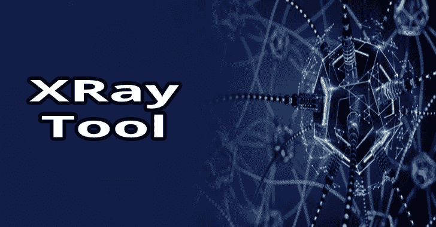

# x 射线:从公共网络侦察、测绘和收集信息的工具

> 原文：<https://kalilinuxtutorials.com/xray-recon-mapping-osint-gathering/>

**XRay** 是一个网络信息收集的工具，它的目标是使一些信息收集和网络映射的初始任务自动化。

它是如何工作的？

x 射线是一个非常简单的工具，它是这样工作的:

*   它会使用单词表和 DNS 请求来破坏子域名。
*   对于发现的每个子域/ip，它将使用 Shodan 收集开放端口和其他情报。
*   如果提供了 ViewDNS API 密钥，将收集每个子域的历史数据。
*   对于每一个唯一的 IP 地址，和每一个开放的端口，它将启动特定的横幅抓取器和信息收集器。
*   最终，数据在 web UI 上呈现给用户。

**抓取器和收集器**

*   **HTTP** `**Server**` **，** `**X-Powered-By**`，`**Location**`表头。
*   **HTTP** 和**HTTPS**不允许的条目。
*   **HTTPS** 证书链(从 CN 和 Alt 名称中抓取递归子域)。
*   **HTML** 标签。
*   **DNS 的** `**version.bind.**`和`**hostname.bind.**`记录。
*   **MySQL** ， **SMTP** ， **FTP** ， **SSH** ， **POP** 和 **IRC** 横幅。

**注释**

**Shodan API 密钥**

[shodan.io](https://www.shodan.io/) API 关键参数(`**-shodan-key KEY**`)是可选的，但是如果没有指定，将不会执行服务指纹识别，并且会显示更少的信息(基本上它只是 DNS 子域枚举)。

**查看 DNS API 密钥**

如果一个 [ViewDNS](http://viewdns.info/) API 关键参数(`**-viewdns-key KEY**`)被传递，域历史数据也将被检索。

**匿名和法律问题**

该软件将依赖您的主 DNS 解析器来枚举子域，此外，可能会从您的主机直接建立几个连接到您正在扫描的网络计算机，以便从打开的端口抓取横幅。

从技术上来说，你只是连接到开放端口的公共地址(并且**不涉及端口扫描**，因为这些信息是使用 Shodan API 间接获取的)，但是你知道，有人可能不喜欢这种行为。

如果我是你，我会找到一种方法来代理整个过程…#只是说

**也可阅读-[Gosec:Golang 安全检查器检查源代码](http://kalilinuxtutorials.com/gosec-golang-security-checker-to-inspects-source-code/)**

**构建 Docker 图像**

要使用最新版本的 XRay 构建 Docker 映像:

**git 克隆 https://github . com/evilsxmlsocket/Xray . git
CD Xray
dock build-t xraydocker**

构建完成后，可以使用以下代码在 Docker 容器中启动 XRay:

**docker run–RM-it-p 8080:8080 Xray docker Xray-address 0 . 0 . 0 . 0-shod an-key shod an _ key _ here-domain example.com**

**手动编译**

确保您正在使用 **Go > = 1.7** ，您的安装工作正常，您已经设置了`**$GOPATH**`变量，并且您已经将`**$GOPATH/bin**`附加到了您的`**$PATH**`。

然后:

**去拿 github.com/evilsocket/xray
CD＄GOPATH/src/github . com/evil socket/Xray/
make**

您将在`**build**`文件夹中找到可执行文件。

**用途**

用法:Xray-shod an-KEY YOUR _ shod an _ API _ KEY-DOMAIN TARGET _ DOMAIN
选项:
-地址字符串
web ui 服务器绑定到的 IP 地址。(默认为“127 . 0 . 0 . 1”)
-consumers int
用于子域枚举的并发使用者数量。(默认为 16)
-开始枚举的域字符串
基域。
-port int
将 web ui 服务器绑定到的 TCP 端口。(默认 8080)
-preserve-domain
不要从提供的域名中删除子域。
-会话字符串
会话文件名。(默认"-Xray-session . JSON ")
-shod an-key 字符串
Shodan API key。
-viewdns-key 字符串
ViewDNS API key。
-用于枚举的单词列表字符串
单词列表文件。(默认为“wordlists/default.lst”)

[**Download**](https://github.com/evilsocket/xray)