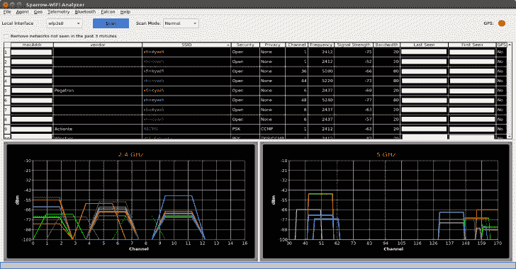
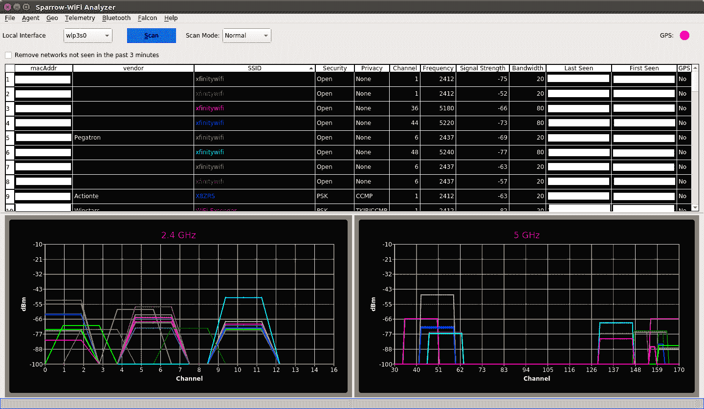
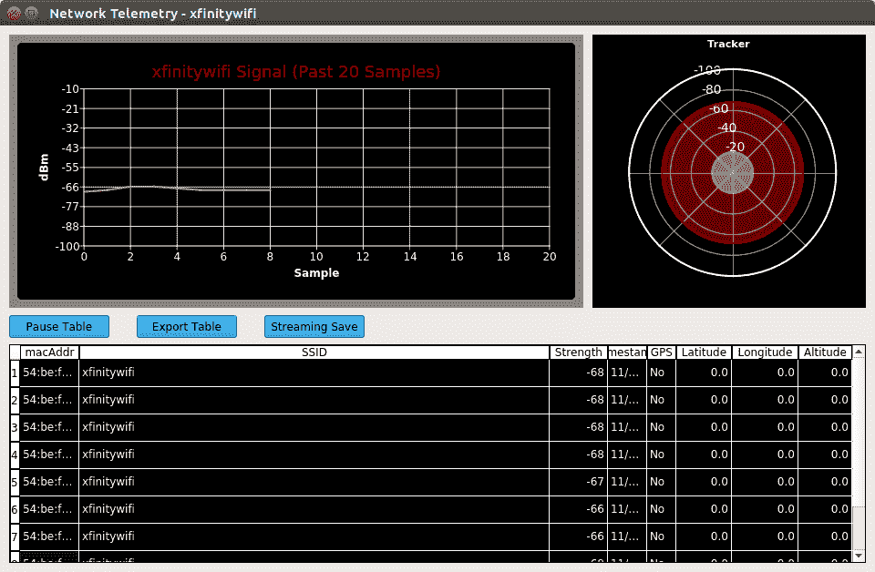
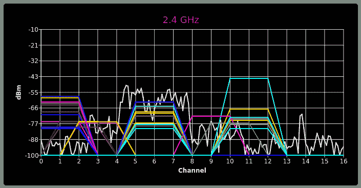

# Sparrow WiFi:下一代基于 GUI 的 WiFi 和蓝牙分析仪，适用于 Linux

> 原文：<https://kalilinuxtutorials.com/sparrow-wifi-next-gen-gui-based-wifi-bluetooth-analyzer/>

Sparrow WiFi 是从零开始构建的，是下一代 2.4 GHz 和 5 GHz WiFi 频谱感知工具。最基本的是，它为专门运行在 Linux 上的 inSSIDer 和 linssid 等工具提供了一个更全面的基于 GUI 的替代品。

在其最全面的使用案例中，它在一个解决方案中集成了 WiFi、软件定义无线电(hackrf)、高级蓝牙工具(传统和 Ubertooth)、传统 GPS(通过 gpsd)和通过 mavlink 的无人机/漫游器 GPS。

[注意:查看树莓 Pi 部分的更新。现在包含了一个设置脚本来让项目在 Raspbian Stretch 上运行。]

它完全用 Python3 编写，设计用于以下场景:

*   基本 WiFi SSID 识别
*   wifi 源搜索–从正常模式切换到搜索模式，每秒获取多个样本，并使用遥测窗口跟踪 WiFi 源
*   2.4 GHz 和 5 GHz 频谱视图–将来自 Ubertooth (2.4 GHz)或 HackRF (2.4 GHz 和 5 GHz)的频谱实时覆盖在 wifi 频谱之上(当重叠 WiFi 似乎不是原因时，这对于不良连接故障排除非常有价值)
*   蓝牙识别–通过标准蓝牙收听 LE 广告，在 LE 中使用完全混杂模式，通过 Ubertooth 使用经典蓝牙
*   蓝牙寻源–使用遥测窗口跟踪广告源或 iBeacons
*   iBeacon 广告–宣传你自己的 I beacon
*   远程操作–包括一个代理，它通过 GUI 可以与之对话的远程代理提供所有 GUI 功能。
*   无人机/漫游车操作-代理可以在 Raspberry Pi 等系统上运行，并在无人机上飞行(它在 Solo 3DR 上进行了几次飞行)，或者以 GUI 控制或自主扫描/记录模式连接到漫游车。
*   远程代理是基于 JSON 的，因此可以与其他应用程序集成
*   导入/导出——能够从 CSV 和 JSON 导入和导出，便于集成和重新可视化。你也可以运行“iw dev scan ”,将其保存到一个文件中并导入。
*   当 GPS 坐标可用于发现的 SSID 蓝牙设备时，制作谷歌地图，或绘制一段时间内的 WiFi 遥测数据。

几张样本截图。第一个是显示基本 WiFi 扫描的主窗口，第二个显示用于 WiFi 和蓝牙跟踪的遥测/跟踪窗口。

**安装**

它使用 python3、qt5 和 qt-chart 作为 UI。在一个标准的 Debian 版本上，你可能已经安装了 python3 和 qt5。唯一能运行它的是 qt-chart。以下命令应该可以让您在 Ubuntu 和 Kali Linux 上启动并运行 WiFi:

**sudo apt-get 安装 python 3 pip gpsd gpsd 客户端 python3-tk python3 安装工具
sudo pip3 安装 qscintilla pyqtchart gps 3 无人驾驶仪 python-dateutil num py matplot lib**

有些人已经用 python virtualenv 运行了 sparrow，如果您想在一个隔离的 python 环境中运行它，下面的序列应该可以让您启动并运行它:

**git 克隆 https://github . com/ghost op 14/sparrow wifi
CD sparrow wifi
virtualenv–python = python 3 $ home/sparrow
source $ home/sparrow/bin/activate
pip 3 install GPS 3 python-dateutil requests pyqt5 pyqtt chart numpy matplot lib
sudo python 3 sparrow wifi .【py】**

注意:如果你想在 Raspberry Pi 上运行，请看下面的 Raspberry Pi 部分。只有远程代理在 Pi 上运行，一些 GUI 组件不能在 ARM 平台上安装/设置。

**运行中**

因为它需要使用标准的命令行工具“iw”进行 WiFi 扫描，所以您需要以 root 用户身份运行它。只需从克隆的目录中运行:

**须藤。/sparrow-wifi.py**

**WiFi 笔记**

关于 wifi 扫描，特别是在 5 GHz 范围内，需要注意的一点是找到一个可用的卡。对于“iw”工具来说，这不是太大的问题，但是在需要监控模式的更高级配置中，这可能是一个问题。

**蓝牙**

对于熟悉 WiFi 但对蓝牙扫描“陌生”的人来说，蓝牙是如此不同，以至于你可能想基于 WiFi 看到的一些内容将无法获得(起初可能会有点沮丧)。从根本上来说，这一切都归结于蓝牙是如何工作的。

蓝牙在整个 2.4 GHz 范围内使用跳频，所以它不像 WiFi 那样出现在漂亮干净的单通道桶中。更复杂的是，从射频的角度来看，低能量(BTLE)和经典模式是不兼容的，所以一般来说，蓝牙适配器在任何给定的时间只能扫描一种类型或另一种类型。

蓝牙设备通常也只能在广告时被发现(想想广播)。找到蓝牙设备的另一种方法是使用一种可以从空气中嗅出所有蓝牙数据包的设备，这是标准蓝牙适配器做不到的。

这就是像 Ubertooth 这样的硬件可以更好地了解蓝牙环境的地方。当然，如果他们不发射信号，你就没有任何东西可以关掉。如果你必须捕捉正在传输的数据包，你可能需要扫描/逗留更长时间才能看到它，将扫描帧速率增加到 30 秒到 1 分钟。

因此，尽管如此，通过标准/内置蓝牙适配器，它可以对蓝牙低能耗(BTLE)设备进行广告扫描。如果他们在宣传他们的发射功率，它会尝试计算距离。这就是最新的 iBeacon 解决方案和产品在物理上可定位的原因。然而，对于多路径、内壁等。不要期望极高的准确性。

作为一个额外的好处，sparrow wifi 还可以广告自己的 iBeacons 进行跟踪(这对于远程代理打开位置发现非常有用)。然而，并不是所有的蓝牙卡都会宣传发射功率，所以你可能并不总是得到范围。如果你有一个 Ubertooth，它可以用来混杂发现 BTLE 和传统的蓝牙设备。

当然有一个权衡。传统的 LE 扫描更新更快，便于蓝牙“搜索”，然而混杂模式可以识别更多的设备，代价是需要逗留更长时间来监听。

如果你想扫描蓝牙，你需要一些东西:

1.  蓝牙适配器(用“hcitool dev”测试以确保它出现)。有了适配器，你可以做基本的 BTLE 广告和 iBeacon 扫描。
2.  [可选]用于混杂发现扫描的 Uber tooth(BTLE 和经典蓝牙)
    *   Ubertooth 工具已安装并运行(您可以使用 ubertooth-specan-ui 测试它)
    *   蓝色九头蛇安装成**/opt/蓝牙/blue _ Hydra(mkdir/opt/蓝牙&CD/opt/蓝牙&git 克隆**【https://github.com/pwnieexpress/blue_hydra.git】T2)。然后，请确保您遵循了 blue_hydra 的安装说明。可以用 bin/blue_hydra 测试一下。这个必须在/opt/bluetooth/blue_hydra 里面，不然应用找不到。

我强烈建议首先从命令行运行“hcitool lescan ”,以确保一切正常。如果你有一个 Ubertooth，运行 ubertooth-specan-ui 并运行 blue_hydra 以确保这些工具在尝试之前正常工作。

一些故障排除提示:

*   如果您没有看到任何具有基本 LE 广告扫描的设备，请从命令行尝试“hcitool lescan ”,看看是否会出现任何错误。如果是这样，在那里解决他们。有时候一个快速的"**hciconfig HCI 0 down&hciconfig HCI 0 up**就能搞定。
*   如果你有一个 Ubertooth 并且没有看到任何光谱，试着从命令行运行 ubertooth-specan 或者 ubertooth-specan-ui。如果有任何错误，请在那里解决。

**光谱**

两种光谱中近乎实时的光谱重叠是它区别于其他 WiFi 工具的一个特征。要获得光谱重叠，有两种选择。

更便宜的方法是使用 Ubertooth。频谱扫描是 1 MHz 通道分辨率的硬件特性之一。缺点是 Ubertooth 只是专注于 2.4 GHz 的频谱(毕竟那是蓝牙发挥作用的地方)，所以你将无法扫描 5 GHz 的范围。

如果您在软件定义无线电(SDR)方面有更多的经验和/或硬件，并且有 HackRF 可用，尽管价格稍贵，但您可以扫描 2.4(分辨率为 0.5 MHz)和 5 GHz(分辨率为 2 MHz)频谱范围。

接下来的两个部分提供了每个硬件设备特有的一些细节。一般来说，sparrow-wifi 的目标是本地帧速率约为 10 fps，远程代理帧速率约为 5 fps(取决于远程硬件和网络连接)。

下面的屏幕截图显示了一个 2.4 GHz 的视角，覆盖了 Ubertooth 频谱(1 MHz 频段)。当蓝牙设备也处于活动状态时，观看频谱是一件非常有趣的事情。

你可以观察到蓝牙频道在频谱中跳跃。还有其他协议，如 zigbee 和其他物联网协议，甚至无绳电话也可能出现在 2.4 GHz 频谱中，否则不会出现在仅 WiFi 视图中。

拥有频谱重叠为故障排除提供了关于频谱中其他干扰的宝贵视角，例如，如果没有重叠的无线信道似乎是不良连接的来源。

**Ubertooth One**

一旦你有了一个 Ubertooth，你要做的第一件事就是下载并构建最新的工具，用最新的固件版本刷新它。准备好之后，试着运行 ubertooth-specan-ui，获得一个漂亮的快速图形光谱显示。

如果这是可行的，那么 Ubertooth 在其中应该工作正常(在尝试显示光谱之前，只需关闭任何正在运行的 Ubertooth 工具)。Sparrow WiFi 将在启动时自动检测 Ubertooth 是否存在以及工具是否可用，并启用相应的菜单选项。

请注意，如果您在没有连接 Ubertooth 的情况下启动 sparrow wifi，只需关闭并重新打开它，它应该会看到它。可以用 lsusb 手动测试一下，看看 Ubertooth 是否存在。

**HackRF One**

添加了 HackRF 支持，以利用添加到 hackrf 固件中的 hackrf_sweep 功能。使用 HackRF，您可以扫描整个范围以查看光谱。

虽然 hackrf_sweep 可以从 2.4 GHz 扫描到 5 GHz，但帧速率太慢了(比如每 2 秒 1 帧)，所以一次只能用于一个频段。

也就是说，如果您同时拥有 Ubertooth 和 HackRF，您可以使用 Ubertooth 同时显示 2.4 GHz 频段，使用 HackRF 同时显示 5 GHz 频段。

重要提示:标准射频和天线规则适用。如果您想要监控任何一个频段，请确保您有一个能够在该频段接收的天线(标准的伸缩式 HackRF 天线可能无法工作，因为它的额定频率最高只有 1 GHz)。

如果你想使用无线网卡上的外置双频天线，只需注意连接器极性通常是反的(rp-sma 而不是 HackRF 上的 sma 连接器)，因此你需要一个适配器将其连接到 HackRF(亚马逊上只有几美元)。

RP-SMA 天线会拧到 SMA 连接器上，但中心销不在那里，因此您实际上不会收到任何东西。只是提醒一句。

注:即使使用双频天线，5 GHz 频谱也很难像在 2.4 GHz 频谱中那样看到信号。5 GHz 的信噪比似乎比 2.4 GHz 低得多。

其中一些可归因于 HackRF，因为 5 GHz 正接近其可用频率范围的边缘，而另一部分也可归因于 5 GHz 未穿透墙壁、天花板等。以及 2.4 GHz。

有时，5 GHz 频段在瀑布图中显示更好，以区分活动信号，但如果这是您需要的，请尝试工具 qspectrumanalyzer。

故障排除提示:

*   如果您根本看不到任何频谱，请尝试从命令行运行 hackrf_sweep。如果你有任何错误，在那里解决它们。

**GPS**

它依靠 gpsd 来提供标准的 GPS 通信。在测试期间，有许多与 GPS 相关的问题值得注意。首先在 GPS 接收器方面，确保你得到一个与 gpsd 一起工作的。

我用 GlobalSAT ND-105C 微型 USB 接收器测试过。我还在 android 设备上使用了一个 GPS 应用程序来通过蓝牙提供 GPS(尽管这需要一些修改，并且在使用蓝牙适配器进行 GPS 扫描时会排除使用蓝牙适配器)。

因此，第一个重要注意事项是在 GPS 接收器端。如果你打算在室内使用 GPS 接收器，你可能需要确保你得到的 GPS 明确说明它将在室内工作。

任何拥有 Garmin 或其他户外运动 GPS 系统的人可能都知道，他们在室内时往往无法与卫星很好地同步。Solo 3DR 无人机上的股票 GPS 与 GlobalSAT 接收器的方式相同。

当它们靠近窗户时，等等。经过一段时间后，它们可能最终同步，但室内接收效果不佳，如果你在办公楼或其他金属/混凝土结构中，接收器可能很难接收卫星信号。所以在挑选 GPS 接收器时要记住这一点。

在让接收器与 gpsd 一起工作方面，遇到了一些挑战。首先，测试 GPS 最简单的方法是停止 gpsd 服务(service gpsd stop)，并在启用调试的情况下从命令行运行 gpsd。

如果你有一个基于 USB 的 GPS，你应该会看到一个看起来像 **/dev/ttyUSB0** 的设备在连接后出现。如果是这种情况，类似这样的命令将在前台启动 gpsd 进行快速测试:

**gpsd -D 2 -N /dev/ttyUSB0**

如果您看到好的数据，您可以通过删除-N 参数来对其进行守护化。在 Ubuntu 上，编辑/etc/default/gpsd，特别是将/dev/ttyUSB0 放在设备参数中，并重新启动服务，效果很好。

然而在 Kali linux 和 Raspberry Pi 上，如果 gpsd 服务忽略了参数，相同的过程就不会工作。在这些情况下，GPS 服务被设置为不自动启动，gpsd 守护进程是从命令行使用命令“gpsd /dev/ttyUSB0”手动启动的。

一旦守护进程启动并运行，xgps 就是 gpsd-clients 包中的一个工具，它提供了一个非常好的 GUI 来检查 gps 和卫星状态。如果你运行 xgps，它会告诉你什么时候接收器同步，并给你一些其他参数，以确保它工作正常。如果一切看起来都与 GPS 一起工作，那么它应该能够像任何其他 gpsd 客户端一样提取数据。

**运行麻雀 WiFi 远程代理**

因为代理在系统访问方面与 GUI 有相同的要求，所以您也需要以 root 用户身份运行代理。只需运行:

**sudo。/雀巢保安员. py**

默认情况下，它将侦听端口 8020。使用–help 可以看到许多选项，也可以使用本地配置文件。

也可以使用以下选项指定备用端口:

**sudo。/雀巢保安员. py–port =<我的端口>**

**无人驾驶飞机/漫游车操作**

该项目的另一个目标是能够“战斗飞行”(相当于 wifi 世界流行的“驾驶”无人机)。

因此，能够拥有一个轻量级代理，可以在一个小平台上运行，如可以安装在无人机上的 Raspberry Pi，这被纳入了设计要求。

该代理已在一架单飞 3DR 无人机上成功飞行(保持总重量低于 350 g 有效载荷重量)。

Solo 是该项目的完美选择，因为控制器充当 wifi 接入点，并使用 mavlink 协议通过传统的 IP 网络与无人机通信。

这使得笔记本电脑、平板电脑和 Raspberry Pi 等其他设备可以简单地加入控制器 wifi 网络并拥有 IP 连接。这对外勤业务很重要，因为它降低了业务的复杂性。

因为这些无人机具有机载 GPS 作为其基本功能的一部分，所以可以通过 mavlink(在 dronekit 的帮助下)直接从无人机的 GPS 中获取 GPS 坐标。

这有助于降低有效载荷的总重量，因为额外的 GPS 接收器不需要作为有效载荷的一部分飞行。此外，为了在飞行期间将无人机操作员所需的任务数量保持在最低水平，可以启动代理，等待无人机 GPS 同步，使用树莓 Pi 灯来表示操作准备就绪，并自动开始将 wifi 网络记录到本地文件。

然后，GUI 提供一个界面来检索那些远程保存的文件，并将其拉回来进行可视化。

这个场景已经用连接到 Pi 的 Cisco AE1000 双频适配器进行了测试。请注意，虽然我遇到了一个问题，从 Pi 扫描 5 GHz，我终于找到了解决方案。

对于双频适配器，如果您不禁用内部 Pi 无线适配器，您将不会获得任何 5 GHz 的结果(这是一个已知的问题)。你需要做的是通过编辑 **/boot/config.txt** 并添加以下行来禁用板载 wifi，然后重启'**dt overlay = pi3-disable-wifi**'。现在，您将能够从 Pi 扫描这两个波段。

在 Raspberry Pi 上启动代理的最快方法(重要:首先参见 Raspbery Pi 一节，如果您正在运行 Raspian Squeeze，您需要首先构建 Python 3.5(Stretch 已经有了 3.5)来运行代理，因为所使用的子进程命令最初是从 Python 3 中删除的，后来又放回到 3.5 中)和从 Solo drone 中提取 GPS 的最快方法是在 Pi 上使用以下命令启动它:

**须藤蟒 3.5。/sparrowwifiagent . py–userpileds–send announce–mavlinkgps 3dr**

Raspberry Pi 红色和绿色 LED 将用作视觉指示器，在以下状态间转换:

*   两盏灯都灭了-初始化
*   红色 LED 心跳–连接到无人机(dronekit 车辆连接成功)
*   红色 LED 稳定-已连接，GPS 同步且可操作(无人机可能需要几分钟让 GPS 稳定下来，作为其基本飞行初始化的一部分)
*   绿色 LED 稳定亮起-代理 HTTP 服务器已启动，代理正在运行并准备好为请求提供服务

注意:没有 mavlink 设置，如果使用本地 GPS 模块，红色 LED 将通过相同的心跳=GPS 存在但不同步，稳定= GPS 同步状态转换。

如果你在驾驶无人机时没有第二双手，并且想在不用担心代理的情况下驾驶 Pi，你可以在自动记录模式下启动代理。脚本目录中有几个以“rpi”开头的脚本，可以安排这些脚本来监视代理并在适当的时候启动它。

总体意图是一个无头配置，其中 Pi 启动(您需要提前在 Pi 上配置 wifi 以自动连接到控制器 wifi 网络)，代理将启动并自动进入 wifi 记录模式，使用无人机的 gps 进行记录。完成后，it 代理菜单会提供一个屏幕，让您管理代理上录音目录中的文件，并在那里下载或删除文件。

脚本目录中的这些脚本只是示例。强烈建议您定制它们和 Pi 集成以满足您的特定需求，并且在使用无人机做任何事情时务必牢记安全(和联邦法规),因为您对这两者都负有责任。

**树莓派笔记**

**拉斯边拉伸**

Raspbian Stretch 现在包含了正确的 python 版本，所以不再需要定制 Python 版本。唯一需要自定义处理的是，PyQTChart 不在 apt 存储库中，也不能通过 pip 在 raspbian 上构建。

然而，感谢在这个线程的人们:[https://github.com/mu-editor/mu/issues/441](https://github.com/mu-editor/mu/issues/441)，我已经能够在 Raspbian Stretch 上重现他们的 pyqtchart 构建过程。因此，为了让每个人的生活更轻松，现在项目中包含了一个名为 rpi.setup_prerequisites.sh 的脚本。

首先执行脚本，然后 Sparrow“应该”为您工作。我在配有 7 英寸触摸屏的 Pi 3B 板上测试了它，效果很好。

**拉斯边·杰西**

您可以在 Raspberry pi 上运行远程代理，但是安装要求有点不同。首先，Python3 在 3.5 之前的最初 3.x 版本中没有包括一些子流程模块功能。

但是他们从 3.5 版本开始又把它们放了回去。在 Raspian 构建方面，Raspbian Squeeze 在存储库中只有 Python 3.4.x。所以第一步将是下载并构建 Python 3.5。

然而，如果你运行的是 Debian Stretch(目前最新的版本)，你可以跳过 3.5 版本。存储库确实有 Python 3.5。

如果需要的话，您可以使用下面的序列来构建 python(您需要在构建 Python 之前 apt-get 安装 libsqlite3-dev，因为它现在是在编译时内置的):

**sudo apt-get 安装 libsqlite3-dev

CD/tmp
wget https://www.python.org/ftp/python/3.5.5/Python-3.5.5.tgz
tar-zxvf Python-3 . 5 . 5 . tgz
CD Python-3 . 5 . 5
。/configure&make-J3&sudo make install**

完成后，将必要的模块安装到 3.5 版本中:sudo pip 3.5 install GPS 3 drone kit manuf python-dateutil

然后，您可以使用如下命令直接运行代理:

**/usr/local/bin/python3.5。/sparrowwifiagent . py

/usr/local/bin/python 3.5。/sparrowwifiagent . py–mavlinkgps = 3dr–record interface = WLAN 0**

请注意，如果您忘记在 3.5 中专门启动它们，您将会得到一个异常抛出，因为一个子流程函数将会丢失。

关于在 Raspberry Pi(在 Pi 3 上测试)上使用双频 USB 无线适配器的另一个重要注意事项是，只要内部无线启用，Raspbian 就不会看到 5 GHz 频带。

在您的/boot/config.txt 中添加这一行以禁用内部无线，然后您的双频 USB 无线将能够看到 5 GHz 频带:

**dtoverlay = pi3-disable-wifi**

树莓 Pi 上还使用了红色和绿色 LED，以提供一些视觉反馈:

*   两盏灯都灭了-初始化
*   红色 LED 心跳–发现 gpsd 但不同步(如果 gpsd 未安装或未运行，红灯将保持熄灭)
*   红色 LED 稳定–gpsd 接收器同步
*   绿色 LED 稳定亮起-代理 HTTP 服务器已启动，代理正在运行并准备好为请求提供服务

[**Download**](https://github.com/ghostop14/sparrow-wifi)