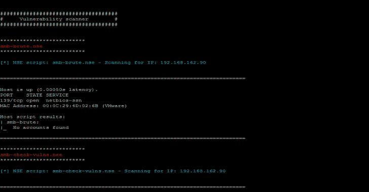
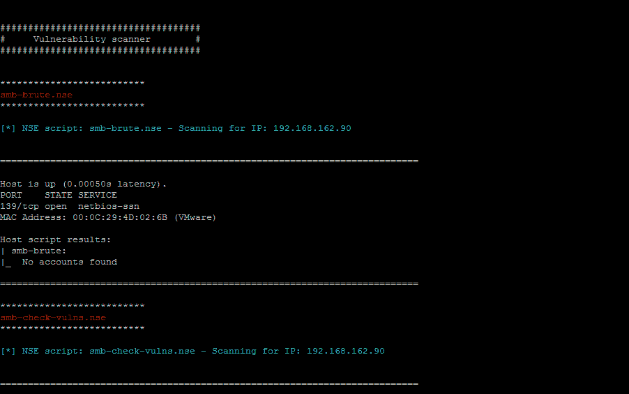
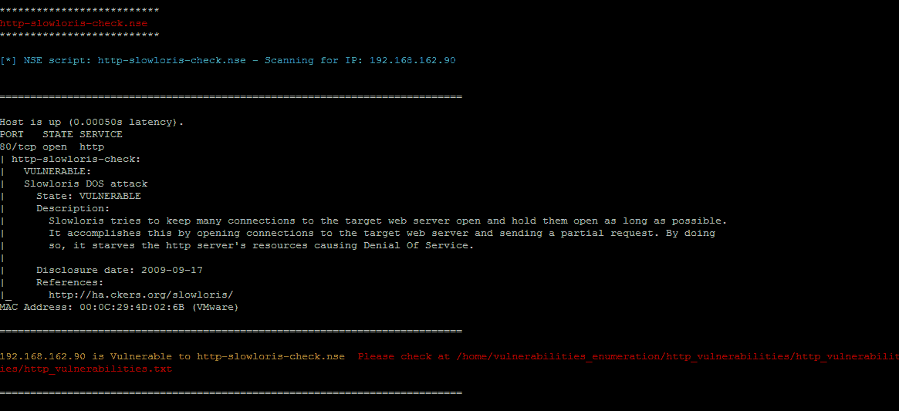
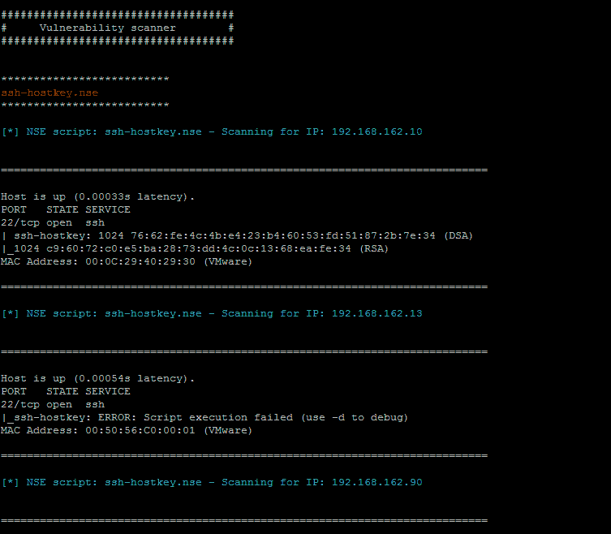
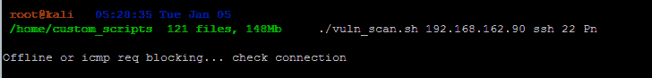

# VScan:使用 nmap & nse 脚本的漏洞扫描工具

> 原文：<https://kalilinuxtutorials.com/vscan-vulnerability-scanner/>

**VScan** 是一个漏洞扫描工具，它使用 nmap 和 nse 脚本来查找漏洞。该工具为 nmap 漏洞扫描增添了价值。

它使用 NSE 脚本，可以在漏洞检测和利用方面增加灵活性。下面是 NSE 脚本提供的一些功能

*   网络发现
*   更复杂的版本检测
*   漏洞检测
*   后门检测
*   漏洞利用

该工具使用 kali linux 中 nse 脚本所在的路径`**/usr/share/nmap/scripts/**`

该工具执行以下操作

*   通过检查 icmp 请求来检查与目标主机的通信
*   将协议名称(如 http)作为输入，并执行与该协议相关的所有 nse 脚本
*   如果任何漏洞触发，它会将输出保存到日志文件中
*   它可以对一系列 IP 地址执行上述所有操作

如果该工具在某个协议(如 http)中发现漏洞，它会将输出保存到一个日志文件中，该文件创建并保存在以下位置`**/home/vulnerabilities_enumeration/http_vulnerabilities/http_vulnerabilities/http_vulnerabilities.txt**`。在本例中，文件夹是使用协议前缀(在当前情况下是 http 协议)创建的。

**又念——[目击者:设计截图网站](https://kalilinuxtutorials.com/eyewitness-designed-take-screenshots-websites/)**

**用途**

`**[Usage:] ./vscan.sh <ip_range> <protocol> <port> <Pn (optional)>[Usage:] ./vscan.sh <ips_file> <protocol> <port> <Pn (optional)>[Usage:] ./vscan.sh <ip> <protocol> <port> <Pn (optional)>**`

**怎么跑？**

**。/vscan . sh 192 . 168 . 162 . 90 http 80
。/vscan . sh 192 . 168 . 162 . 10-90 http 80
。/vscan . sh 192 . 168 . 162 . 90 ssh 22 Pn
。/vscan.sh IPs.txt smb 445**

**参考文献**

*   [https://nmap.org/book/nse.html](https://nmap.org/book/nse.html)
*   [https://nmap.org/nsedoc/](https://nmap.org/nsedoc/)

**截图**

**# # #示例:SMB 扫描**

**# # #示例:Slowloris 漏洞检测**

**# # #示例:多个 IP 扫描 SSH 弱密钥**

**# # #示例:当系统关闭或没有 ICMP 请求时**

[**Download**](https://github.com/xvass/vscan)