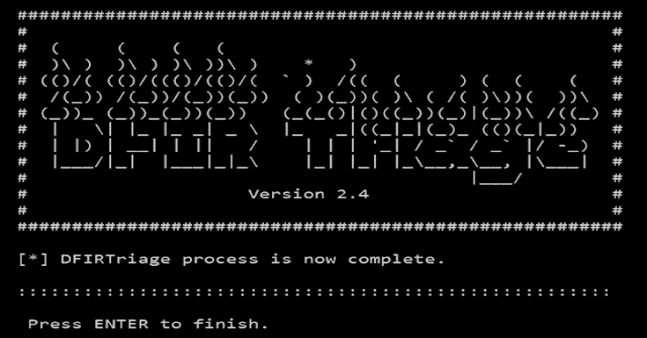

# DFIRTriage:用于基于 Windows 的事件响应的数字取证工具

> 原文：<https://kalilinuxtutorials.com/dfirtriage-digital-forensic-acquisition/>

**DFIRTriage** 是一款基于 Windows 的事件响应数字取证工具。该工具旨在为事故响应者提供快速的主机数据。用 python 编写的代码已经过编译，消除了 Python 对目标主机的依赖性。

该工具将在执行时自动运行各种命令。获取的数据将驻留在执行目录的根目录下。DFIRTriage 可以从 USB 驱动器运行，也可以在目标系统的远程 shell 中执行。仅 Windows 支持。

**也可阅读-[Sparrow WiFi:下一代基于 GUI 的 WiFi&Linux 蓝牙分析仪](https://kalilinuxtutorials.com/sparrow-wifi-next-gen-gui-based-wifi-bluetooth-analyzer/)**

**有什么新鲜事？**

***通用**

*   对代码进行了效率更新，改进了流程，清除了错误，并提供了性能改进。
*   已清理输出目录结构
*   从工具集中删除了 TZworks 工具，避免了许可问题
*   添加了新功能的命令行参数(运行“DFIRtriage–help”了解详细信息)

***内存采集**

*   默认情况下，现在获取内存
*   绕过内存获取所需的参数
*   获取内存之前进行的可用空间检查
*   更新了获取流程，以避免 Windows 10 崩溃

***新神器**

*   windowsupdate.log 文件
*   Windows Defender 扫描日志
*   PowerShell 命令历史记录
*   主机文件
*   netstat 输出现在包括所有网络连接的相关 PID
*   将当前登录到目标计算机的所有用户记录到 Triage_info.txt 文件中
*   从 Windows 事件日志中提取几十个新事件

***新！DFIRtriage 搜索工具**

*   在 DFIRtriage 输出数据中进行关键字搜索，并将结果写入日志文件
*   搜索工具是一个单独的可执行文件(dtfind.exe)
*   双击运行或从命令行运行(如 dt find-kw badstuff.php)

**依赖关系**

工具存储库包含正确执行所需的完整工具集，并打包到一个名为“core.ir”的文件中。这个”。ir”文件是在 Python 中运行时 DFIRtriage 唯一需要的依赖项，应该位于一个名为 data 的目录中。"./data/core.ir”)。DFIRtriage 的编译版本嵌入了完整的工具集，不需要添加。/data/core.ir "文件。注意:不再使用 TZWorks 实用程序。

**内容**

*   DFIRtriage.exe
    *   编译的可执行文件
*   。\data\core.ir
    *   工具集存储库(仅 Python 版本需要)
*   manifest.txt
    *   核心组件的文件哈希
*   unlicense.txt
    *   许可协议副本
*   源目录
    *   DFIRtriage-v4-pub.py
*   dtfind.exe
    *   编译的搜索工具可执行文件

**操作**

DFIRtriage 从执行它的主机上获取数据。对于远程主机的收购，需要将 DFIRtriage 文件复制到目标，然后通过远程 shell 执行。(即。SSH 或 PSEXEC)

**pseexec 用法**

*警告:不要使用 PSEXEC 参数将凭证传递到远程系统进行身份验证。这样做将通过网络明文发送您的用户名和密码。*

为了正确使用 PSEXEC ,应采取以下步骤

1.  映射网络驱动器，并使用在目标主机上具有本地管理权限的帐户进行身份验证。

> 您可以使用此映射连接将 DFIRtriage 复制到目标。

*   现在，我们可以使用 PSEXEC.psexec \target_host cmd 将远程 shell 转移到目标主机
*   现在您在目标上有了一个远程 shell。此时执行的所有命令都在目标主机上完成。

**用途**

*   一旦在目标上建立了远程 shell，您就可以将目录更改为提取的 DFIRtriage.exe 文件的位置并执行。
*   默认情况下会获取内存，不需要任何参数。要绕过内存获取，可以传递“–nomem”参数。
*   DFIRtriage 必须以管理权限执行。

**输出分析**

完成后，按 enter 键清除输出目录。如果运行可执行文件，剩下的唯一数据是输出和 DFIRtriage.exe 的压缩文件。如果直接运行 Python 代码，只剩下 DFIRtriage-v4-pub.py 和输出的压缩文件。

**输出文件夹**

输出文件夹名包括目标主机名和指示 DFIRtriage 执行时间的日期/时间代码。日期/时间代码格式为 YYYYMMDDHHMMSS。

**神器列表**

下面是收集的信息和工件的一般列表。

*   **Memory Raw**–>图像采集(可选)
*   **预取**–>收集所有预取的文件并解析成报告
*   **PowerShell 命令历史**–>收集所有用户的 PowerShell 命令历史
*   **用户活动**–>最近用户活动的 HTML 报告
*   **文件哈希**–>System32 根目录下所有文件的 MD5 哈希
*   **网络信息**–>网络配置、路由表等
*   **网络连接**–>建立网络连接
*   **DNS 缓存条目**–>完整 DNS 缓存内容列表
*   **ARP 表信息**–>完整的 ARP 缓存内容列表
*   **NetBIOS 信息**–>活动的 NetBIOS 会话、传输的文件等
*   **Windows 更新日志**–>收集事件跟踪日志信息并构建 Windows 更新日志
*   **Windows Defender 扫描日志**–>收集事件跟踪日志信息并构建 Windows 更新日志
*   **Windows 事件日志**–>收集并解析 Windows 事件日志
*   **过程信息**–>过程、PID 和图像路径
*   **远程打开文件列表**–>远程主机在目标系统上打开的文件
*   **本地用户账户名称**–>本地用户账户列表
*   **隐藏目录列表**–>系统分区上所有隐藏目录的列表
*   **备用数据流**–>包含备用数据流的文件列表
*   **完整文件列表**–>系统分区上所有文件的完整列表
*   **计划任务列表**–>所有已配置的计划任务列表
*   **所有收集数据的哈希**–>DFIRtriage 收集的所有数据的 MD5 哈希
*   **已安装软件**–>通过 WMI 安装的所有软件列表
*   **自动运行信息**–>所有自动运行的位置和内容
*   **登录用户**–>当前登录到目标系统的所有用户
*   **注册表配置单元**–>所有注册表配置单元的副本
*   **USB 工件**–>收集解析 USB 使用信息所需的数据
*   **浏览器历史**–>从多个浏览器收集浏览器历史

[**Download**](https://github.com/travisfoley/dfirtriage)