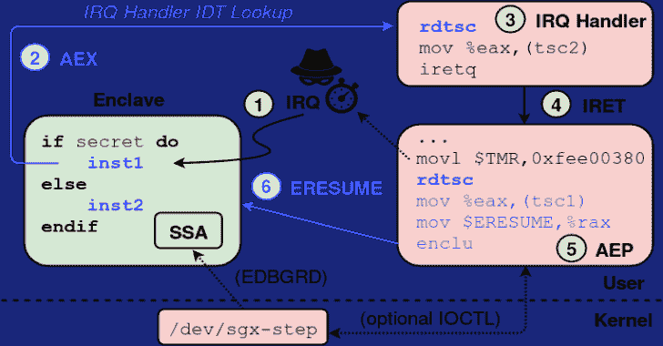

# SGX 步骤:精确飞地执行控制的实用攻击框架

> 原文：<https://kalilinuxtutorials.com/sgx-step-a-practical-attack-framework/>

**SGX-Step** 是一个开源框架，旨在促进英特尔 SGX 平台上的侧信道攻击研究。SGX 步骤包括一个对立的 Linux 内核驱动程序和用户空间库，允许完全从用户空间配置不可信的页表条目和/或 x86 APIC 定时器中断。

我们的研究结果展示了几个新的和改进的 enclave 执行攻击，这些攻击以最大的时间分辨率收集侧信道观察结果(即，通过在每个单个指令的*之后中断受害者 enclave)。*

**执照。** SGX-Step 是自由软件，由 [GPLv3](https://www.gnu.org/licenses/gpl-3.0) 授权。SGX 步标志源自埃德沃德·迈布里奇标志性的[公共领域](https://en.wikipedia.org/wiki/Sallie_Gardner_at_a_Gallop)“Sallie Gardner at a glucation”摄影系列，与我们的 enclave 单步目标一样，该系列将飞奔的马的动态分解为一系列单独的相框，以揭示马的整体步态特征。

**也可阅读-[x 射线:侦察、测绘的工具&从公共网络](https://kalilinuxtutorials.com/xray-recon-mapping-osint-gathering/)收集信息**

| SGX-分步释放 | 出版物详细信息 | 评论 |
| --- | --- | --- |
| v1.3.0 | [使用 C18](https://foreshadowattack.eu/foreshadow.pdf) | 瞬时执行(预示攻击)。 |
| 1.2.0 版 | [CCS'18](https://people.cs.kuleuven.be/~jo.vanbulck/ccs18.pdf) | 用户空间中断处理(涅墨西斯中断计时攻击)。 |
| 1.1.0 版 | [ESSoS’18](https://people.cs.kuleuven.be/~jo.vanbulck/essos18.pdf) | IA32 支持。 |
| 1.0.0 版 | [systex’17](https://people.cs.kuleuven.be/~jo.vanbulck/systex17.pdf)的缩写形式 | 最初的 SGX 步骤框架。 |

**摘要**

英特尔 SGX 等可信执行环境有望保护敏感计算免受潜在操作系统危害。

然而，最近的研究令人信服地表明，SGX 的强化对手模型也产生了一类新的强大、低噪声的旁道攻击，利用对硬件的一流控制。

这些攻击通常依靠频繁的飞地抢占来获得细粒度的边信道观察。当在每个指令之后测量受害者状态时，实现了最大的时间分辨率。

然而，当前最先进的 enclave 执行控制方案通常不能达到这样的指令级粒度。

本文介绍了 SGX 步骤，这是一个开源的 Linux 内核框架，它允许一个不可信的主机进程配置 APIC 定时器中断，并直接从用户空间跟踪页表条目。

我们提出并评估了一种在指令级粒度上单步包围执行的改进方法，并展示了 SGX 步如何实现几种新的或改进的攻击。

最后，我们讨论了它对设计有效防御机制的意义。

> 乔·范·布尔克、弗兰克·皮森斯和拉乌尔·斯特拉克。2017.SGX 步骤:精确飞地执行控制的实用攻击框架。第二届可信执行系统软件研讨会论文集(SysTEX '17)。

**概述**

与以前的 enclave 抢占方案不同，SGX 步骤设计的关键是为保存页表条目的物理内存位置以及本地 APIC 内存映射 I/O 配置寄存器和 x86 中断描述符表(IDT)创建用户空间虚拟内存映射。

这使得一个不受信任的、攻击者控制的主机进程可以轻松地(I)跟踪或修改 enclave 页表条目，(ii)配置 APIC 定时器单次/周期性中断源，(iii)触发处理器间中断，以及(iv)在用户空间内完全注册自定义中断处理程序*。*

上图总结了通过我们的框架中断和恢复 SGX 飞地时的硬件和软件步骤的顺序。

*   本地 APIC 定时器中断在 enclaved 指令内到达。
*   处理器执行 AEX 程序，该程序将执行上下文安全地存储在 enclave 的 SSA 帧中，初始化 CPU 寄存器，并引导至在 IDT 中注册的(用户空间)中断处理程序。
*   此时，任何特定于攻击的间谍代码都可以轻松插入。
*   图书馆返回到用户空间 AEP 蹦床。我们修改了官方 SGX SDK 的不可信运行时，以允许轻松注册自定义 AEP 存根。此外，为了能够在攻击者控制的基准调试飞地上精确评估我们的方法，SGX 步骤可以*可选地*被检测以从被中断飞地的 SSA 帧中检索存储的指令指针。为此，我们的`/dev/sgx-step`驱动程序为特权`EDBGRD`指令提供了一个可选的 IOCTL 调用。
*   此后，我们在执行(6) `ERESUME`之前，通过写入初始计数 MMIO 寄存器，为下一个中断配置本地 APIC 定时器。

**建设和运行**

**0。系统需求**

SGX 步骤需要一个支持 SGX 的英特尔处理器和一个现成的 Linux 内核。我们的评估是在 i7-6500 u/6700 CPU 上进行的，运行 Ubuntu 16.04 和 Linux 4.15.0 内核。下面我们总结一下 Linux [内核参数](https://wiki.archlinux.org/index.php/Kernel_parameters)。

| Linux 内核参数 | 动机 |
| --- | --- |
| `**nox2apic**` | 在内存映射 I/O 模式下配置本地 APIC 设备(以利用 SGX-Step 的精确单步功能)。 |
| `**iomem=relaxed, no_timer_check**` | 取消内核日志中不需要的警告消息。 |
| `**isolcpus=1**` | 将受害者进程关联到一个独立的 CPU 内核。 |
| `**dis_ucode_ldr**` | 禁用 CPU 微码更新([预示](https://foreshadowattack.eu/) /L1TF 缓解可能会影响单步执行间隔)。 |

将所需的引导参数传递给内核，如下所示:

**$ sudo vim/etc/DEFAULT/GRUB # GRUB _ CMDLINE _ LINUX _ DEFAULT = " quiet splash no x2 apic iomem = relaxed no _ timer _ check isol CPUs = 1 "
$ sudo update-GRUB&&sudo 重新启动**

最后，为了重现我们的实验结果，请确保在 BIOS 配置中禁用 C-States 和 SpeedStep 技术。下表列出了当前支持的英特尔 CPU，以及它们的单步 APIC 定时器间隔(`**libsgxstep/config.h**`)。

| 型号名称 | 中央处理器 | 基础频率 | APIC 定时器间隔 |
| --- | --- | --- | --- |
| 天空湖 | [i7-6700](https://ark.intel.com/products/88196) | 3.4 千兆赫 | Nineteen |
| 天空湖 | [i7-6500U](https://ark.intel.com/products/88194) | 2.5 千兆赫 | Twenty-five |
| 天空湖 | [i5-6200U](https://ark.intel.com/products/88193) | 2.3 千兆赫 | Twenty-eight |
| 卡比湖河 | [i7-8650U](https://ark.intel.com/products/124968) | 1.9 千兆赫 | Thirty-four |
| 咖啡湖河 | [i9-9900K](https://ark.intel.com/products/186605) | 3.6 千兆赫 | Twenty-one |

**1。打补丁安装 SGX SDK**

为了方便注册自定义异步退出指针(AEP)存根，我们修改了官方英特尔 SGX SDK 的不可信运行时。按照以下步骤检查 Linux-sgx v 2.6 并应用我们的补丁。

**$ git 子模块初始化
$ git 子模块更新
$。/install_SGX_driver.sh #在 Ubuntu 16.04
$上测试。/patch_sdk.sh
$。/install_SGX_SDK.sh #在 Ubuntu 16.04 上测试**

上面的安装脚本已经在 Ubuntu 16.04 LTS 上测试过了。对于其他 GNU/Linux 发行版，请按照 [linux-sgx](https://github.com/01org/linux-sgx) 项目中的说明构建并安装英特尔 SGX SDK 和 PSW 软件包。您还需要构建并加载一个(未修改的) [linux-sgx-driver](https://github.com/01org/linux-sgx-driver) sgx 内核模块，以便使用 SGX 步骤。

**注意(本地安装)。**打了补丁的 SGX SDK 和 PSW 包可以在本地安装，不会影响兼容的全系统‘Linux-sgx’安装。为此，示例 Makefiles 支持一个指向本地 SDK 安装目录的`SGX_SDK`环境变量。当检测到一个非默认的 SDK 路径(即，不是`/opt/intel/sgxsdk`)时，“运行”Makefile 目标进一步动态链接到本地`linux-sgx`目录中构建的打了补丁的`libsgx_urts.so`不可信运行时(使用`LD_LIBRARY_PATH`环境变量)。

**注意(32 位支持)。**关于构建 32 位版本的 SGX SDK 和 SGX-Step 的说明可以在 [README-m32.md](https://github.com/jovanbulck/sgx-step/blob/master/README-m32.md) 中找到。

**2。构建并加载** `**/dev/sgx-step**`

SGX-Step 附带了一个可加载的内核模块，它将一个 IOCTL 接口导出到`libsgxstep`用户空间库。该驱动程序主要负责(I)挂钩 APIC 定时器中断处理程序，(ii)收集不可信的页表映射，以及可选地(iii)获取基准飞地的中断指令指针。

要构建并加载`/dev/sgx-step`驱动程序，请执行:

**$ cd 内核
$进行干净加载**

**注意(/dev/isgx)。**我们的驱动程序使用了一些来自官方英特尔`/dev/isgx`驱动程序的内部符号和数据结构。因此，我们包含了一个 git 子模块，它指向一个未修改的 v2.1 [linux-sgx-driver](https://github.com/intel/linux-sgx-driver) 。

**注(/dev/mem)。**我们依靠 Linux 的虚拟`/dev/mem`设备为 APIC 物理内存映射 I/O 寄存器和感兴趣的页表条目构建用户级虚拟内存映射。然而，最近的 Linux 发行版通常启用了`CONFIG_STRICT_DEVMEM`选项，这阻止了这种使用。因此，我们的`/dev/sgx-step`驱动程序包含了一个[方法](https://www.libcrack.so/2012/09/02/bypassing-devmem_is_allowed-with-kprobes/)来绕过`devmem_is_allowed`检查，而无需重新编译内核。

**3。构建并运行测试应用**

用户空间应用程序可以链接到`libsgxstep`库，以利用 SGX 步骤的单步执行和页表操作特性。看看“app”目录中的示例应用程序。

例如，要为重复处理秘密字符串 100 次的基准 enclave 构建并运行论文中的`strlen`攻击，请执行:

**$ CD app/BENCH
$ NUM = 100 STRLEN = 1 make parse # alternative varying NUM and use BENCH = 1 or ZIGZAG = 1
$ #(以上命令默认为戴尔 Inspiron 13 7359 评估笔记本电脑；
$ #使用 DESKTOP=1 构建 Dell Optiplex 7040 机器)
$ #使用 SGX_SDK=/home/jo/sgxsdk/进行本地 SDK 安装
$ #使用 M32=1 生成 32 位可执行文件**

上面的命令构建了`libsgxstep`、基准受害者飞地和不可信攻击者主机进程，其中攻击场景和实例大小通过相应的环境变量进行配置。同一命令还以非交互方式运行生成的二进制文件(以确保确定的计时器间隔)，最后调用特定于攻击的后处理 Python 脚本来解析生成的 enclave 指令指针基准测试结果。

**注意(性能)。**单步孤立执行会导致速度大幅下降。对于本文中描述的实验，我们测量的执行时间长达 15 分钟。SGX-Step 的页表操作特性允许只对选定的函数进行单步执行，例如通过撤销对感兴趣的特定代码或数据页的访问权限。

**注意(定时器间隔)。**确切的定时器间隔值取决于 CPU 频率，因此本质上是特定于平台的。在`/app/bench/main.c`中配置一个合适的值。我们通过调整和观察 NOP microbenchmark enclave 指令指针跟踪结果，为我们的评估平台建立了精确的定时器间隔(见上表)。

**利用 SGX-步自己的后尘**

在你自己的项目中开始使用 SGX 步骤框架的最简单的方法是通过 [git 子模块](https://git-scm.com/book/en/v2/Git-Tools-Submodules):

**$ cd my/git/project
$ git 子模块添加 git @ github . com:jovanbulck/sgx-step . git
$ CD sgx-step #现在构建如上所述的`/dev/sgx-step '和` libsgxstep '**

查看一下`app`目录中的 Makefiles 文件，看看客户端应用程序如何链接到`libsgxstep`以及任何本地 SGX SDK/PSW 包。