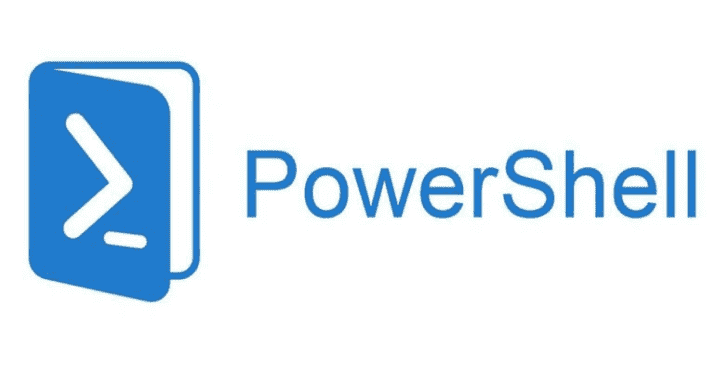

# ADAudit:用于实现域审计自动化的 Powershell 脚本

> 原文：<https://kalilinuxtutorials.com/adaudit-powershell-script-domain-auditing-automation/>

ADAudit 是一个执行快速广告审计的 PowerShell 脚本。如果你有任何像样的 powershell one liners，可以在脚本中使用，请让我知道。我试图将这个脚本保存为一个单独的文件，不需要外部工具(除了 ntdsutil 和 cmd.exe)

使用阿达直接在 DC 上运行。如果你不相信这些代码，我建议你先读一下，你会发现它们都是无害的！(但是你难道不应该用从网上下载的代码来做这件事，然后作为 DA 运行吗？？)

**这有什么用？**

*   设备信息
    *   获取主机详细信息
*   领域审计
    *   get-machineaccountoquota
    *   Get-SMB1Support
    *   获取功能级别
    *   get-dcsnotowedbyda(获取-dcsnotowedbyda)
*   域信任审计
    *   Get-DomainTrusts
*   用户帐户审计
    *   get-inactive 帐户
    *   get-disabled 帐户
    *   Get-AdminAccountChecks
    *   Get-NULLSessions
    *   Get-AdminSDHolders
    *   获取受保护的用户
*   密码信息审计
    *   get-account passdone expirer(获取帐户密码)
    *   get-UserPasswordNotChangedRecently
    *   Get-PasswordPolicy
*   Dumps NTDS。说
    *   Get-NTDSdit
*   计算机对象审计
    *   旧盒子
*   GPO 审计(并检查 SYSVOL 的密码)
    *   Get-GPOtoFile
    *   Get-GPOsPerOU
    *   get-sysvolxml
*   检查通用组 AD 权限
    *   Get-OUPerms
*   检查域中是否存在 lap
    *   Get-LAPSStatus
*   检查身份认证策略和思洛是否存在
    *   get-AuthenticationPoliciesAndSilos

**也读作-[Donut:生成 x86、x64 或 AMD64+x86 位置无关的外壳代码](http://kalilinuxtutorials.com/donut-x86-x64-or-amd64x86-shellcode/)**

**运行时参数**

以下开关可以组合使用

*   –**主机详细信息**检索主机名和其他有用的审计信息
*   **-domainaudit** 检索关于广告的信息，例如功能级别
*   **-trusts** 检索关于任何域名信任的信息
*   **-帐户**识别帐户问题，如过期、禁用等…
*   **-密码策略**检索密码策略信息
*   **-ntds** 使用 ntdsutil 转储 NTDS.dit 文件
*   **-旧盒子**识别出加入该领域的 XP/2003 等过时操作系统
*   **-gpo** 转储 XML 和 HTML 格式的 gpo，以供以后分析
*   **-ouperms** 检查一般 OU 权限问题
*   **-laps 检查** s 是否安装了 laps
*   **-authpolsilos** 检查验证策略和思洛是否存在
*   **-all** 运行所有检查，例如 AdAudit.ps1 -all

[**Download**](https://github.com/phillips321/adaudit)