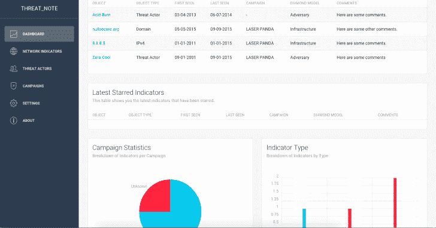
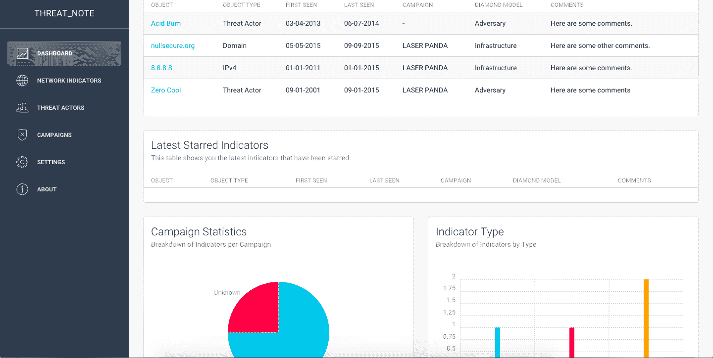
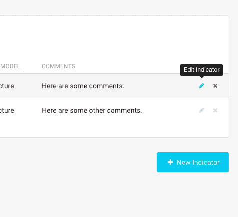
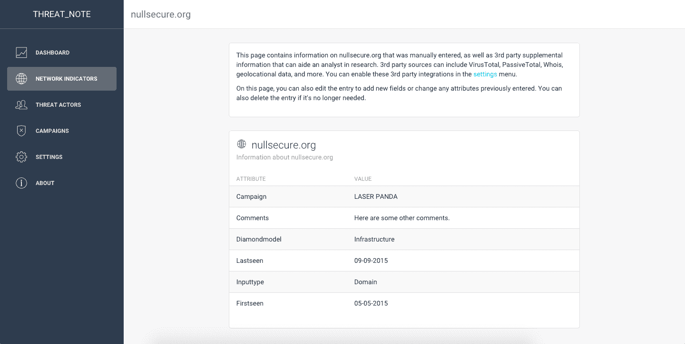
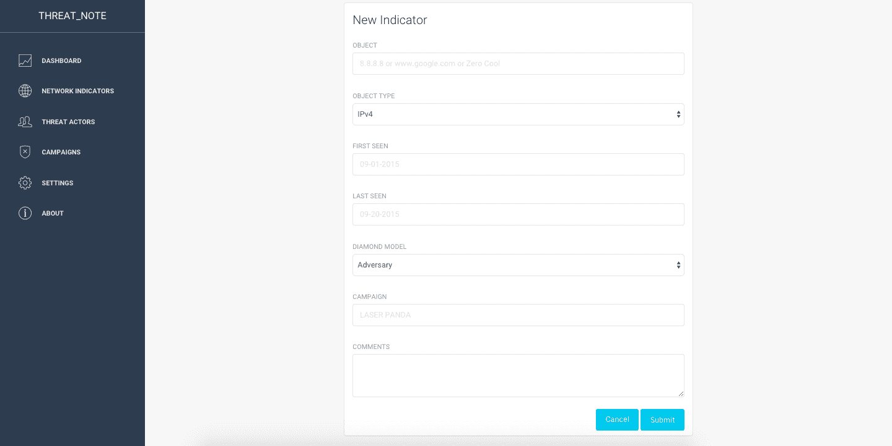
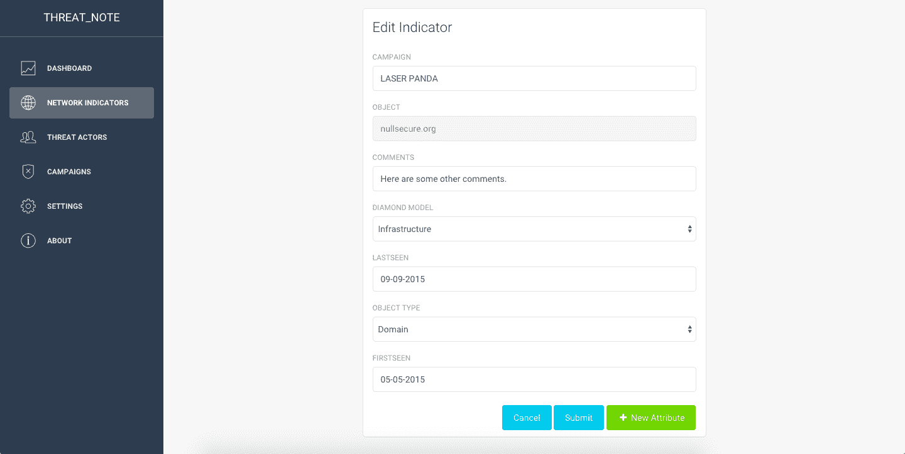
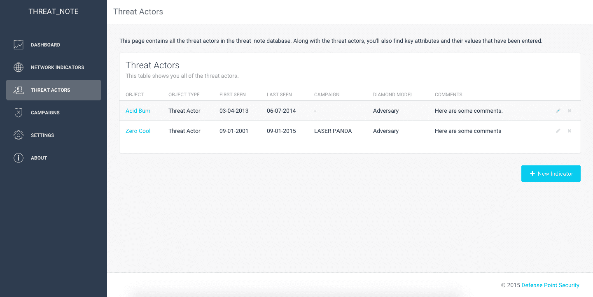
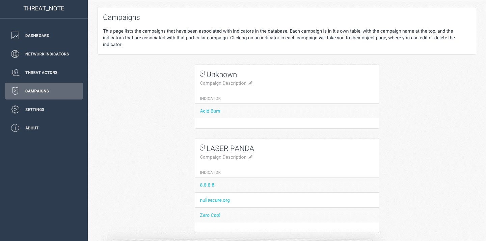
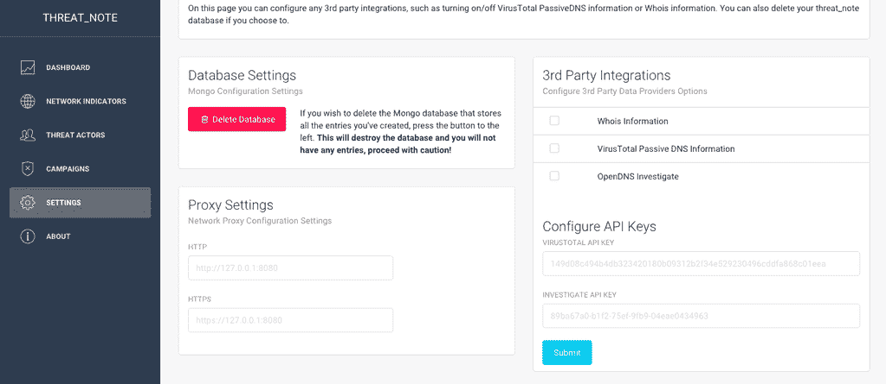

# 威胁 _ 注意:DPS 的轻型调查笔记本

> 原文：<https://kalilinuxtutorials.com/threat_note-dps-lightweight-investigation-notebook/>

**threat_note** 是由[防御点安全](http://www.defpoint.com)构建的一个 web 应用程序，允许安全研究人员添加和检索与其研究相关的指标。截至目前，这包括添加 IP 地址、域和威胁参与者的能力，未来将添加更多类型。

这款应用填补了目前可用的各种解决方案之间的空白，轻量级，易于安装，并最大限度地减少了有时会妨碍添加信息的无用和无关信息。要创建一个新的指示器，您只需要提供对象本身(无论是域、IP 还是威胁行为者)并相应地更改类型，然后砰！就是这样！当然，提供更多的信息肯定是有帮助的，但是，这不是必需的。

为存储指标和研究而构建的其他应用程序有一些缺点，threat_note 希望修复这些缺点。对其他应用程序的一些常见抱怨是:

*   难以安装/配置/维护
*   需要为增加的功能付费(企业许可证)
*   信息太多
    *   这归结为有太多的事情要做，以创建新的指标，或试图在应用程序中塞进大量的功能。

**安装**

既然我们使用 SQLite，就不需要讨厌的流浪机器了。我们所需要做的就是通过 pip 安装一些需求并启动服务器:

**CD threat _ note
pip install-r requirements . txt
honcho start**

一旦服务器开始运行，您就可以浏览到 [http://localhost:5000](http://localhost:5000) 并注册一个新帐户来登录 threat_note。

**码头工人安装**

开发 docker 文件现已可用，要构建它，请从其目录中执行以下操作:

**sudo 坞站构建-t 威胁 _note。
sudo 坞站运行-itd-p 8888:888 threat _ note**

一旦服务器开始运行，您就可以浏览到 [http://localhost:8888](http://localhost:8888) 并注册一个新帐户来登录 threat_note。

**截图**

首先是仪表板的一个镜头，其中有最新的指标，最新的星号指标，以及一个活动和指标类型细分。

接下来是网络指示器页面的屏幕截图，在这里您将看到所有具有“域”、“网络”或“IP 地址”类型的指示器。

通过将鼠标悬停在指示器右侧的适用图标上，您可以在此页面中编辑或删除指示器。

单击网络指示器将弹出该指示器的详细信息页面。如果您打开了 Whois 信息，您将在指示器下方看到城市和国家。

单击网络或威胁因素页面上的“新指标”按钮，将显示一个页面，输入有关新指标的详细信息。

如果您单击指标旁边的“编辑指标”图标，您将看到一个页面，可以编辑您之前输入的任何详细信息。您也可以点击右下角的“新属性”图标，为您的指标添加新属性。

在下面的截图中，你可以看到“威胁因素”页面，它类似于“网络指标”页面，但是，你只会看到你输入的威胁因素。

下面是活动页面。它包含您的所有指标，按活动名称分类。**请注意，活动描述右侧的“编辑描述”按钮现在已损坏，将在未来版本中修复。**点击指标将进入指标详情页面。

最后，这里是设置页面，在这里您可以删除您的 threat_note 数据库，以及控制任何第三方集成，如 Whois 数据或 VirusTotal 信息。打开这些集成会降低检索指标详细信息的速度。最近由 [@alxhrck](https://github.com/alxhrck) 添加的一个新特性是，如果你需要连接到第三方，可以添加一个 HTTP(s)代理。他最近还增加了对新的第三方集成 OpenDNS Investigate 的支持，可以在这个页面上激活。

学分:[创意 Tim](http://www.creative-tim.com/)

[**Download**](https://github.com/DefensePointSecurity/threat_note)