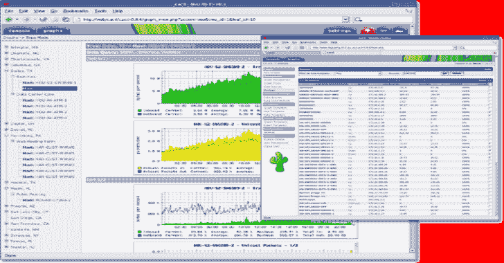

# Cacti:完整的网络绘图解决方案

> 原文：<https://kalilinuxtutorials.com/cacti-complete-network-graphing-solution/>

**Cacti** 是一个完整的网络图形解决方案，旨在利用 RRDtool 的数据存储和图形功能，提供以下特性:

*   远程和本地数据采集器
*   设备发现
*   设备和图形创建的自动化
*   图形和设备模板
*   自定义数据收集方法
*   用户、组和域访问控制

所有这些都包含在一个直观、易于使用的界面中，对于局域网规模的安装和拥有数千台设备的复杂网络都有意义。

它是由 Ian Berry 在 21 世纪初作为一个高中项目开发的，已被成千上万的公司和爱好者用来监控和管理他们的企业网络和数据中心。

当使用源代码或通过直接从存储库中下载代码时，如果遇到任何与数据库中缺失的表或列有关的错误，运行数据库升级脚本是非常重要的。

对数据库的更改被提交到用于新安装的`**cacti.sql**`文件，并被提交到现有安装的安装程序数据库升级。

因为版本号在`**develop**`分支发布之前不会改变，这将导致数据库升级无法运行，所以使用数据库升级脚本强制当前版本或更新数据库中的版本是很重要的。

**也可理解为—[DFIRTriage:基于 Windows 的事件响应数字取证工具](https://kalilinuxtutorials.com/dfirtriage-digital-forensic-acquisition/)**

**运行数据库升级脚本**

**sudo-u cacti PHP-q CLI/upgrade _ database . PHP–force ver = ` cat include/cacti _ version `**

**更新数据库中的 Cacti 版本**

**更新版本集 cacti = ' 1 . 1 . 38 '；**

**注意:**将上述版本更改为正确的版本，否则安装程序可能会从以前的版本升级。

**要求**

Cacti 应该能够在满足以下要求的任何基于 Linux、UNIX 或 Windows 的操作系统上运行:

*   PHP 5.4 以上
*   MySQL 5.1 以上版本
*   建议使用 RRDtool 1.3+和 1.5+版本
*   NET-SNMP 5.5+版本
*   支持 PHP 的 Web 服务器

PHP 也必须编译成独立的 cgi 或 cli 二进制文件。这是通过 cron 收集数据所必需的。

**php-snmp**

我们将 php-snmp 模块标记为可选的。只要您不使用 ipv6 设备，或者不使用 snmpv3 引擎 id 或上下文，那么使用 php-snmp 应该是安全的。否则，您应该考虑卸载 php-snmp 模块，因为它会产生问题。我们意识到了 php-snmp 的问题，并希望参与到 php 项目中来解决这些问题。

**RRDtool**

RRDtool 有多个版本，其中大多数都受 Cacti 支持。如果在绘制图形时遇到问题，请记得确认 RRDtool 版本的 Cacti 设置。

**文档**

Cacti 版本提供了文档，也可以在[文档库](https://github.com/Cacti/documentation/blob/develop/README.md)上查看。

**投稿**

查看主 [Cacti](http://www.cacti.net/) 网站，下载、更改日志、发布说明等等！

**社区论坛**

鉴于 Cacti 的大范围，论坛往往会产生可观的流量。尽你的一份力量来回答基本问题有很长的路要走，因为我们不可能同时出现在每一个地方。通过参加[仙人掌社区论坛](http://forums.cacti.net/)为仙人掌社区做贡献。

**GitHub 文档**

参与创建和编辑 Cacti 文档！派生、更改并提交一个 pull 请求，以帮助改进 [GitHub](https://github.com/cacti/documentation) 上的文档。

**功能**

**数据来源**

Cacti 通过数据源的概念处理数据的收集。数据源利用输入方法从设备、主机、数据库、脚本等收集数据。就您能够收集的数据的性质而言，可能性是无限的。数据源是底层 RRD 文件的直接链接；如何将数据存储在 RRD 文件中，以及如何从 RRD 文件中检索数据。

**图表**

图表是 Cacti 的心脏和灵魂，由 RRDtool 使用已定义的数据源定义来创建。

**模板化**

综上所述，Cacti 使用了广泛的模板系统，允许创建和使用可移植的模板。图表、数据源和 RRA 模板允许轻松创建现成的图表和数据源。随着 Cacti 社区的支持，模板已经成为支持在当今的计算和网络环境中绘制任意数量的设备的标准方法。

**【数据收集(Poller)】**

本地和远程数据收集支持，能够设置收集间隔。查看 Cacti 中的数据源概要文件以了解更多信息。数据源配置文件可以在创建时或在数据模板级别应用于图表。

通过将资源复制到远程数据收集器，远程数据收集变得很容易。即使远程数据收集器与主 Cacti 安装的连接丢失，它也会存储收集的数据，直到连接恢复。远程数据收集只需要 MySQL 和 HTTP/HTTPS 访问主 Cacti 安装位置。

**网络发现和自动化**

Cacti 为管理员提供了一系列网络自动化功能，以减少设置和管理设备所需的时间和精力。

*   多个可定义的网络发现规则
*   指定如何配置设备的自动化模板

**插件框架**

Cacti 不仅仅是一个网络监控系统，它还是一个允许扩展和增加 Cacti 功能的操作框架。Cacti 组继续维护各种插件。如果你想给 Cacti 添加特性，GitHub 上有相当多的参考资料可供选择。

**动态图形查看体验**

Cacti 允许在查看图形时进行许多运行时扩充:

*   动态加载的树和图形视图
*   按字符串、图形和模板类型搜索
*   视觉增强
*   简单的时间跨度调整
*   方便的滑动时间窗口按钮
*   单击实时图表选项
*   轻松将图形导出到 csv
*   只需点击一下，即可查看 RRA

**用户、组和权限**

支持每个领域(Cacti 区域)、每个图形、每个图形树、每个设备等的每个用户和每个组权限。Cacti 中的权限模型是基于角色的访问控制(RBAC ),允许灵活分配权限。支持强制执行密码复杂性、密码期限和更改过期密码。

**RRDtool 图形选项**

Cacti 支持大多数 RRDtool 图形功能，包括:

**图形选项**

*   全右轴
*   变化
*   虚线和虚线偏移
*   替代 y 轴网格
*   无网格匹配
*   单位长度
*   制表符宽度
*   动态标签
*   规则图例
*   图例位置

**图形项**

*   VDEFs
*   堆叠线条
*   用户可定义的线宽
*   文本对齐

[**Download**](https://github.com/Cacti/cacti)