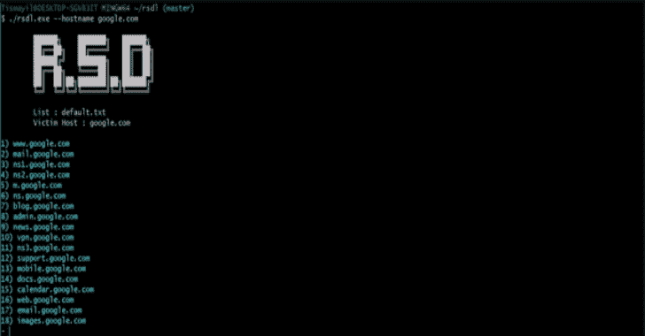
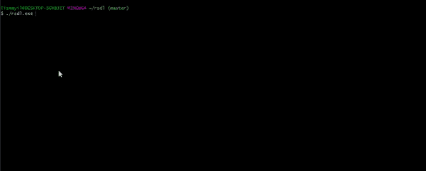

# RSDL:使用 Ping 方法进行子域扫描

> 原文：<https://kalilinuxtutorials.com/rsdl-subdomain-scan-with-ping-method/>

**RSDL** 是一个用 Ping 方法进行子域扫描的工具。

| 旗帜 | 价值 | 描述 |
| --- | --- | --- |
| –主机名 | example.com | 要扫描的域。 |
| –输出 |  | 记录带有域名的输出。 |
| –列表 | /tmp/list/example . txt | 子域名列表。 |

**也可阅读-[gcpbucketbrut:枚举谷歌存储桶的脚本](https://kalilinuxtutorials.com/gcpbucketbrute-enumerate-google-storage-buckets/)**

**安装**

**go 获取 github.com/tismayil/rsdl**
**克隆回购并构建(go build rsdl.go )**

**二手回购**

**出发**微调:github.com/briandowns/spinner—【出发去找 github.com/briandowns/spinner】
**出发**平:github.com/sparrc/go-ping—【出发去找 github.com/sparrc/go-ping】

[**Download**](https://github.com/tismayil/rsdl)