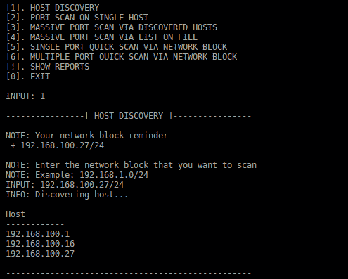
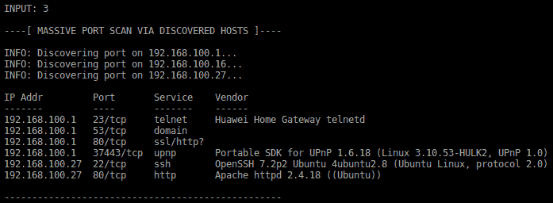

# NetAss2:网络评估援助框架(PenTest 工具包)

> 原文：<https://kalilinuxtutorials.com/netass2-network-assessment-assistance-framework/>

[")](https://1.bp.blogspot.com/-ANdMXMPhwD0/Xc0L1Mp2A0I/AAAAAAAADa4/1FNGXgSeFQcKKYjy4Dzho2C_78-tdhMFwCLcBGAsYHQ/s1600/netass2-menu%2B%25281%2529.png)

**NetAss2** 是用 NetAss2(网络评估辅助框架)更容易的网络扫描。使 Pentester 在网络上进行渗透测试变得容易。

**依赖关系**

*   nmap(工具)
*   zmap(工具)

**安装**

**git 克隆 https://github.com/zerobyte-id/NetAss2.git**
**CD netass 2**
**sudo chmod+x install . bash**
**sudo/install.bash**

**跑**

**netass2**

**现有菜单**

*   主机发现
*   单台主机上的端口扫描
*   通过发现的主机进行大量端口扫描
*   通过文件上的列表进行大量端口扫描
*   通过网络块进行单端口快速扫描
*   通过网络块进行多端口快速扫描
*   显示报告

**也可阅读-[ad audit:Powershell 脚本来实现域审计自动化](https://kalilinuxtutorials.com/adaudit-powershell-script-domain-auditing-automation/)**

**截图**

[**Download**](https://github.com/zerobyte-id/NetAss2)