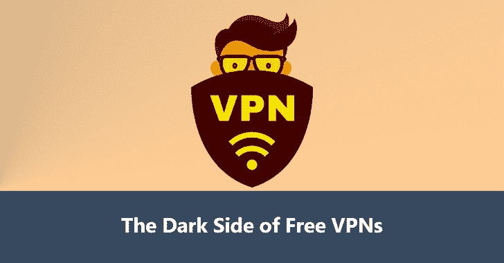

# 免费 VPN 的阴暗面——你必须知道的事情

> 原文：<https://kalilinuxtutorials.com/dark-side-of-free-vpn/>

互联网隐私应该是每个人的主要关注点，无论你使用互联网只是为了社交媒体还是网上银行，你都应该尽可能地保护你的浏览隐私。

市场上有太多的优质 VPN 产品，你可以选择为各种服务付费，这些服务将努力保护你的浏览隐私和数据安全，但免费服务呢？免费 VPN 有阴暗面吗？阅读以下内容，了解更多信息。

## **免费 VPN 的跟踪你**

与高级服务不同，[免费 VPN 的](https://gbhackers.com/vpn-free-trial/)将在你使用服务时跟踪并记录你的所有活动。这正是你想要避免的活动类型，因此你正在考虑使用 VPN 进行浏览。

您的浏览列表、IP 地址和任何其他重要信息可能会被其他公司、团体或组织传阅，而这些公司、团体或组织可能不会以最合理或合法的方式使用这些信息。

## 免费的 VPN 安全吗？

正如我们之前提到的，没有人会出于好心做任何事情，尤其是当涉及到有钱可赚的产品时。

由英联邦科学和工业研究组织(CSIRO)进行的一项研究评估和分析了 200 多个 android 免费 VPN 应用程序，发现超过 70%的这些应用程序利用了第三方跟踪库，因此简而言之，它们不能被信任。

这些应用程序还要求用户签署同意这些应用程序可以访问私人信息，例如跨不同平台和不同用户帐户的消息。

为什么一个应该保护你的信息和私人数据安全的应用程序需要访问一些不必要的东西？

## **为什么免费从来不是真正的免费**

当一个东西说免费时，我们会立即想到成本，但如果成本是免费的，那么取而代之的是什么？没有人做任何事情是免费的，这包括企业，尤其是基于互联网的产品。

如果听起来好得不像真的，那很可能是真的，那么这些免费产品到底是如何从你使用他们的服务中获益的呢？他们通过出售你的数据来赚钱。通过注册一个免费的 VPN，您允许该服务将 VPN 收集的您的数据出售给第三方，而第三方可能不会出于道德目的使用这些数据。

我们中的很多人都公开表示担心，我们从未接触过的企业和组织掌握了我们多少信息和数据，通过使用免费的 VPN 服务，你甚至允许更多人访问你的数据。

## **免费服务还有哪些剥削用户的方式？**

如果窃取你的个人数据还不足以阻止你，那么节流你的带宽呢？这是使用免费服务的另一个非常真实的副作用。

CSRIO 发现，这些产品不仅具有上述所有功能，而且它们还可以在您的 IP 地址下进行更具破坏性的活动，而您可能对此一无所知。

当你让这些应用程序进来的时候，它们实际上可以劫持你的浏览器。虽然如果他们被重定向到像易贝和其他电子商务平台这样的网站，这可能不会带来麻烦，但其背后的全部意义是，该应用程序完全控制了你的浏览器，因此可以将你指引到他们希望的任何地方，以便他们可以赚取代销商佣金或甚至更恶意的东西。

## **恶意软件**

在大量的免费下载中，你可以肯定你的机器或设备可能在某个阶段感染了恶意软件。在这些免费服务上发现的一些恶意软件旨在窃取你的个人和敏感信息，然后卖给出价最高的人，完全由你承担费用。

## **最终考虑事项**

虽然看起来免费 VPN 是一个惊人的选择，特别是如果你第一次了解它们，并考虑到你的数字足迹，免费从来都不是免费的。虽然你没有拿出任何辛苦赚来的钱来支付服务费用，但你却以更糟糕的方式来支付。即使是在很短的时间内，收集到的关于你的数据量也是惊人的。

不仅如此，这些服务将节流你的带宽，然后把你重定向到联盟网站，以进一步增加他们的收入，从而赚更多的钱。

当一个 VPN 声明它是免费的，它是免于财务费用的，但他们会从你身上拿走什么，然后从中获利，这是不值得考虑的。在你选择一个免费的 VPN 之前，彻底研究一下这个平台，问问你自己为什么它是免费的。