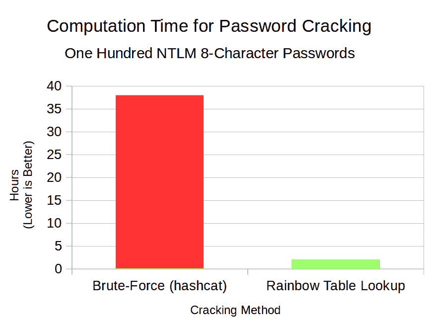

# 彩虹裂缝:彩虹表生成和查找工具

> 原文：<https://kalilinuxtutorials.com/rainbow-crackalack/>

Rainbow Crackalack 项目开发了开源代码来生成 Rainbow 表，并使用它们来查找密码哈希。虽然当前版本只支持 NTLM，但未来版本的目标是支持 MD5、SHA-1、SHA-256，甚至更多。Linux 和 Windows 都支持！

几年前，当 GPU 加速的密码破解变得流行时，彩虹表就过时了。有了 hashcat 这样的工具，投入精力获取现有的过时表就不再有意义了。此外，没有 GPU 加速的开源工具可以用来创建新表。由于这些原因，彩虹表的世界被 infosec 社区遗忘了。

然而，基于规则的破解和彩虹表破解从来都不是唯一的策略。它们过去是(事实上现在仍然是)互补的。规则非常善于发现模式，这些模式通常是由用户设置的；彩虹表对于完全随机的密码是有效的，这对于高度敏感的帐户是存在的。

**也可理解为-[Cacti:完整的网络图形解决方案](https://kalilinuxtutorials.com/cacti-complete-network-graphing-solution/)**

**例题**

#### 生成 NTLM 9 字表

以下命令显示了如何生成标准的 9 字符 NTLM 表:

**#。/crackalack _ gen NTLM ascii-32-95 9 9 0 803000 67108864 0**

这些参数被设计成可以与原始的(现在是闭源的)rainbow crack 工具相媲美。按顺序，它们的意思是:

| 争吵 | 意义 |
| --- | --- |
| ntlm | 要使用的哈希算法。目前仅支持“ntlm”。 |
| ascii-32-95 | 要使用的字符集。这实际上意味着“美国键盘上所有可用的字符”。 |
| nine | 最小明文字符长度。 |
| nine | 最大明文字符长度。 |
| Zero | 缩减指数。标准条件下不使用。 |
| Eight hundred and three thousand | 单个彩虹链的链长。 |
| Sixty-seven million one hundred and eight thousand eight hundred and sixty-four | 每张桌子的链条数量(= 64M) |
| Zero | 表部件索引。保持所有其他参数不变，并增加该字段以生成一组表。 |

**针对 NTLM 8 字符哈希的表查找**

以下命令显示了如何根据 NTLM 8 字符表查找 NTLM 散列文件(每行一个):

**#。/crack alack _ lookup/export/NTLM 8 _ tables//home/user/hashes . txt**

**推荐硬件**

NVIDIA GTX 和 RTX GPU 硬件系列已经过彩虹 Crackalack 软件的良好测试，并提供了出色的性价比。具体来说，GTX 1660 Ti 或 RTX 2060 是建立一个新的裂解机器的最佳选择。[本文件](https://docs.google.com/spreadsheets/d/1jigNGvt9SUur_SNH7QDEACapJbrdL_wKYtprM23IDpM/edit?usp=sharing)包含支持本建议的原始数据。

然而，其他现代设备也可以工作得很好，所以你不一定需要购买新的东西。英伟达 GTX 和 AMD Vega 产品线对破解还是挺有用的！

**更改日志**

*   1.0 版:2019 年 6 月 11 日:初次修订。
*   v 1.1:2019 年 8 月 8 日:大规模的速度改进(归功于史蒂夫·托马斯)，NTLM9 规范的定稿，错误修复。

**Windows 构建**

通过安装以下先决条件，可以在 Ubuntu 主机上实现 64 位 Windows 版本:

**#安装 mingw-w64 opencl-headers**

然后开始构建:

**#使干净；。/make_windows.sh**

**鸣谢:** [乔·泰斯塔](https://www.positronsecurity.com/company/)

[**Download**](https://github.com/jtesta/rainbowcrackalack)