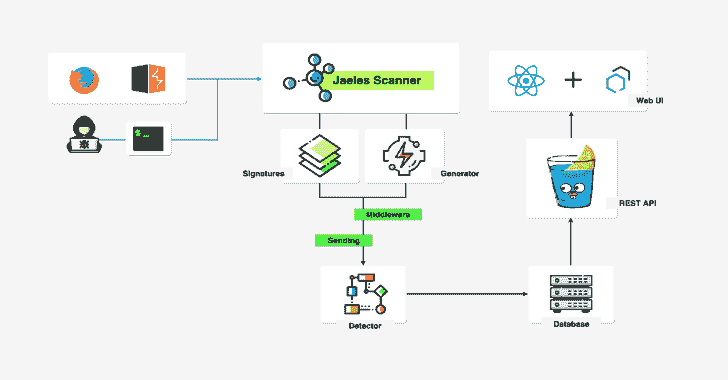

# Jaeles:自动化 Web 应用测试的瑞士军刀

> 原文：<https://kalilinuxtutorials.com/jaeles-the-swiss-army-knife-web-application-testing/>

Jaeles 是一个强大、灵活且易于扩展的框架，用 Go 编写，用于构建自己的 Web 应用程序扫描器。

**安装**

**去 github.com/jaeles-project/jaeles 吧**

**用途**

**模式；** –扫描模式
–模糊模式

jaeles–瑞士军刀自动化 Web 应用测试 beta v 0.1 by @ j 3 ssiejjj

**>>用法:** jaeles【命令】

**> >可用命令:** config 配置 CLI
帮助关于任何命令
扫描做扫描
服务器运行服务器

**> >标志:** -cjaeles/config . YAML)
–Debug Debug
-h，–help 帮助 jaeles
–no-output 不存储原始输出
-o，–输出字符串输出文件夹名(默认“out”)
–代理字符串 proxy
–Refresh int Refresh(默认 10)
–retry int retry(默认 3)
–rootDir 字符串根项目(默认“~/)。jaeles/"
–save-raw 保存原始请求
–scanID 字符串扫描 ID
–sign dir 字符串 signFolder(默认" ~/)。jaeles/signatures-base/"
–time out int time out(缺省值为 20)
-v，–Verbose Verbose

**>>使用“jaeles[命令]–帮助”了解有关命令的更多信息。**

**也可阅读-[netass 2:网络评估辅助框架(PenTest Toolkit)](https://kalilinuxtutorials.com/netass2-network-assessment-assistance-framework/)**

**扫描**

**根据签名扫描 URL 列表** 
**用法:** jaeles Scan[Flags]

**Flags:** -h，–帮助帮助扫描
-s，–sign string 提供自定义标题，用'；'
–ssrf string Fill your burp collab
-U，–URL string URL of target
-U，–URLs string URLs file of target

**示例命令**

**#扫描单个 url 的所有签名** jaeles scan-U http://example.com

**#扫描 URL 列表的 phpdebug.yaml 签名** jaeles scan-s signatures/common/PHP debug . YAML-U/tmp/list _ of _ URLs . txt

**#扫描 URL 列表的所有带有“aem”前缀的签名** jaeles scan–retry 3–verbose-s " signatures/cves

**模糊**

**启动 API 服务器** 
**用法:** jaeles Server【Flags】

**Flags:** -h，–help 为服务器提供帮助
–主机字符串 IP 地址绑定服务器(默认为“127 . 0 . 0 . 1”)
-l，–level int 16 提供自定义头文件，以“；”分隔(默认为 1)
–端口字符串 port(默认为“5000”)
-s，–符号字符串提供由“；”分隔的自定义标头

**示例命令**

**#扫描 http://127.0.0.1:5000 上的 API 服务器** jaeles 服务器

**#扫描 http://127.0.0.1:5000 上的 API 服务器，默认签名为 sqli** jaeles–verbose server-s sqli

**展示区**

**带 URL 列表的列表签名**

**带 URL 列表的单一签名**

**打嗝的模糊模式**

https://youtu.be/Ij6SPy-6tro[**Download**](https://github.com/jaeles-project/jaeles)