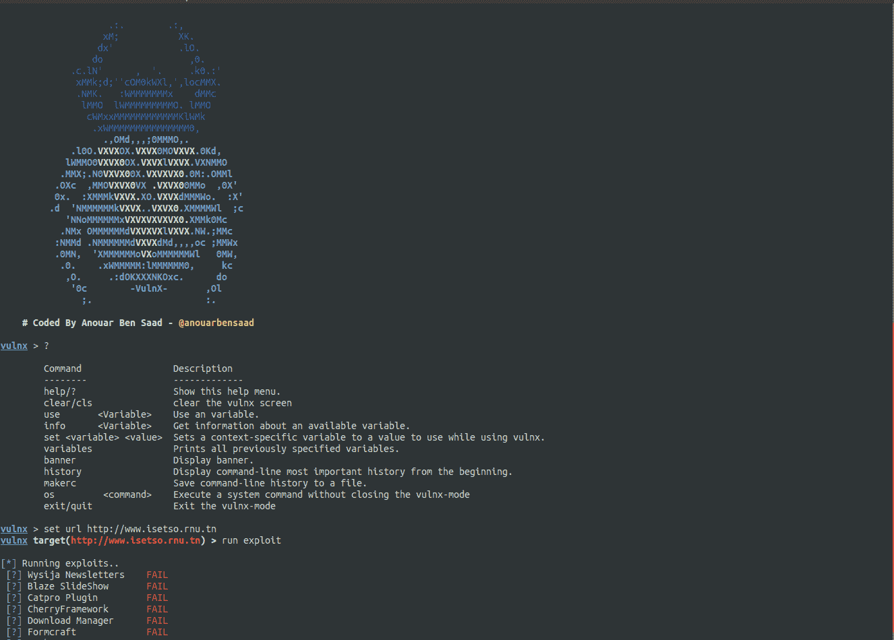

# Vulnx:智能机器人自动外壳注入器，可检测多种类型的 CMS 中的漏洞

> 原文：<https://kalilinuxtutorials.com/vulnx-intelligent-bot-auto-shell-injector/>

Vulnx 是一个智能 Bot 自动外壳注入器，可以检测多种类型的 cms 中的漏洞，快速 CMS 检测，信息收集和目标漏洞扫描，如子域，IP 地址，国家，组织，时区，地区，ans 等。

它不像其他工具那样手动注入每一个外壳，而是分析目标网站，检查是否存在漏洞。如果存在漏洞，就会注入外壳。

**特性**

*   检测 cms (wordpress，joomla，prestashop，drupal，opencart，magento，lokomedia)
*   目标信息收集
*   目标子域收集
*   按需多线程
*   检查漏洞
*   汽车外壳注射器
*   利用呆子搜索器
*   [`**Ports Scan**`](https://user-images.githubusercontent.com/23563528/58365946-40a83a00-7ec3-11e9-87c5-055ed67109b7.jpg) 级别高
*   [`**Dns**`](https://user-images.githubusercontent.com/23563528/58365784-09388e00-7ec1-11e9-8a05-e71fa39f146d.png)-服务器转储
*   输入多个要扫描的目标。
*   按名字和利用名列出的呆子。
*   将多个目标从 Dorks 导出到日志文件中。

**也可理解为—[资产发现:从 HTTP 响应中发现资产的 Burp 套件扩展](https://kalilinuxtutorials.com/burpsuite-asset_discover/)**

**DNS 映射结果**

为此，请使用–DNS 标志和-d 对子域运行扫描。要生成 isetso.rnu.tn 的映射，可以在新的终端中运行命令`**vulnx -u isetso.rnu.tn --dns -d --output $PATH**`。

`**$PATH**`:存储图形结果的位置。

让我们生成一个显示目标子域、MX 和 DNS 数据的图像。

**战功**

##### 网站架站软件

*   [Com Jce](https://github.com/anouarbensaad/vulnx/blob/master/'#')
*   [Com 壁纸](https://github.com/anouarbensaad/vulnx/blob/master/'#')
*   [Com Jdownloads](https://github.com/anouarbensaad/vulnx/blob/master/'#')
*   [Com Jdownloads2](https://github.com/anouarbensaad/vulnx/blob/master/'#')
*   与网络链接
*   [Com Fabrik](https://github.com/anouarbensaad/vulnx/blob/master/'#')
*   [Com Fabrik2](https://github.com/anouarbensaad/vulnx/blob/master/'#')
*   [Com Jdownloads 索引](https://github.com/anouarbensaad/vulnx/blob/master/'#')
*   [Com Foxcontact](https://github.com/anouarbensaad/vulnx/blob/master/'#')
*   [Com 博客](https://github.com/anouarbensaad/vulnx/blob/master/'#')
*   [Com 用户](https://github.com/anouarbensaad/vulnx/blob/master/'#')
*   [Com 广告经理](https://github.com/anouarbensaad/vulnx/blob/master/'#')
*   [Com 性接触形式](https://github.com/anouarbensaad/vulnx/blob/master/'#')
*   [Com 媒体](https://github.com/anouarbensaad/vulnx/blob/master/'#')
*   [Mod_simplefileupload](https://github.com/anouarbensaad/vulnx/blob/master/'#')
*   [Com 工具格式](https://github.com/anouarbensaad/vulnx/blob/master/'#')
*   [Com 工具格式](https://github.com/anouarbensaad/vulnx/blob/master/'#')
*   [用灭火器](https://github.com/anouarbensaad/vulnx/blob/master/'#')

##### wordpress 软件

*   [简单的广告管理器](https://www.exploit-db.com/exploits/36614)
*   [线内营销](https://www.rapid7.com/db/modules/exploit/unix/webapp/wp_inboundio_marketing_file_upload)
*   [WPshop 电子商务](https://www.rapid7.com/db/modules/exploit/unix/webapp/wp_wpshop_ecommerce_file_upload)
*   [天气](https://cxsecurity.com/issue/WLB-2017030099)
*   [娱乐圈专业人士](https://www.exploit-db.com/exploits/35385)
*   [作业管理器](https://www.exploit-db.com/exploits/45031)
*   [Formcraft](https://www.exploit-db.com/exploits/30002)
*   [动力变焦](http://www.exploit4arab.org/exploits/399)
*   [下载管理器](https://www.exploit-db.com/exploits/35533)
*   [奇瑞框架](https://www.exploit-db.com/exploits/45896)
*   [Catpro](https://vulners.com/zdt/1337DAY-ID-20256)
*   [火焰幻灯](https://0day.today/exploits/18500)
*   [Wysija-时事通讯](https://www.exploit-db.com/exploits/33991)

##### Drupal

*   [添加管理员](https://github.com/anouarbensaad/vulnx/blob/master/'#')
*   [Drupal BruteForcer](https://github.com/anouarbensaad/vulnx/blob/master/'#')
*   [Drupal Geddon2](https://github.com/anouarbensaad/vulnx/blob/master/'#')

##### 预车间

*   [attributewizardpro](https://github.com/anouarbensaad/vulnx/blob/master/'#')
*   [栏目广告](https://github.com/anouarbensaad/vulnx/blob/master/'#')
*   [soopamobile](https://github.com/anouarbensaad/vulnx/blob/master/'#')
*   [PK _ 弹性菜单](https://github.com/anouarbensaad/vulnx/blob/master/'#')
*   [pk_vertflexmenu](https://github.com/anouarbensaad/vulnx/blob/master/'#')
*   [nvn _ 出口 _ 订单](https://github.com/anouarbensaad/vulnx/blob/master/'#')
*   [大菜单](https://github.com/anouarbensaad/vulnx/blob/master/'#')
*   [tdpsthemeoptionpanel](https://github.com/anouarbensaad/vulnx/blob/master/'#')
*   [psmode 主题选项面板](https://github.com/anouarbensaad/vulnx/blob/master/'#')
*   [批量生产](https://github.com/anouarbensaad/vulnx/blob/master/'#')
*   [区块证明](https://github.com/anouarbensaad/vulnx/blob/master/'#')
*   [速食班](https://github.com/anouarbensaad/vulnx/blob/master/'#')
*   [Vtermslideshow](https://github.com/anouarbensaad/vulnx/blob/master/'#')
*   [简单滑展](https://github.com/anouarbensaad/vulnx/blob/master/'#')
*   [产品页面广告](https://github.com/anouarbensaad/vulnx/blob/master/'#')
*   [主页广告](https://github.com/anouarbensaad/vulnx/blob/master/'#')
*   [主页广告 2](https://github.com/anouarbensaad/vulnx/blob/master/'#')
*   [jro_homepageadvertise](https://github.com/anouarbensaad/vulnx/blob/master/'#')
*   [高级滑块](https://github.com/anouarbensaad/vulnx/blob/master/'#')
*   [cartabandonmentpro](https://github.com/anouarbensaad/vulnx/blob/master/'#')
*   [cartabandonmentproOld](https://github.com/anouarbensaad/vulnx/blob/master/'#')
*   [videostab](https://github.com/anouarbensaad/vulnx/blob/master/'#')
*   [wg24 行政管理](https://github.com/anouarbensaad/vulnx/blob/master/'#')
*   [fieldvmegamenu](https://github.com/anouarbensaad/vulnx/blob/master/'#')
*   [wdoptionpanel](https://github.com/anouarbensaad/vulnx/blob/master/'#')

##### 开放式购物车

*   [敞开式手推车粗放机](https://github.com/anouarbensaad/vulnx/blob/master/'#')

**虚拟模式**

vulnx 现在有一个交互模式。 **URLSET**

**多克斯**

**可用的命令行选项**

用法:vulnx[options]

-u–URL URL target
-D–呆子搜索有呆子的网页
-o–output 指定输出目录
-t–超时 http 请求超时
-c–cms-info 搜索 CMS 信息[主题，插件，用户，版本..]
-e-exploit 搜索漏洞&run exploits
-w-we b-info web 信息收集
-d-domain-info 子域信息收集
-l，–dork-list 列出被利用的 dorks 的名称
-n，–number-搜索引擎(Google)的页码页
-p，–ports 要扫描的端口
-i，–输入从输入文件中指定要扫描的域
–线程数线程数
–DNS DNS

**码头工人**

**$吉特克隆 https://github.com/anouarbensaad/VulnX.git
$ CD VulnX
$ docker build-t VulnX。/docker/
$ docker run-it-name vulnx vulnx:latest-u http://example.com**

以交互模式运行工具容器

要查看日志文件，请将其装入卷中，如下所示:

**$ docker run-it–name VulnX-v " $ PWD/logs:/VulnX/logs " VulnX:latest-u http://example.com**

更改[安装目录](https://github.com/anouarbensaad/vulnx/blob/master/docker/Dockerfile#L46)..

**卷[" $路径"]**

**在 Ubuntu 上安装**

**git 克隆 https://github . com/anouanoisaad/vulcnx . git
$ CD vulcnx
$ chmod+x install . sh
$。/install.sh**

现在运行该工具。

**安装在 Termux 上**

$ pkg 更新
$ pkg install -y git
$ git 克隆 http://github.com/anouarbensaad/vulnx
$ CD vulnx
$ chmod+x install . sh
$。/install.sh

**在 Windows 中安装**

*   [点击此处](https://github.com/anouarbensaad/vulnx/archive/master.zip)下载 vulnx
*   下载并安装 python3
*   将 vulnx-master.zip 解压缩到 c:/
*   打开命令提示符 cmd。

**>CD c:/vulnx-master
>python vulnx . py**

[**Download**](https://github.com/anouarbensaad/vulnx)