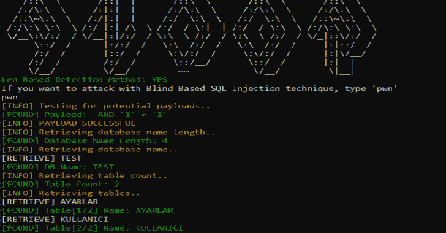
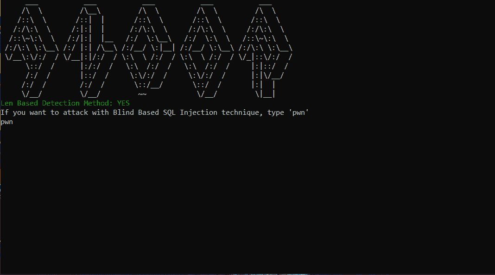

# Andor:带 Golang 的盲 SQL 注入工具

> 原文：<https://kalilinuxtutorials.com/andor-blind-sql-injection-tool/>

**Andor** 是一个带有 Golang 的盲 SQL 注入工具。

**也可阅读-[Jaeles:自动化 Web 应用测试的瑞士军刀](https://kalilinuxtutorials.com/jaeles-the-swiss-army-knife-web-application-testing/)**

**用途**

下载和或. go 并转到下载文件所在的文件夹。并键入以下命令提示:

**go run and or . go–URL "http://deneme.com/index.php？id=1"**

**注意:Get 参数值必须正确，否则无法工作。

[**Download**](https://github.com/sadicann/andor)