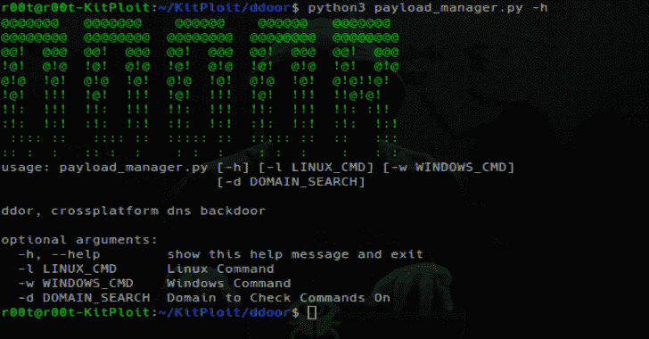

# DDoor:使用 DNS txt 记录的跨平台后门

> 原文：<https://kalilinuxtutorials.com/ddoor-cross-platform-backdoor/>

**DDoor** 是使用 dns txt 记录的跨平台后门。这是一个跨平台的轻量级后门程序，使用 txt 记录在受感染的机器上执行命令。

**特性**

*   允许一个 txt 记录对 linux 和 windows 机器使用不同的命令
*   它随机选择的大约 10 个公共 DNS 服务器的列表
*   不可预测的回电时间
*   使用带有自定义密码的 xor 加密 txt 记录

**Linux 特性:**

*   反调试，如果检测到 ptrace 附加到进程，它将退出。
*   进程名/线程名被隐藏，一个假名字覆盖了所有的系统参数和文件名，使它看起来像一个合法的程序。
*   自动守护
*   尝试将 GUID/UID 设置为 0(根)

**Windows 功能:**

*   隐藏控制台窗口
*   大约 20kb 的存根大小

**安装**

要安装 python 生成脚本所需的依赖项，请运行。

**pip 3 install-r requirements . txt**

请务必编辑 config.h 并用您的域名替换提供的域名，您可以更改假名以及密码。

**创建一个 Linux 二进制:**

运行 compile.sh 脚本，这将在 bin 文件夹中创建一个名为 binary 的文件。

**创建一个 Windows 二进制:**

此项目是使用 VS2019 构建的，如果您使用 VS 2019 打开 sln 文件，请选择发布版本并构建它。

**也可阅读-[Vulnx:智能 Bot 自动外壳注入器，可检测多种类型的 CMS 中的漏洞](https://kalilinuxtutorials.com/vulnx-intelligent-bot-auto-shell-injector/)**

**用法**

用 python3 运行 payload_manager.py 来创建一个十六进制编码的有效载荷，然后为你的域更新或创建一个 txt 记录，确保 **TTL 设置为 300 秒！！！**

**$。/payload_manager.py -h

用法:payload _ manager . py[-h][-l LINUX _ CMD][-w WINDOWS _ CMD]
[-d DOMAIN _ SEARCH]

ddor，跨平台 dns 后门

可选参数:
-h，–help 显示此帮助消息并退出
-l LINUX_CMD Linux 命令
-w WINDOWS_CMD Windows 命令
-d DOMAIN_SEARCH 域检查**

[**Download**](https://github.com/rek7/ddoor)