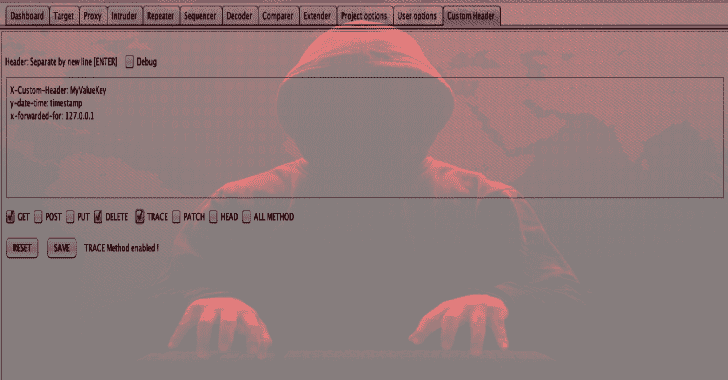

# 自定义标头:自动向整个 BurpSuite HTTP 请求添加新标头

> 原文：<https://kalilinuxtutorials.com/custom-header-burpsuite-http-requests/>

**自定义报头**是一个 Burp 套件扩展，允许您自定义报头，将新报头放入 HTTP 请求 Burp Suite(扫描器、入侵者、中继器、代理历史)中，并且您还可以选择您想要自定义的任何 HTTP 动词。

**用途**

*   好用！🙂
*   不要忘记点击保存按钮！

**也可阅读-[Vulnx:智能 Bot 自动外壳注入器，可检测多种类型的 CMS 中的漏洞](https://kalilinuxtutorials.com/vulnx-intelligent-bot-auto-shell-injector/)**

**变更日志**

【2019 年 10 月 24 日–1.0 版

*   首次公开发行

[**Download**](https://github.com/mirfansulaiman/CustomHeader)