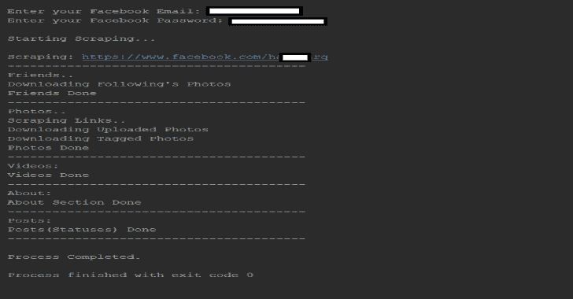
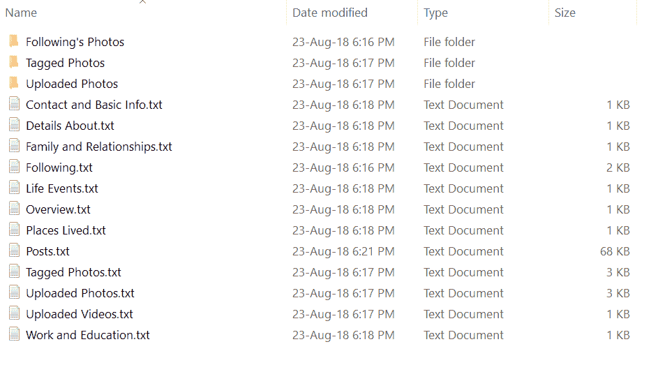

# UFS:终极脸书铲运机

> 原文：<https://kalilinuxtutorials.com/ufs-ultimate-facebook-scraper/>

**UFS** 是一个抓取脸书用户几乎所有个人资料的机器人，包括用户时间轴上所有公开的帖子/状态、上传的照片、标记的照片、视频、朋友列表和他们的个人资料照片(包括关注者、追随者、工作朋友、大学朋友等)。

工具化**自动化**你的社交媒体互动，收集脸书上的帖子、照片、视频、朋友、关注者等等。

**也可阅读–DDoor:使用 DNS txt 记录的跨平台后门**

**特性**

一个抓取几乎所有 facebook 用户资料的机器人，包括

*   上传的照片
*   标记的照片
*   录像
*   朋友列表及其个人资料照片(包括关注者、追随者、工作朋友、大学朋友等)
*   以及用户时间线上可用的所有公共帖子/状态。

关于这个刮刀最好的事情是数据以一种有组织的格式被刮擦，以便它能被研究人员用于教育/研究目的。此外，这种刮刀不使用脸书的图形 API，因此不存在速率限制问题。

这个工具每周都有成千上万的开发者在使用，我们对这个反应感到非常惊讶！谢谢大家！

有关**引用/参考**这一工具进行研究的详细信息，请查看下面的“引用”部分。

**注**

在其核心，这个工具使用 xpaths 的**‘divs’**来提取数据。因为脸书经常更新它的网站,“div”也变了。因此，我们必须相应地更新 div，以正确地抓取数据。

这个工具的开发者已经投入了大量的时间和精力来开发这个工具，最重要的是维护这个工具。为了让这个神奇的工具继续存在，我们需要你们这些极客的支持。

代码非常直观且易于理解，所以当您觉得已经尝试了许多概要文件，但没有为其中任何一个收集到数据时(这暗示脸书已经更新了他们的站点)，您可以更新代码中的相关 xpaths，并生成一个 pull 请求。那是一件相当容易做的事情。谢谢！

**用途**

**安装**

你需要安装最新版本的谷歌浏览器。此外，您还需要使用

**pip 安装硒**

使用 Python 3 运行代码。此外，代码是多平台的，并且在 Windows 和 Linux 上都经过了测试。该工具使用最新版本的 Chrome Web 驱动程序。我已经把网络驱动和代码放在一起了，但是如果那个版本不工作，那么就用最新的版本替换 chrome 网络驱动。

**怎么跑？**

有个文件叫“input.txt”。您可以按以下格式添加任意数量的配置文件，每个链接占一行:

https://www.facebook.com/andrew.ng.96
https://www.facebook.com/zuck

确保链接末尾只包含用户名或 id 号，不包含任何其他内容。确保它是上面提到的格式。

注:下载好友资料图片和用户照片有两种模式:大尺寸和小尺寸。您可以更改以下变量。默认情况下，它们被设置为小尺寸图片，因为它真的很快，而大尺寸模式需要时间，这取决于要下载的图片数量

**#是下载完整图像还是缩略图(小尺寸)
#如果小尺寸为真，那么速度会很快，否则为假，那么它会打开每张照片来下载
#这将花费更多的时间**

**样品**

[**Download**](https://github.com/harismuneer/Ultimate-Facebook-Scraper)