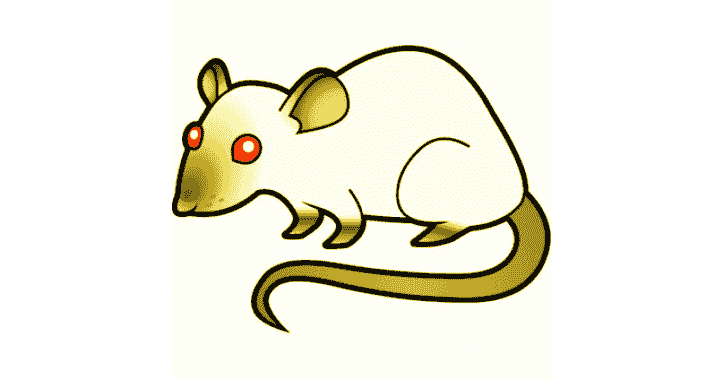

# 红花生:小老鼠，于 1920 年发育。网络核心 2 及其代理。净 3.5 / 4.0

> 原文：<https://kalilinuxtutorials.com/redpeanut-small-rat-developed-in-net-core/>

[](https://1.bp.blogspot.com/-DSuWHWSXxeQ/XdfIYdZ4EEI/AAAAAAAADik/XKgTXidGFcMeVmFa-91jUDDsx4ZIgVH9wCLcBGAsYHQ/s1600/RAT.png)

RedPeanut 是一只小老鼠，于 1995 年出生。网络核心 2 及其代理。净 3.5 / 4.0。RedPeanut 代码的执行基于用 [DonutCS](https://github.com/n1xbyte/donutCS) 生成的外壳代码。因此，它是一个混合体，虽然是在。Net 不仅仅依赖于 Assembly.Load。

这增加了检测面，但允许我们实践和试验与 dotnet 环境、流程管理和注入相关的各种规避技术。

这种行为可以在运行时用“托管”和“非托管”命令来改变。如果你对. Net C2 框架感兴趣，并且这个框架是一致的，并且可以在一个协议中使用，我建议使用 [Covenant](https://github.com/cobbr/Covenant) 。

RedPeanut 的武器是:

*   幽灵背包
*   夏普波阿普斯
*   sharp.com
*   EvilClippy
*   多特内特霍斯
*   夏普网
*   PsExec 的修改版本
*   夏普斯洛特
*   提基火炬

**也读作——[DDoor:跨平台后门使用 DNS txt 记录](https://kalilinuxtutorials.com/ddoor-cross-platform-backdoor/)**

**红花生代理**

RedPeanut 代理可以在。Net 3.5 和 4.0，并通过 NamedPipe 提供旋转功能。该代理在非托管模式下执行时，会在单独的进程中执行自己的关键任务，以防止 AV 在执行过程中对检测或错误的响应使您失去整个代理。

执行流程如下:

1.  流程创建
2.  注入用 DonutCS 生成的静态外壳代码
3.  加载程序加载并执行登台程序或模块

代理当前仅支持 https 通道。

**C2 频道**

代理签入协议非常简单:

1.  登台者需要一个代理 id，消息用共享服务器密钥通过 RC4 加密
2.  服务器解密消息，编译并发送给代理，生成并发送密钥和 IV，用于将来通信的 AES 加密，消息被 RC4 加密
3.  stager 解密消息并通过程序集加载代理。负荷
4.  代理向服务器发送签入消息，该消息用 AES 加密

或者，可以激活覆盖频道功能(目前它只是一个 PoC)。这个想法是模仿真实用户的网络流量。通常一个网页是由 html 页面和所有需要显示的对象组成的，比如 css，图片等等。在新任务的请求下，来自服务器的回答将不是直接加密的任务，而是一个 html 页面，从该页面中提取到将嵌入加密的任务的图像的链接。对图像的 http 请求将包含 Referer 标头。

**内容交付**

内容交付由 4 个渠道组成:

1.  C2 频道可通过个人资料定制
2.  由 RedPeanut 生成/管理的动态内容可通过个人资料定制
3.  映射到/file/的静态内容
4.  用于恢复包含映射到/images/的负载的映像的覆盖通道

**配置文件**

RedPeanut 能够定制服务器端和客户端的网络足迹。可以设置的属性有:

*   **通用**
    *   延迟(请求之间)
    *   ContentUri(动态内容的 url，如 dll hta 等。)
    *   UserAgent
    *   衍生(为执行关键任务而创建的流程)
    *   HtmlCovered(启用覆盖频道)
    *   TargetClass(用于搜索映像恢复的类)
*   **Http Get**
    *   ApiPath(逗号分隔的 url 列表 es /news-list.jsp，/antani.php 等。)
    *   *服务器*
        *   预先考虑
        *   附加
        *   头(http 头的名称和值对)
    *   *客户端*
        *   头球
*   **Http 帖子**
    *   ApiPath(逗号分隔的 url 列表 es /news-list.jsp，/antani.php 等。)
    *   param(post 请求负载参数的名称)
    *   Mask(解释键值对的格式，例如{0}={1})(需要更多工作…)
    *   **服务器**
        *   预先考虑
        *   附加
        *   头(http 头的名称和值对)
    *   **客户端**
        *   头球

**域名前置**

要启用域前端支持，必须重视客户机部分的“Host”头，包括 post 和 get(在默认配置文件 2 中举例说明)

**power helleiner 执行程序**

PowerShellExecuter 模块允许您在已经加载了 AMSI 绕过、日志记录绕过和 PowerView 的运行空间中执行 oneliner 命令或文件。

**发射器**

*   可执行程序的扩展名
*   动态链接库
*   PowerShell
*   Hta (vbs，powershell)
*   InstallUtil
*   MSBuild
*   宏 Vba

**本地模块**

*   EvilClippy

**代理任务**

*   上传
*   下载
*   夏普网
*   夏普米
*   急剧上升
*   UACBypass 令牌重复
*   SharpDPAPIVaults
*   SharpDPAPITriage
*   SharpDPAPIRdg
*   SharpDPAPIMasterKeys
*   sharpdpapimachinesevaults
*   sharpdpapimmachineretriage
*   SharpDPAPIMachineMasterKeys
*   sharpdpapimachinecredentails
*   SharpDPAPICredentials
*   SharpDPAPIBackupKey
*   安全带
*   安全 Katz
*   鲁伯特里亚
*   RubeusTgtDeleg
*   鲁布图斯 4U
*   RubeusRenew
*   RubeusPurge
*   RubeusPtt
*   管道监视器
*   RubeusKlist
*   鲁伯鲁斯特
*   红色沙希
*   rubrusharvest
*   RubeusDump
*   橡胶描述
*   RubeusCreateNetOnly
*   RubeusChangePw
*   风疹复发
*   RubeusAskTgt
*   sharp.com
*   SharpGPOAddUserRights
*   SharpGPOAddStartupScript
*   SharpGPOAddLocalAdmin
*   SharpGPOAddImmediateTask
*   powershelloxecuter 计算机
*   LatteralMSBuild
*   夏普赛克
*   SharpAdidnsdump
*   PPIDAgent
*   产卵剂
*   SpawnShellcode
*   SpawnAsShellcode
*   SharpMiniDump

**坚持**

*   自动运行
*   启动
*   WMI
*   CRL

**块 dll**

从 0.3.0 版开始，RedPeanutAgent 支持 blockdlls 命令。启用此选项后，为在非托管模式下执行任务而创建的子进程将使用属性 PROCESS _ CREATION _ MITIGATION _ POLICY _ BLOCK _ NON _ MICROSOFT _ BINARIES _ ALWAYS _ ON 来创建。这个属性阻止加载非微软签名的 dll 的进程，这可以保护我们的任务免受反病毒和 EDR 挂钩技术的攻击。

**直接系统调用和动态 Dll 加载**

RedPeanutAgent 使用动态 Dll 加载来避免使用可疑的 Dll 导入。动态 Dll 加载的荣誉归于[@ over](https://twitter.com/TheRealWover)、 [@cobbr_io](https://twitter.com/cobbr_io) 和 [@FuzzySec](https://twitter.com/FuzzySec) 在 [SharpSploit](https://github.com/cobbr/SharpSploit/tree/master/SharpSploit/Execution/DynamicInvoke) 中的工作。

一些反病毒和 EDR 供应商使用挂钩技术来跟踪活动。为了避免使用挂接的 syscall，RedPeanutAgent 使用直接的 syscall，自动注入必要的代码。直接系统调用的积分归 [@Cneelis](https://github.com/outflanknl/Dumpert)

**运行中**

要运行 RedPeanut，您需要安装 dotnet。要在 Kali 上安装 dotnet:

**wget-qO-https://packages.microsoft.com/keys/microsoft.asc | gpg–dearmor>Microsoft . ASC . gpg
mv Microsoft . ASC . gpg/etc/apt/trusted . gpg/
wget-q https://packages.microsoft.com/config/debian/9/prod.list
mv prod . list/etc/apt/sources . list . d/Microsoft-prod . list
chown root:root/etc/apt/trusted . gpg
chown root:root/etc/apt/sources . list . d**

**git 克隆–递归 https://github.com/b4rtik/RedPeanut.git**

对于涵盖的频道功能，有必要安装 libgdiplus 库，因此:

对于 linux 用户:

**apt-get install-y libgdiplus**

对于 OSx

**brew 安装 mono-libgdiplus**

程序集签名密钥生成

**C:\ Program Files(x86)\ Microsoft Visual Studio \ 2017 \ Community【sn.exe k 4096 key . snk**

然后在工作区/密钥文件中复制 key.snk

**root @ kali:~ # CD RedPanut
root @ kali:~/red peanut # dot net run
使用/root/Projects/red peanut/Properties/launch settings . JSON 中的启动设置…
输入密码以加密服务器 key:

[*]没有可用的配置文件，正在创建新的…
【RP】>**

**外壳代码生成器**

DonutCS 是一个外壳代码生成工具，它从。NET 程序集。该外壳代码可用于将程序集注入任意 Windows 进程。给定一个任意的。NET 程序集、参数和入口点(如程序。Main)，它产生与位置无关的外壳代码，从内存中加载它。的。NET 程序集既可以从 URL 进行分段，也可以通过直接嵌入外壳代码来进行分段。

**CLR 持久性**

CLR 持久化技术在 [@Am0nsec](https://twitter.com/am0nsec) 的这篇[帖子](https://www.contextis.com/en/blog/common-language-runtime-hook-for-persistence)中首次提出。该技术包括执行应用程序域管理器挂钩。如帖子中所述，执行挂钩的组件是必需的，在 GAC 中可用。要从 GAC 使用的程序集必须具有强名称，然后用密钥签名。CLR 持久性模块需要一个密钥来对程序集进行签名，该密钥可以使用 needs 工具生成，如下所示:

```
**********************************************************************
** Visual Studio 2017 Developer Command Prompt v15.9.3
** Copyright (c) 2017 Microsoft Corporation
**********************************************************************

C:\Program Files (x86)\Microsoft Visual Studio\2017\Community>sn.exe -k 4096 key.snk 
```

将 key.snk 文件复制到 Workspace/KeyFile 文件夹。该文件将用于为程序集签名以实现持久性。

**工具更新**

RedPeanut 中一些众所周知的工具(如 GhostPack 工具)被完全打包并在客户端执行。为了更新工具，例如座椅安全带，不更新整个库是必要的:克隆座椅安全带库，在“执行”中重命名“主”方法，插入公共修饰符并重新编译为 dll。必须使用 ps RastaMouse 的脚本[Get-compressed shell code . PS1](https://github.com/rasta-mouse/TikiTorch/blob/dev/Get-CompressedShellcode.ps1)以 Base64 压缩和编码 dll

[**Download**](https://kalilinuxtutorials.com/wp-admin/post.php?post=7391&action=edit)