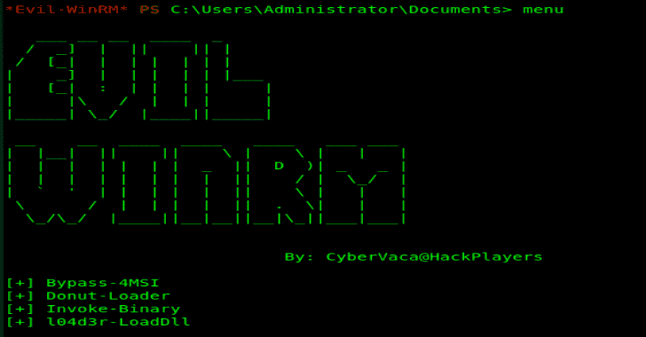
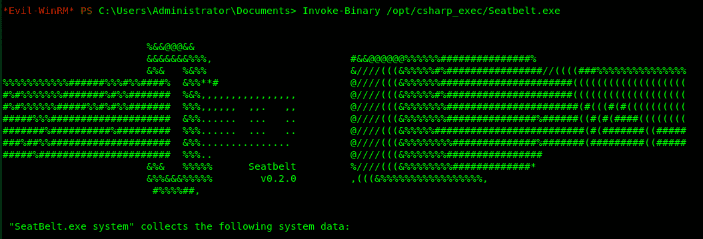
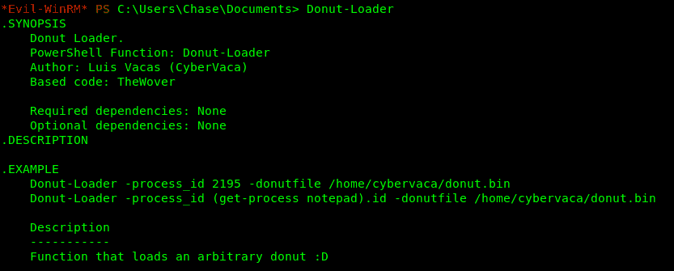
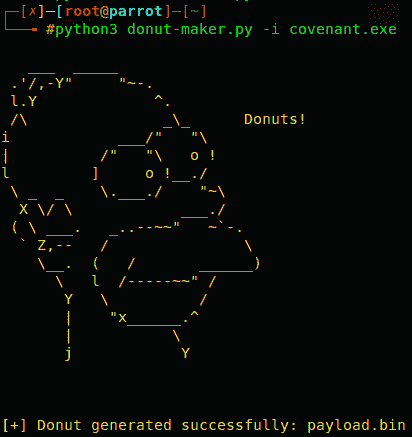
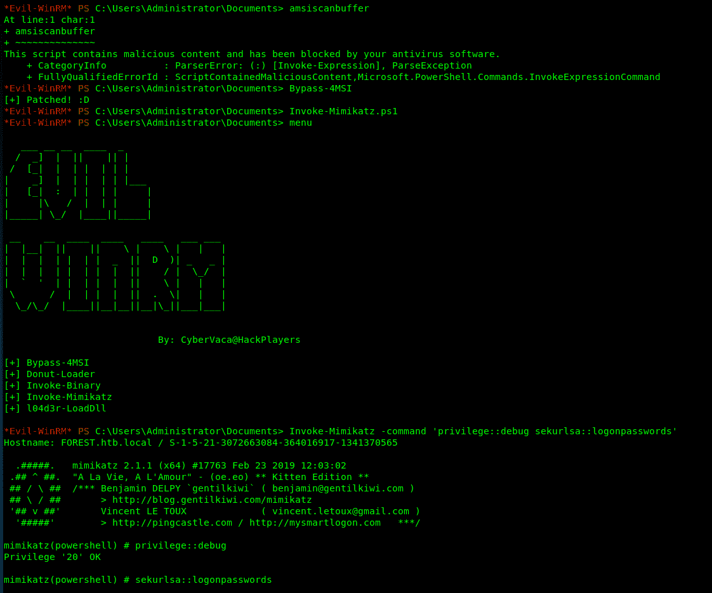

# Evil-Winrm:用于黑客攻击/测试的终极 Winrm 外壳

> 原文：<https://kalilinuxtutorials.com/evil-winrm-the-ultimate-winrm-shell-hacking-pentesting/>

**Evil-WinRM** 是用于黑客攻击/测试的终极 WinRM shell。WinRM (Windows 远程管理)是 WS-Management 协议的 Microsoft 实现。一种基于 SOAP 的标准协议，允许不同供应商的硬件和操作系统进行互操作。微软将它包含在他们的操作系统中，以使系统管理员的工作更容易。

这个程序可以在任何启用了此功能的 Microsoft Windows 服务器上使用(通常在 5985 端口)，当然前提是您有使用它的凭证和权限。因此，我们可以说，它可以用在开发后的黑客攻击/测试阶段。

这个程序的目的是为黑客提供漂亮易用的特性。系统管理员也可以出于合法目的使用它，但它的大多数功能都集中在黑客/测试方面。

**特性**

*   在内存中加载 Powershell 脚本
*   绕过一些 AVs 在内存中加载 dll 文件
*   绕过一些 AVs，在内存中加载 C# (C Sharp)程序集
*   加载用 awesome [donut](https://github.com/TheWover/donut) 技术生成的 x64 有效负载
*   AMSI 旁路
*   哈希传递支持
*   Kerberos 身份验证支持
*   SSL 和证书支持
*   上传和下载文件
*   列出没有权限的远程机器服务
*   命令历史
*   WinRM 命令完成
*   本地文件完成
*   输出消息的彩色化(可以选择禁用)
*   Docker 支持(可在 [Dockerhub](https://hub.docker.com/r/oscarakaelvis/evil-winrm) 获得预建图像)

**也可理解为-[SCShell:依靠 ChangeServiceConfigA 运行命令](https://kalilinuxtutorials.com/scshell/)T3 的无文件横向移动工具**

**帮助**

用法:evil-winrm-I IP-U USER[-S SCRIPTS _PATH][-e EXES _ PATH][-P PORT][-P PASS][-U HASH][-S][-c PUBLIC _ KEY _ PATH][-k PRIVATE _ KEY _ PATH][-r REALM]
-S，–SSL Enable SSL
-c，–pub-KEY PUBLIC _ KEY _ PATH 公钥证书的本地路径
-k，–priv-KEY 私钥 _ PATH 的本地路径 –脚本 PS_SCRipTS_PATH Powershell 脚本本地路径
-e，–可执行文件 EXES_PATH C#可执行文件本地路径
-i，–IP IP 远程主机 IP 或主机名(必需)
-U，–url URL 远程 URL 端点(默认 wsman)
-u，–用户用户用户名(如果不使用 kerberos 则必需)
-p，–Password Password
-H，–hash n hash n hash
-P，–PORT 远程主机端口(默认 5985

## 要求

需要 Ruby 2.3 或更高版本。还需要一些红宝石:**`winrm >=2.3.2``winrm-fs >=1.3.2``stringio >=0.0.2``colorize >=0.8.1`。**根据您的安装方法(3 种可用),可能需要手动安装。

另一个仅用于 Kerberos 身份验证的重要要求是安装用于网络身份验证的 Kerberos 包。对于一些像基于 Debian 的 Linux(Kali，Parrot 等。)它叫`krb5-user`。对于 BlackArch，它被称为`krb5`,对于其他 Linux 发行版，它可能以不同的方式被调用。

**安装&快速启动(4 种方法)**

**方法一。直接安装为 ruby gem(依赖项会自动安装在你的系统上)**

*   第一步。安装它(它会自动安装依赖项):`**gem install evil-winrm**`
*   第二步。准备好了。启动它！`**~$ evil-winrm -i 192.168.1.100 -u Administrator -p 'MySuperSecr3tPass123!' -s '/home/foo/ps1_scripts/' -e '/home/foo/exe_files/'**`

**方法二。手动在您的系统上克隆和安装依赖项**

*   第一步。手动安装依赖项:`**~$ sudo gem install winrm winrm-fs colorize stringio**`
*   第二步。克隆回购:`**git clone https://github.com/Hackplayers/evil-winrm.git**`
*   第三步。准备好了。启动它！`**~$ cd evil-winrm && ruby evil-winrm.rb -i 192.168.1.100 -u Administrator -p 'MySuperSecr3tPass123!' -s '/home/foo/ps1_scripts/' -e '/home/foo/exe_files/'**`

**方法三。使用 bundler(依赖项不会安装在你的系统上，只是为了使用 evil-winrm)**

*   第一步。安装捆扎机:`**gem install bundler:2.0.2**`
*   第二步。使用 bundler 安装依赖项:`**cd evil-winrm && bundle install --path vendor/bundle**`
*   第三步。用捆绑器启动:`**bundle exec evil-winrm.rb -i 192.168.1.100 -u Administrator -p 'MySuperSecr3tPass123!' -s '/home/foo/ps1_scripts/' -e '/home/foo/exe_files/'**`

**方法四。使用 Docker**

*   第一步。基于已经构建的映像启动 docker 容器:`**docker run --rm -ti --name evil-winrm -v /home/foo/ps1_scripts:/ps1_scripts -v /home/foo/exe_files:/exe_files -v /home/foo/data:/data oscarakaelvis/evil-winrm -i 192.168.1.100 -u Administrator -p 'MySuperSecr3tPass123!' -s '/ps1_scripts/' -e '/exe_files/'**`

**文档**

**明文密码**

如果您不想以明文形式输入密码，您可以选择避免设置`-p`参数，密码将被提示阻止显示。

**Ipv6**

要使用 IPv6，必须将地址添加到/etc/hosts 中。只需将已经设置好的主机名放在`-i`参数之后，而不是 IP 地址。

#### 基本命令

*   **上传**:本地文件可以使用 tab 键自动完成。
    *   用法:**T0 或`upload local_filename destination_filename`T3**
*   **下载**:
    *   用法:**T0 或`download remote_filename destination_filename`T3**

**路径注意事项(上传/下载)**:下载/上传时不允许使用相对路径。使用当前目录或绝对路径上的文件名。如果您在 docker 环境中使用 Evil-WinRM，请记住，所有本地路径都应该在`/data`处，并确保您将它映射为一个卷，以便能够访问下载的文件或能够从本地主机操作系统上传文件。

*   **服务**:列出所有服务。不需要管理员权限。
*   **菜单**:加载 **`Invoke-Binary`、`l04d3r-LoadDll`、`Donut-Loader`和`Bypass-4MSI`** 功能，我们将在下面解释。ps1 加载后，其所有功能都会显示出来。

**加载 powershell 脚本**

*   要加载 ps1 文件，您只需输入名称(允许自动完成 usnig 制表符)。脚本必须位于在`**-s**`参数处设置的路径中。再次键入 menu 并查看加载的函数。非常大的文件可能需要很长时间才能加载。

**高级命令**

*   Invoke-Binary:允许从 c#编译的 exe 在内存中执行。该名称可以使用 tab 键自动完成，最多允许 3 个参数。可执行文件必须位于在`-e`参数处设置的路径中。

l04d3r-LoadDll:允许在内存中加载 Dll 库，它相当于:`**[Reflection.Assembly]::Load([IO.File]::ReadAllBytes("pwn.dll"))**`

dll 文件可以由 smb、http 或本地托管。一旦加载了 type `menu`，就可以自动完成所有功能。

Donut-Loader:允许注入用 awesome [donut](https://github.com/TheWover/donut) 技术生成的 x64 有效载荷。不需要对 payload.bin 进行编码，只需要生成和注入即可！

如果你不使用 Windows，你可以使用这个[甜甜圈制作器](https://github.com/Hackplayers/Salsa-tools/blob/master/Donut-Maker/donut-maker.py)来生成 payload.bin。这个脚本使用了 Marcello Salvati 编写 python 模块( [byt3bl33d3r](https://twitter.com/byt3bl33d3r) )。它可以使用 pip 进行安装:

**pip3 安装 donut-shellcode**

Bypass-4MSI:补丁 AMSI 保护。

#### 麻省理工学院开发的安全认证系统

*   首先你要与 DC 同步日期: **`rdate -n <dc_ip>`**
*   生成票证有多种方式:
    *   从 impacket: **`ticketer.py -dc-ip <dc_ip> -nthash <krbtgt_nthash> -domain-sid <domain_sid> -domain <domain_name> <user>`** 中使用[ticket . py](https://github.com/SecureAuthCorp/impacket/blob/master/examples/ticketer.py)
    *   如果你用[鲁伯](https://github.com/GhostPack/Rubeus)或[米米卡兹](https://github.com/gentilkiwi/mimikatz)得到一张 kirbi 票，你必须用 [ticket_converter.py](https://github.com/Zer1t0/ticket_converter) : `**python ticket_converter.py ticket.kirbi ticket.ccache**`转换成 ccache
*   添加 ccache 票证。有 2 种方式: **`export KRB5CCNAME=/foo/var/ticket.ccache` `cp ticket.ccache /tmp/krb5cc_0`**
*   将领域添加到`**/etc/krb5.conf**`(适用于 linux)。使用这种格式很重要: `**CONTOSO.COM = { kdc = fooserver.contoso.con }**`
*   用 **`klist`** 查 Kerberos 票
*   要删除票使用: **`kdestroy`**
*   有关 Kerberos 的更多信息，请查看此[备忘单](https://gist.github.com/TarlogicSecurity/2f221924fef8c14a1d8e29f3cb5c5c4a)

#### 额外功能

*   要禁用颜色，只需修改代码中的变量`**$colors_enabled**`。将其设置为假:`**$colors_enabled = false**`

[**Download**](https://github.com/Hackplayers/evil-winrm)