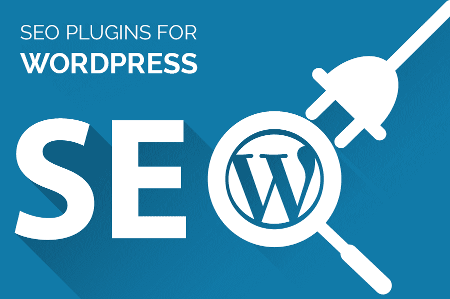

# WordPress WooCommerce 的 10 个最佳 SEO 插件

> 原文：<https://kalilinuxtutorials.com/10-best-seo-plugin-for-wordpress-woocommerce/>

SEO 插件是在谷歌、雅虎和必应等搜索引擎中提升 WordPress WooCommerce 网站的最佳方式。最佳 WordPress SEO 插件帮助你改善网站的 SEO，这样你的产品或服务就可以在搜索引擎中展示给相关用户。在这篇文章中，我们为 WordPress WooCommerce 网站精心挑选了 10 个最好的 SEO 插件，你可以用它们来提高 SEO。

1.  排名数学

Rank Math 是 WooCommerce 用户使用的最好的 WordPress SEO 插件 之一。它有助于提高你的 WordPress 网站的搜索引擎优化，优化你的文章，并建议你进行必要的修改来提高你网站的排名。它包含许多功能和特性，帮助每个用户提高他们在 Google SERPs 中的排名。它还基于 30 个已知因素进行了详细的搜索引擎优化分析

亮点:

*   测量和跟踪关键字
*   赢得 20 多种模式类型的丰富片段
*   干净、简单、用户友好的界面
*   内置高级搜索引擎优化分析模块
*   速度优化

2.  Yoast SEO

当我们在为 WordPress 的 WooCommerce 用户谈论**最佳 SEO 插件时，Yoast SEO 是不能被忽视的。毫无疑问，这个 SEO 插件被数百万网站用户使用。Yoast SEO 是用户使用最多的 SEO 插件之一，用于执行不同的现场技术优化，以提高网站的 SEO。它还包括免费版本中的无限功能。但是，如果你需要高级 SEO，那么你必须购买它的付费版本。**

亮点:

*   关键词优化
*   剽窃检测
*   出站链接和内部链接警报
*   多站点兼容性
*   对面包屑的完全控制

3.  所有在一个搜索引擎优化包

当谈到 WooCommerce SEO 插件时，ALL In One SEO Pack 也不落后。顾名思义，这个插件是一个完整的 SEO 包，有助于改善 WooCommerce 网站的 SEO。它使用简单，包含许多有用的功能。它顺利地与电子商务网站集成，并提供大量的高级功能。如果你是 WordPress 和插件的新手，那么考虑使用一个 SEO 包，因为它有更少的复杂性和简单的用户界面。

亮点:

*   自动元数据生成
*   抄袭检测功能
*   能够覆盖任何设置
*   XML 站点地图支持
*   内置 API 特性

4.  Google XML 网站地图

如果你直到今天才知道 Google XML 站点地图，那么你就错过了机会。谷歌 XMP 网站地图是每个在线商务网站的需要。通过这个功能，你的网站地图将自动生成，这将有助于谷歌索引你的内容。一旦你完成了站点地图的设置，你就不需要改变它了。它不会让你的网站超负荷，而且工作出色。

亮点:

*   免费
*   简短地索引内容
*   更多控制和灵活性
*   不要霸王网站

5.  松鼠 seo

Squirrly SEO 也是**最好的 SEO 插件**，帮助用户纠正与 SEO 相关的问题。这是一个用户友好的插件，尤其是对初学者。它有一个内容优化功能，为您选择的关键字。它还包括一个竞争对手分析功能，也提供建议。Squirrly SEO 衡量受众参与度，帮助用户提高点击率(CTRs)。它还可以恢复旧的设置，如果你切换到另一个搜索引擎优化插件。

亮点:

*   社交媒体的监控
*   谷歌分析集成
*   模式标记
*   高级电子商务功能
*   站点地图 XML

6.  全在一个模式中丰富的片段

每个 WordPress 用户都经常使用 All In One Schema Rich Snippets 在 Google 搜索结果中突出显示他们的产品或服务。它在 Google、Yahoo、Bing 和其他搜索引擎的搜索结果中提供了您网站页面的摘要。这会吸引用户，让他们打开你的网页，寻找你提供的服务或产品。您可以为评论、事件、食谱、产品、服务等实现丰富的片段。

亮点:

*   为更高的 SERPs 优化内容
*   提高点击率(CTR)
*   令人印象深刻的丰富片段
*   帮助您在搜索结果中获得高排名
*   它以不同的格式显示评级。

7.  SEOPress

这是一个强大的和最好的搜索引擎优化插件。它贴着白色标签，没有广告。它具有无限的功能，使您能够完全优化一个网站。通过 SEOPress，可以管理重定向；基于关键词等分析内容。这个插件与 Google Analytics 集成在一起，减少了你的搜索引擎优化工作，并给你一个完整的报告。

亮点:

*   社交媒体监控
*   支持无限制的关键字
*   直观的设置向导
*   优化现场相关问题
*   支持谷歌本地业务

8.  WP Smushit

如果你在一个 WooCommerce 网站上工作，那么很明显你会为你的产品上传大量的图片。WP Smush 帮助用户压缩、调整和优化你想上传到网站上的图片。压缩或调整大小时不会影响图像质量。它将帮助您快速上传图片到您的在线商店，并节省您的网站空间。它提高了你的 WooCommerce 网站的加载速度。

亮点:

*   优化图像并节省存储
*   与媒体库插件兼容
*   支持不同格式的图像
*   优化 WP 目录中的图像
*   WPML 媒体翻译插件

9.  断开链接检查器

重要的是消除你的网站上所有的坏链接，以获得谷歌的积极点。断开的链接是您过去添加的，但现在您不再使用它们并将其删除。此类页面或断开的链接会在您的网站页面上显示 404 错误信息。这些链接对搜索引擎来说是多余的，他们会把它视为你网站的一个不利点。使用断链检查插件，以避免任何可能的惩罚你的网站。

亮点:

*   监控所有页面、评论、帖子和博客中的链接
*   快速找出断开的链接
*   检测丢失的图像和重定向
*   通过仪表板或邮件通知
*   使断开的链接显示在帖子上

10.  WP 超级缓存

网站速度在决定网站成功与否的过程中起着重要的作用。大多数网站仅仅因为加载时间而失去客户或访问者。你只有 1-2 秒的时间来吸引顾客到你的网页。WP 超级缓存有助于提高网站的加载速度。它拥有超过 2M 的下载量，并为访问者和搜索引擎优化电子商务网站。

亮点:

*   ●易于使用的界面
*   自定义缓存
*   预加载功能
*   内容交付网络支持
*   垃圾收集和 rest API

结论

SEO 对每个网站所有者都很重要。你必须知道提高网站搜索引擎优化的重要插件，因为只有这样你才能在搜索结果页面中获得高排名。正确的工具可以帮助你获得好的结果。万事如意！