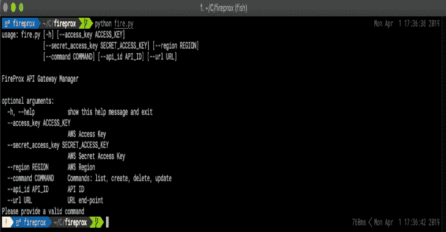
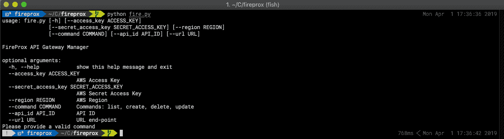
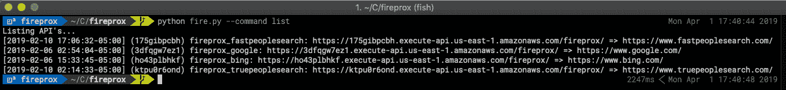
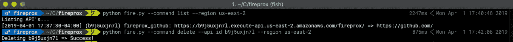
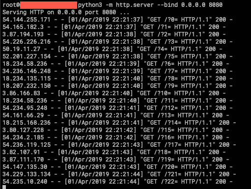

# Fireprox : AWS API 网关管理工具，用于动态创建 HTTP

> 原文：<https://kalilinuxtutorials.com/fireprox-aws-api-gateway-creating-http/>

当进行网络呼叫时，能够隐藏或不断轮换源 IP 地址可能是困难的或昂贵的。许多工具已经存在了一段时间，但它们要么受限于 IP 地址的数量，要么价格昂贵，要么需要部署大量的虚拟处理器。FireProx 利用 AWS API 网关来创建传递代理，这些代理会随着每个请求轮换源 IP 地址！使用 FireProx 创建一个指向目标服务器的代理 URL，然后向返回目标服务器响应的代理 URL 发出 web 请求！

**好处**

*   随着每个请求轮换 IP 地址
*   配置单独的区域
*   支持所有 HTTP 方法
*   所有参数和 URI 的都通过
*   创建、删除、列出或更新代理
*   通过请求 X-My-X-Forwarded-For 标头来欺骗 X-Forwarded-For 源 IP 标头

**免责声明**

*   ~~AWS~~在 X-Forwarded-For 报头中将源 IP 地址传递给目的地
    *   (100 美元给第一个想出如何在它到达目的地之前在 AWS 配置中剥离它的人！)
    *   感谢在 1 小时内发布了令人敬畏的 X-Forwarded-For 补丁！
*   如果你不遵守 robots.txt，我不负责🙂
*   CloudFlare 似乎有时会检测到 X-Forwarded-For(当阻塞刮刀(**需要测试新补丁**)时)
*   在您所拥有的系统之外的系统上使用此工具可能违反 [AWS 可接受使用政策](https://aws.amazon.com/aup/)，并可能导致您的 AWS 帐户被终止或暂停。此外，即使在您拥有的系统上使用该工具，或者获得明确许可在其上执行渗透测试，也要遵守 AWS 关于[渗透测试](https://aws.amazon.com/security/penetration-testing/)的政策。

**又读-[UFS:终极脸书刮刀](https://kalilinuxtutorials.com/ufs-ultimate-facebook-scraper/)**

**信用**

在公开发布 FireProx 之后，我了解到另外两个已经在使用 AWS API 网关技术。通过研究事件链和一些精彩的对话，我意识到我知道这件事的唯一原因是因为这些人。我认为给他们一些欢呼和赞扬，关注这些人会很酷——他们太棒了。

*   这要归功于 Ryan Hanson –@ ryHanson,他是 API 网关技术的第一个已知来源
*   向[迈克·豪杰斯大声欢呼—@ rmikhodges](https://twitter.com/rmikehodges)在 2018 年黑帽阿森纳公开它
*   再次向我的好朋友 Ralph May –@ Ralph te 1 大声欢呼，感谢他不久前向我介绍了这项技术。

**基本用法**

**需要配置 AWS 访问密钥和秘密访问密钥或 AWS CLI**

用法:**fire . py**[-h][–ACCESS _ KEY ACCESS _ KEY][–SECRET _ ACCESS _ KEY SECRET _ ACCESS _ KEY][–REGION REGION][–COMMAND COMMAND][–API _ ID API _ ID][–URL URL]

firepro api 网关管理器

**可选参数:**
**-h，–help**显示此帮助消息并退出
**–ACCESS _ KEY ACCESS _ KEY**AWS 访问密钥
**–SECRET _ ACCESS _ KEY SECRET _ ACCESS _ KEY**AWS 秘密访问密钥
**–REGION**AWS REGION
**–COMMAND**命令:列出、创建、删除、更新
**–API _ ID API _ API**

*   **例题**
    *   examples/google.py:使用 FireProx 代理抓取 google 搜索。
    *   examples/bing.py:使用 FireProx 代理抓取 bing 搜索。

**安装**

您可以使用以下命令安装并运行:

**$ git 克隆 https://github.com/ustayready/fireprox
$ CD fireprox
~/fireprox $ virtualenv-p python 3。
~/fireprox $ source bin/activate
(fireprox)~/fireprox $ pip install-r requirements . txt
(fireprox)~/fireprox $ python fire . py**

注意，Python 3.6 是必需的。

构建 Docker 映像:(目前在 Docker for Windows 上不工作，可能是由于 entrypoint.sh 中的行尾。)

$ git 翻制 https://github . com/usteriay/fireprox【$ CD fire prox【
】docker build-t fireprox。
美元码头运行──RM-it fire prox-h

**截图**

