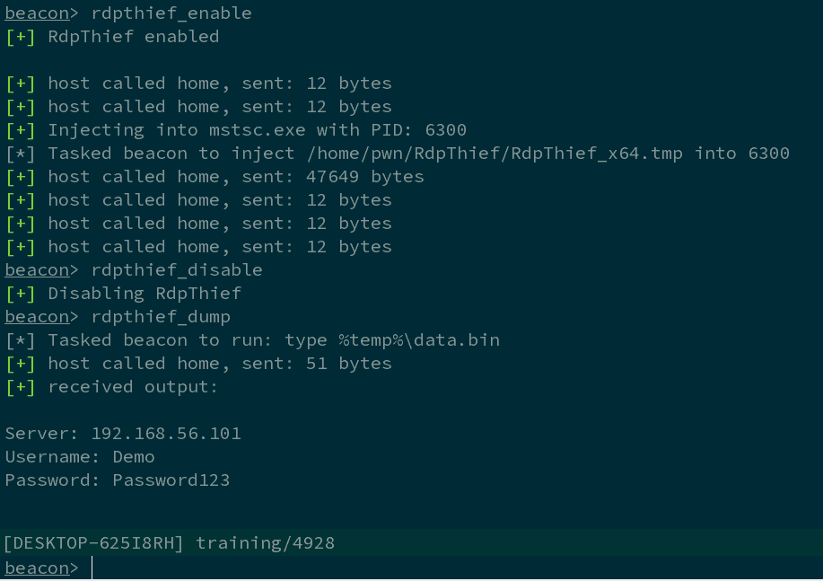

# RDPThief:使用 API 挂钩从 mstsc.exe 提取明文密码

> 原文：<https://kalilinuxtutorials.com/rdpthief-passwords-mstsc-exe-api-hooking/>

RDPThief 本身是一个独立的 DLL，当它被注入到 mstsc.exe 进程中时，将执行 API 挂钩，提取明文凭证并将它们保存到一个文件中。

伴随它的是一个攻击者脚本，它负责管理状态、监控新进程并在 mstsc.exe 注入外壳代码。使用 sRDI 项目([https://github.com/monoxgas/sRDI](https://github.com/monoxgas/sRDI))将 DLL 转换成外壳代码。启用时，RdpThief 将每 5 秒钟获取一次进程列表，搜索 mstsc.exe，并向其注入。

当侵略者脚本加载到钴罢工，三个新的命令将是可用的:

*   rdpthief _ enable–启用新 mstsc.exe 进程的心跳检查并注入其中。
*   rdpthief _ disable–禁用新 mstsc.exe 的心跳检查，但不会卸载已经加载的 DLL。
*   rdpthief _ dump–打印提取的凭据(如果有)。

**也可理解为-[SCShell:依靠 ChangeServiceConfigA 运行命令](https://kalilinuxtutorials.com/scshell/)T3 的无文件横向移动工具**

**截图**

**演示视频**

[https://www.youtube.com/embed/F77eODhkJ80?feature=oembed&enablejsapi=1](https://www.youtube.com/embed/F77eODhkJ80?feature=oembed&enablejsapi=1)

[**Download**](https://github.com/0x09AL/RdpThief)